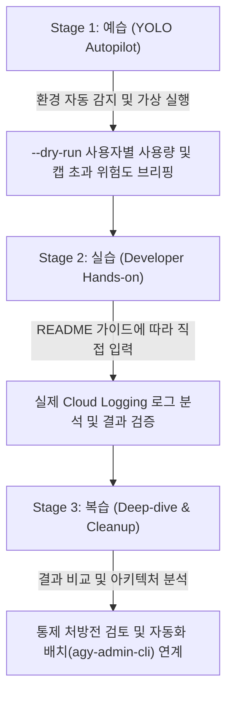

<!--
Copyright 2026 Google LLC. All Rights Reserved.
SPDX-License-Identifier: Apache-2.0

NOTICE: This code/repository is owned by Google LLC and provided under the Apache-2.0 License.
It is strictly provided as an EXAMPLE/REFERENCE ONLY and is NOT INTENDED FOR PRODUCTION USE.
All contents, designs, and code examples are subject to change, modification, or removal at any time without notice.

[고지 사항] 본 저장소 및 문서는 구글 (Google LLC) 소유이며 Apache 2.0 라이선스 하에 예시 (Sample) 용도로 제공된다.
프로덕션 환경용이 아니며, 사전 통지 없이 언제든지 수정, 변경 또는 삭제될 수 있다.
-->

---
name: antigravity-user-quota-cap
description: >-
  Autopilot, hands-on diagnostics, and self-healing for antigravity-user-quota-cap: Google Antigravity 개발자별 토큰 소비량 및 호출 횟수를 실시간 분석하고, 일일/주간 쿼터 캡(Cap) 초과자를 식별하여 프로젝트 IAM 마커 역할 기반의 안전한 통제 처방을 제공하는 진단 도구다.
---

# Google Antigravity 사용자별 사용량 모니터링 및 쿼터 캡 진단기 (Autopilot & Hands-on Guide)

본 스킬은 고객사 엔지니어와 실무자가 `antigravity-user-quota-cap` 미니 프로젝트를 **"예습(YOLO 자율 주행) -> 실습(단계별 핸즈온) -> 복습(심화 검증 및 리소스 정리)"** 3단계 학습 사이클로 완주할 수 있도록 지원하는 실행 가이드다.

**Audience**: `#Architect`, `#Developer`, `#FinOps`  
**Concern**: `#Billing`, `#Compliance`, `#IAM`  
**Service**: `#AgentPlatform`, `#CloudLogging`  

---

## 1. 3단계 학습 워크플로우 한눈에 보기



---

## 2. Stage 1: 예습 (YOLO Autopilot 모드)

고객 개발자가 "이 미니 프로젝트 욜로 모드로 먼저 시연해 줘"라고 요청할 때 에이전트가 수행하는 자율 실행 절차다.

### Step 1.1 환경 자동 감지 및 설정 세팅 (Pre-flight)
1. 현재 활성화된 gcloud 프로젝트 및 계정을 확인한다:
   ```bash
   gcloud config get-value project
   gcloud config get-value account
   ```
2. `samples/antigravity-user-quota-cap/.env.example`을 참조하여 `.env` 파일을 자동 구성한다.
3. 실행에 필요한 최소 IAM 권한(`roles/logging.viewer, roles/resourcemanager.viewer`) 충족 여부를 안내한다.

### Step 1.2 가상 모의 실행 및 아키텍처 브리핑 (Smoke Test)
실제 클라우드 호출 없이 1초 만에 전체 실행 흐름과 예상 진단 리포트를 화면에 출력하고 `report.md`를 자동 생성한다:
```bash
cd samples/antigravity-user-quota-cap
python diagnose.py --dry-run
```
- 화면에 출력된 진단 결과와 계산 공식, 정상/초과 판단 기준을 사용자에게 간결하게 브리핑한다.
- 자동 생성된 `report.md` 파일 구조를 안내한다.

### Step 1.3 장애 해결 및 자가 치유 시연 (Self-healing Showcase)
- **Metadata Logging 누락**: 콘솔에서 Gemini Enterprise 메타데이터 로깅이 꺼져 있어 토큰이 집계되지 않을 때의 원인과 조치 경로를 설명한다.
- **IAM 통제 불가(NOT_ENFORCEABLE) 계정 대응**: Google Group 또는 상위 권한 보유자에 대한 그룹 콘솔 수동 관리 방안을 안내한다.

---

## 3. Stage 2: 실습 (Developer Hands-on 단계)

예습을 통해 전체 흐름을 파악한 고객 개발자가 콘솔과 터미널에서 직접 명령어를 수행하는 본 실습 단계다.

### Step 2.1 저장소 이동 및 의존성 확인
```bash
cd samples/antigravity-user-quota-cap
cat requirements.txt
```

### Step 2.2 진단 도구 실행
```bash
python diagnose.py
```
- 특정 프로젝트나 커스텀 캡(토큰 80만 개)을 지정하여 검사할 경우:
  ```bash
  python diagnose.py --project-id=<대상_프로젝트_ID> --cap-tokens=800000
  ```

### Step 2.3 진단 리포트 확인 및 조치 가이드 적용
- 터미널에 출력된 진단 표와 갱신된 `report.md`를 확인한다.
- 초과 사용자에 대해 리포트 하단에 제시된 마커 역할(`CustomAntigravityCapBlocked`) 부여 명령어를 실행한다.

---

## 4. Stage 3: 복습 (Deep-dive & Cleanup)

### Step 4.1 요구 사항 추적성 및 아키텍처 복습
- `docs/BRD.md`: 비즈니스 요구 사항(`BR-01` ~ `BR-04`)이 실제 솔루션으로 어떻게 구체화되었는지 검토한다.
- `docs/TDD.md`: 기능(`FR-01` ~ `FR-04`) 및 비기능(`NFR-01` ~ `NFR-03`) 기술 설계를 복습한다.

### Step 4.2 자원 정리 (Teardown)
> [!IMPORTANT]
> **자동 정리 금지 및 환경 보존 안내**:
> 실습 및 진단 과정에서 확인하거나 조정한 리소스 및 설정은 사용자가 Google Cloud 콘솔에서 직접 확인하고 지속해서 활용할 수 있도록 **절대로 에이전트가 임의로 자동 삭제 또는 원복하지 않는다**.
> 본 미니 프로젝트는 순수 진단 도구이므로 별도의 리소스 삭제가 필요하지 않다.
