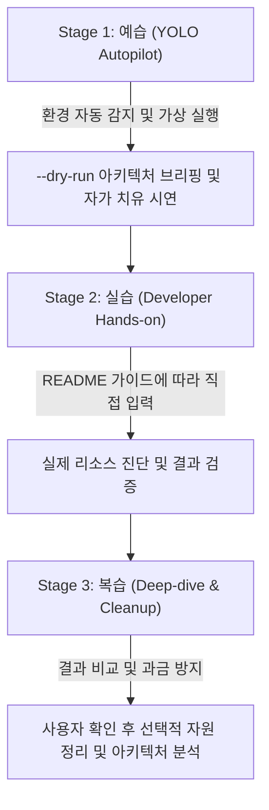

<!--
Copyright 2026 Google LLC. All Rights Reserved.
SPDX-License-Identifier: Apache-2.0

NOTICE: This code/repository is owned by Google LLC and provided under the Apache-2.0 License.
It is strictly provided as an EXAMPLE/REFERENCE ONLY and is NOT INTENDED FOR PRODUCTION USE.
All contents, designs, and code examples are subject to change, modification, or removal at any time without notice.

[고지 사항] 본 저장소 및 문서는 구글 (Google LLC) 소유이며 Apache 2.0 라이선스 하에 예시 (Sample) 용도로 제공된다.
프로덕션 환경용이 아니며, 사전 통지 없이 언제든지 수정, 변경 또는 삭제될 수 있다.
-->

> [!IMPORTANT]
> **구글 (Google LLC) 참조용 샘플 고지 사항**:
> 본 프로젝트의 모든 소스 코드와 문서는 Google LLC의 소유이며, Apache-2.0 라이선스에 따라 오직 **참조용 샘플 (Sample / Reference Only)** 목적으로만 제공된다. 프로덕션 환경에 그대로 사용할 수 없으며, 사전 통지 없이 언제든 내용이 수정, 변경 또는 삭제될 수 있다.

---
name: bigquery-data-agent-semantic-enricher
description: >-
  Autopilot, hands-on diagnostics, and self-healing for bigquery-data-agent-semantic-enricher: BigQuery Data Agent(Gemini in BigQuery, 자연어 기반 SQL 생성 도구, NL2SQL) 도입 시 발생하는 심각한 환각(Hallucination)과 테이블 오...
---

# BigQuery Data Agent 시맨틱 메타데이터 준비도 진단 및 지능형 보강 가이드 (Autopilot & Hands-on Guide)

본 스킬은 고객사 엔지니어와 실무자가 `bigquery-data-agent-semantic-enricher` 미니 프로젝트를 **"예습(YOLO 자율 주행) -> 실습(단계별 핸즈온) -> 복습(심화 검증 및 리소스 정리)"** 3단계 학습 사이클로 완주할 수 있도록 지원하는 실행 가이드다.

**Audience**: `#Architect`, `#DataEngineer`, `#Developer`  
**Concern**: `#Accuracy`, `#GenAI`, `#Governance`, `#Performance`  
**Service**: `#BigQuery`, `#Dataplex`, `#GeminiAPI`, `#KnowledgeCatalog`

---

## 1. 3단계 학습 워크플로우 한눈에 보기



---

## 2. Stage 1: 예습 (YOLO Autopilot 모드)

고객 개발자가 "이 미니 프로젝트 욜로 모드로 먼저 시연해 줘"라고 요청할 때 에이전트가 수행하는 자율 실행 절차다.

### Step 1.1 환경 자동 감지 및 설정 세팅 (Pre-flight)
1. 현재 활성화된 gcloud 프로젝트 및 기본 리전을 확인한다:
   ```bash
   gcloud config get-value project
   gcloud config get-value compute/region
   ```
2. `samples/bigquery-data-agent-semantic-enricher/.env.example`을 참조하여 `samples/bigquery-data-agent-semantic-enricher/.env` 파일이 없을 경우 자동 생성하고, 감지된 프로젝트 ID와 리전으로 기본 세팅을 구성한다.
3. 실행에 필요한 최소 IAM 권한(`roles/bigquery.dataEditor, roles/bigquery.metadataViewer, roles/datacatalog.viewer, roles/dataplex.viewer`) 충족 여부를 안내한다.

### Step 1.2 가상 모의 실행 및 아키텍처 브리핑 (Smoke Test)
실제 클라우드 비용이나 리소스 변경 없이 1초 만에 전체 실행 흐름과 예상 진단 리포트를 화면에 출력한다:
```bash
cd samples/bigquery-data-agent-semantic-enricher
./run.sh --dry-run
```
- 화면에 출력된 진단 결과와 계산 공식, 정상/주의/위험 판단 기준을 사용자에게 간결하게 브리핑한다.

### Step 1.3 장애 해결 및 자가 치유 시연 (Self-healing Showcase)
실제 실행 중 발생할 수 있는 주요 예외 상황과 해결 방법을 실시간으로 중계한다:
- **IAM 권한 부족 (`403 Forbidden`)**: 최소 필요 역할(`roles/bigquery.dataEditor, roles/bigquery.metadataViewer, roles/datacatalog.viewer, roles/dataplex.viewer`) 부여 가이드 제공
- **리소스 부재 또는 설정 누락**: 콘솔 조치 경로 및 파라미터 자동 탐지 과정 설명
- **비대화형 환경 방어**: `sys.stdin.isatty()` 분기에 따라 CI/CD 및 백그라운드 태스크에서 멈춤 없이 기본값으로 안전하게 동작함을 시연

---

## 3. Stage 2: 실습 (Developer Hands-on 단계)

예습을 통해 전체 흐름을 파악한 고객 개발자가 콘솔과 터미널에서 직접 명령어를 수행하는 본 실습 단계다.

### Step 2.1 저장소 이동 및 의존성 확인
```bash
cd samples/bigquery-data-agent-semantic-enricher
cat requirements.txt
```

### Step 2.2 진단 도구 실행
```bash
./run.sh
```
- 특정 프로젝트나 리소스를 지정하여 검사할 경우:
  ```bash
  ./run.sh -p <대상_프로젝트_ID>
  ```

### Step 2.3 진단 리포트 확인 및 조치 가이드 적용
- 터미널에 출력된 진단 표(`PASS`, `WARN`, `FAIL`)를 확인한다.
- `WARN` 또는 `FAIL` 항목이 발생한 경우, 리포트 하단에 제시된 공식 콘솔 URL 및 권장 CLI 명령어를 실행하여 문제를 해결한다.

---

## 4. Stage 3: 복습 (Deep-dive & Cleanup)

### Step 4.1 요구 사항 추적성 및 아키텍처 복습
- `docs/BRD.md`: 비즈니스 요구 사항(`BR-01` 등)이 실제 기술 솔루션으로 어떻게 정의되었는지 확인한다.
- `docs/TDD.md`: 기능(`FR-01` 등) 및 비기능(`NFR-01` 등) 기술 아키텍처와 계층형 캐스케이드 탐색 메커니즘을 복습한다.

### Step 4.2 자원 정리 (Teardown)
> [!IMPORTANT]
> **자동 정리 금지 및 환경 보존 안내**:
> 실습 및 진단 과정에서 확인하거나 조정한 리소스 및 설정은 사용자가 Google Cloud 콘솔에서 직접 확인하고 지속해서 활용할 수 있도록 **절대로 에이전트가 임의로 자동 삭제 또는 원복하지 않는다**.
> 환경 검증을 충분히 마치고 사용자가 명시적으로 정리를 원할 때에만 수동 정리 절차를 안내한다.
