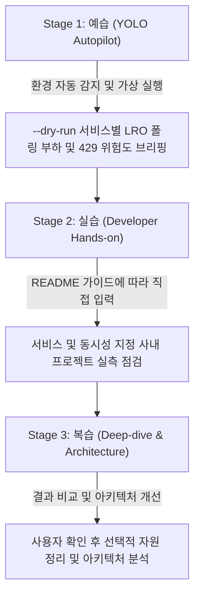

# lro-polling-quota-guard Autopilot & Diagnostic Guide

Google Cloud 비동기 장기 실행 작업(LRO) 파이프라인에서 발생하는 `operation_requests` 쿼터 초과 및 429 오류를 해결하는 에이전트 자율 진단 및 개발자 핸즈온 가이드다.

---

## 1. 3단계 학습 워크플로우 한눈에 보기



---

## 2. Stage 1: 예습 (YOLO Autopilot 모드)

고객 개발자가 "이 미니 프로젝트 욜로 모드로 먼저 시연해 줘"라고 요청할 때 에이전트가 수행하는 자율 실행 절차다.

### Step 1.1 환경 자동 감지 및 설정 세팅 (Pre-flight)
1. 현재 활성화된 gcloud 프로젝트 및 기본 리전을 확인한다:
   ```bash
   gcloud config get-value project
   gcloud config get-value compute/region
   ```
2. `samples/lro-polling-quota-guard/.env.example`을 참조하여 `samples/lro-polling-quota-guard/.env` 파일이 없을 경우 자동 생성하고 기본 설정을 구성한다.
3. 실행에 필요한 최소 IAM 권한(`roles/monitoring.viewer`, `roles/serviceusage.serviceUsageViewer`) 충족 여부를 안내한다.

### Step 1.2 가상 모의 실행 및 아키텍처 브리핑 (Smoke Test)
실제 클라우드 비용이나 리소스 변경 없이 1초 만에 전체 실행 흐름과 예상 진단 리포트를 화면에 출력한다:
```bash
cd samples/lro-polling-quota-guard
./run.sh --dry-run
./run.sh --service document-ai --dry-run
```
- 화면에 출력된 진단 결과와 계산 공식, 정상/주의/위험 판단 기준을 사용자에게 간결하게 브리핑한다.

### Step 1.3 장애 해결 및 자가 치유 시연 (Self-healing Showcase)
실제 실행 중 발생할 수 있는 주요 예외 상황과 해결 방법을 실시간으로 중계한다:
- **메트릭 착시 설명**: 주 작업 지표(예: `BatchRecognize requests`) vs 숨겨진 `operation_requests` 지표 분리 원리 설명
- **SDK 커스텀 Polling 처방**: `polling.DEFAULT_POLLING.with_delay(initial=15.0, maximum=30.0, multiplier=1.5)` 적용 시 85% 이상 호출 절감 시연

---

## 3. Stage 2: 실습 (Developer Hands-on 단계)

예습을 통해 전체 흐름을 파악한 고객 개발자가 콘솔과 터미널에서 직접 명령어를 수행하는 본 실습 단계다.

### Step 2.1 저장소 이동 및 의존성 확인
```bash
cd samples/lro-polling-quota-guard
cat requirements.txt
```

### Step 2.2 진단 도구 실행
```bash
./run.sh
```
- 특정 서비스나 프로젝트, 동시 배치 작업 수를 지정하여 검사할 경우:
  ```bash
  ./run.sh -s document-ai -p <대상_프로젝트_ID> -c 20
  ```

### Step 2.3 진단 리포트 확인 및 조치 가이드 적용
- 터미널에 출력된 진단 표(`[정상]`, `[주의]`, `[위험]`)를 확인한다.
- `[위험]` 항목이 발생한 경우, 리포트 하단에 제시된 SDK 커스텀 Polling 코드 스니펫 및 Google Cloud 콘솔 Quotas 상향 링크를 통해 문제를 해결한다.

---

## 4. Stage 3: 복습 (Deep-dive & Cleanup)

### Step 4.1 요구 사항 추적성 및 아키텍처 복습
- `docs/BRD.md`: 비즈니스 요구 사항(`BR-01` 등)이 실제 기술 솔루션으로 어떻게 정의되었는지 확인한다.
- `docs/TDD.md`: 기능(`FR-01` 등) 및 비기능(`NFR-01` 등) 기술 아키텍처와 계층형 캐스케이드 탐색 메커니즘을 복습한다.

### Step 4.2 자원 정리 (Teardown)
> [!IMPORTANT]
> **자동 정리 금지 및 환경 보존 안내**:
> 실습 및 진단 과정에서 확인하거나 조정한 리소스 및 설정은 사용자가 Google Cloud 콘솔에서 직접 확인하고 지속해서 활용할 수 있도록 **절대로 에이전트가 임의로 자동 삭제 또는 원복하지 않는다**.
> 본 미니 프로젝트는 순수 진단 도구이므로 별도의 리소스 삭제가 필요하지 않다.
