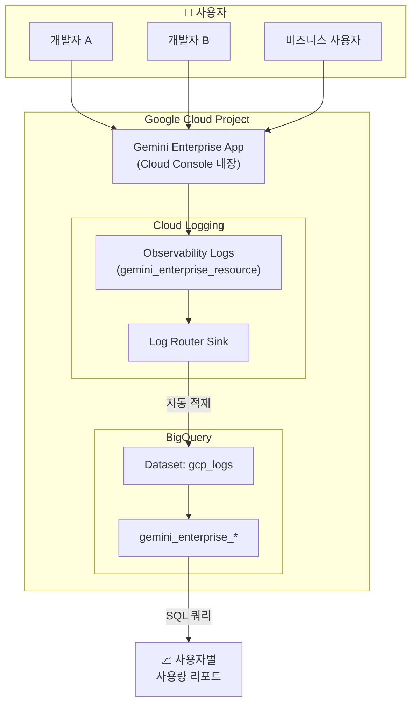

# Google Cloud 0 to 1

```text
.
├─ scripts/
│ └─ gemini-enterprise-usage-by-account.sh # 제미나이 엔터프라이즈 앱 로그 적재 및 사용자 쿼리
└─ README.md
```

---

## 📋 Gemini Enterprise 앱 사용량 모니터링 가이드

이 프로젝트는 **Gemini Enterprise 앱(Gemini for Google Cloud)의 사용량을 사용자별로 모니터링**하는 파이프라인을 구성합니다.

Gemini Enterprise 앱은 Cloud Console에 내장된 AI 어시스턴트로, Observability 로그를 활성화하면 별도의 Data Access 감사 로그 없이도 사용자별 호출 기록을 수집할 수 있습니다.

```
1️⃣ Observability 활성화 → 2️⃣ Cloud Logging 필터 확인 → 3️⃣ Log Sink → BigQuery → 4️⃣ BigQuery SQL 조회
```

### 전체 아키텍처



---

## 🔧 사전 준비

### 필수 조건
- Google Cloud 프로젝트에 Gemini Enterprise 앱이 활성화되어 있을 것
- `gcloud` CLI 설치 및 인증 완료
- 아래 IAM 역할을 가진 계정으로 로그인:
  - `roles/logging.admin` (로그 싱크 생성)
  - `roles/bigquery.admin` (데이터셋 관리)
  - `roles/iam.securityAdmin` (IAM 바인딩 추가)

### gcloud 인증 및 프로젝트 설정

```bash
# 1. gcloud 로그인
gcloud auth login

# 2. 프로젝트 설정 (your-project-id를 실제 프로젝트 ID로 변경)
gcloud config set project your-project-id

# 3. 현재 설정 확인
gcloud config list
```

---

## 🚀 적용 단계 (Step-by-Step)

> ⚠️ **중요**: 아래 모든 명령에서 `your-project-id`를 **실제 Google Cloud 프로젝트 ID**로 반드시 변경하세요.

### Step 1️⃣ — Gemini Enterprise Observability 활성화

Gemini Enterprise 앱의 사용 로그를 수집하려면 **Observability(로깅)를 활성화**해야 합니다. Data Access 감사 로그를 별도로 켤 필요가 없어 **추가 비용 부담이 적습니다.**

#### Google Cloud Console에서 활성화

1. [Gemini 설정 콘솔](https://console.cloud.google.com/gemini/settings)로 이동
2. **Observability** 또는 **Logging** 섹션에서 로깅을 **활성화**
3. 필요 시 Prompts & Responses 로깅도 활성화

#### gcloud CLI로 활성화

```bash
PROJECT_ID="your-project-id"

gcloud gemini logging-settings update default \
  --location=global \
  --project="${PROJECT_ID}" \
  --log-prompts-and-responses
```

---

### Step 2️⃣ — Cloud Logging에서 로그 수집 확인

Observability 활성화 후, Cloud Console에서 Gemini Enterprise 앱을 사용하면 로그가 수집됩니다.

[Cloud Logging 콘솔](https://console.cloud.google.com/logs/query)에서 아래 필터로 확인:

```
resource.type="gemini_enterprise_resource"
```

또는 gcloud CLI로 확인:

```bash
gcloud logging read 'resource.type="gemini_enterprise_resource"' \
  --project="${PROJECT_ID}" \
  --limit=5 \
  --freshness=1d
```

> 💡 **팁**: 로그가 보이지 않는다면 Cloud Console 우측 상단의 **Gemini 💬 아이콘**을 클릭하여 채팅을 한 번 사용한 뒤 **1~2분 후** 다시 확인하세요.

---

### Step 3️⃣ — BigQuery로 로그 싱크(Log Sink) 생성

Cloud Logging의 Gemini Enterprise 로그를 BigQuery 데이터셋으로 자동 전송하는 **Log Router Sink**를 생성합니다.

```bash
PROJECT_ID="your-project-id"
BIGQUERY_DATASET_ID="gcp_logs"
BIGQUERY_LOCATION="asia-northeast3"

# 3-1. BigQuery 데이터셋 생성
bq --location=${BIGQUERY_LOCATION} mk \
  --dataset ${PROJECT_ID}:${BIGQUERY_DATASET_ID}

# 3-2. Gemini Enterprise 앱 로그 싱크 생성
gcloud logging sinks create "gemini-enterprise-logs-sink" \
  "bigquery.googleapis.com/projects/${PROJECT_ID}/datasets/${BIGQUERY_DATASET_ID}" \
  --log-filter='resource.type="gemini_enterprise_resource"' \
  --project="${PROJECT_ID}"
```

### Step 3-b — 싱크 서비스 계정에 BigQuery 권한 부여

Log Sink가 생성되면 자동으로 **Writer Service Account**가 발급됩니다. 이 계정에 BigQuery 데이터셋 쓰기 권한을 부여합니다.

```bash
# 싱크 서비스 계정 확인
SINK_SA=$(gcloud logging sinks describe "gemini-enterprise-logs-sink" \
  --project="${PROJECT_ID}" \
  --format="value(writerIdentity)")

# IAM 바인딩 추가
gcloud projects add-iam-policy-binding "${PROJECT_ID}" \
  --member="${SINK_SA}" \
  --role="roles/bigquery.dataEditor"
```

---

### Step 4️⃣ — BigQuery에서 사용자별 사용량 조회

로그가 BigQuery로 적재되기 시작하면 (보통 **5~10분 소요**) 아래 SQL로 사용자별 사용량을 조회할 수 있습니다.

> ℹ️ **참고**: Log Sink는 BigQuery에 **날짜 샤딩 테이블**(예: `gemini_enterprise_*_20260611`)을 생성합니다. 와일드카드 테이블 조회 시 `_TABLE_SUFFIX`를 사용하여 조회 범위를 제한하세요.

#### BigQuery 콘솔에서 조회

```sql
-- BigQuery 콘솔: https://console.cloud.google.com/bigquery
SELECT 
  jsonPayload.principalEmail AS user_email,
  COUNT(1) AS request_count
FROM `your-project-id.gcp_logs.gemini_enterprise_*`
WHERE _TABLE_SUFFIX >= FORMAT_DATE('%Y%m%d', DATE_SUB(CURRENT_DATE(), INTERVAL 7 DAY))
GROUP BY user_email
ORDER BY request_count DESC;
```

#### CLI로 조회

```bash
bq query --use_legacy_sql=false "
SELECT jsonPayload.principalEmail AS user_email,
       COUNT(1) AS request_count
  FROM \`${PROJECT_ID}.${BIGQUERY_DATASET_ID}.gemini_enterprise_*\`
 WHERE _TABLE_SUFFIX >= FORMAT_DATE('%Y%m%d', DATE_SUB(CURRENT_DATE(), INTERVAL 7 DAY))
 GROUP BY user_email
 ORDER BY request_count DESC;
"
```

> 💡 **팁**: 테이블 이름은 로그가 적재된 후 `bq ls ${PROJECT_ID}:gcp_logs` 명령으로 확인할 수 있습니다. 실제 테이블 이름에 따라 쿼리의 FROM 절과 필드명을 조정하세요.

---

## ⚠️ 주의사항

| 항목 | 설명 |
|---|---|
| **비용** | BigQuery 적재는 무료이나, 쿼리 시 스캔한 데이터량에 따라 비용 발생. `_TABLE_SUFFIX` 필터 필수 사용 |
| **로그 지연** | Observability 활성화 후 실제 로그 수집까지 최대 **수 분** 소요 |
| **리전** | 데이터셋 리전이 `asia-northeast3` (서울)로 설정됨. 필요 시 변경 |
| **Observability vs 감사 로그** | 이 파이프라인은 Gemini Enterprise Observability 로그만 사용. Data Access 감사 로그를 켤 필요 없음 (비용 절감) |

---

## ✅ 적용 체크리스트

- [ ] `PROJECT_ID` 변수를 실제 프로젝트 ID로 변경
- [ ] gcloud 인증 및 프로젝트 설정 완료
- [ ] Gemini Enterprise Observability 활성화
- [ ] Cloud Logging에서 `gemini_enterprise_resource` 로그 수집 확인
- [ ] BigQuery 데이터셋(`gcp_logs`) 생성
- [ ] Log Router Sink(`gemini-enterprise-logs-sink`) 생성 완료
- [ ] Sink 서비스 계정에 BigQuery 권한 부여
- [ ] BigQuery에서 사용자별 사용량 쿼리 정상 동작 확인
