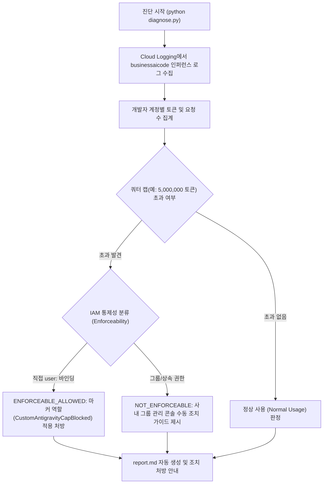

<!--
Copyright 2026 Google LLC. All Rights Reserved.
SPDX-License-Identifier: Apache-2.0

NOTICE: This code/repository is owned by Google LLC and provided under the Apache-2.0 License.
It is strictly provided as an EXAMPLE/REFERENCE ONLY and is NOT INTENDED FOR PRODUCTION USE.
All contents, designs, and code examples are subject to change, modification, or removal at any time without notice.

[고지 사항] 본 저장소 및 문서는 구글 (Google LLC) 소유이며 Apache 2.0 라이선스 하에 예시 (Sample) 용도로 제공된다.
프로덕션 환경용이 아니며, 사전 통지 없이 언제든지 수정, 변경 또는 삭제될 수 있다.
-->

# Google Antigravity 사용자별 사용량 모니터링 및 쿼터 캡 진단기

Google Antigravity(데스크톱, CLI, IDE 확장 프로그램) 환경에서 Cloud Logging 인퍼런스 로그를 기반으로 개발자별 토큰 소비량 및 호출 횟수를 실시간 분석하고, 일일/주간 쿼터 캡(Cap) 초과자를 식별하여 프로젝트 IAM 마커 역할 기반의 안전한 통제 처방을 제공하는 진단 도구다. (As of 2026-09-28)

**Audience**: `#Architect`, `#Developer`, `#FinOps`  
**Concern**: `#Billing`, `#Compliance`, `#IAM`  
**Service**: `#AgentPlatform`, `#CloudLogging`  

---

## 1. 이 가이드가 필요한 상황 (증상 체크리스트)
- [ ] 전사 개발자에게 Google Antigravity를 배포했으나, 특정 헤비 유저가 과도하게 토큰을 소비하여 전체 풀링 쿼터가 조기 소진된다.
- [ ] Google Cloud 콘솔에서 프로젝트 총량만 보이고, 개발자 개인별 토큰(Prompt / Candidate) 소모량 현황을 파악하기 어렵다.
- [ ] 개발자별로 일일 쿼터 상한(예: 500만 토큰)을 설정하고, 초과자를 식별하여 접근을 안전하게 일시 제어하고자 한다.
- [ ] 구글 그룹(`group:`)이나 상위 조직 권한으로 부여된 사용자와 개별 바인딩(`user:`) 사용자를 구분하여 통제 가능 여부를 사전에 파악하고 싶다.

---

## 2. 진단 및 해결 흐름



---

## 3. 사전 준비 사항 및 필요 권한

### (1) 필수 API 활성화 및 관리 콘솔 설정
본 도구가 Cloud Logging을 통해 Antigravity 인퍼런스 지표를 실측하려면 아래 API와 관리 콘솔 로깅 설정이 선행되어야 한다 (스크립트 실행 시 미흡 항목 자동 탐지 및 조치 명령어 안내):

1. **필수 API 활성화**:
   ```bash
   gcloud services enable logging.googleapis.com businessaicode.googleapis.com
   ```
2. **관리 콘솔 개발자 도구 활동 로깅(Metadata Logging)**:
   - Google Workspace / Gemini Enterprise 관리 콘솔(`admin.google.com`) > 생성형 AI / 개발자 도구 설정에서 **'인퍼런스 메타데이터 로깅'**이 켜져 있어야 Cloud Logging으로 토큰 및 사용자 정보가 적재된다.

### (2) 진단 실행 계정 최소 IAM 권한
본 도구는 순수 읽기 전용 진단 스크립트이므로 최소한의 조회 권한만 요구한다:

| 역할 (Role) | 설명 |
| :--- | :--- |
| `roles/logging.viewer` | Cloud Logging 인퍼런스 로그(`businessaicode.googleapis.com`) 조회 권한 |
| `roles/serviceusage.serviceUsageViewer` | 필수 API 활성화 상태 사전 점검 권한 |
| `roles/resourcemanager.viewer` | 프로젝트 IAM 정책 및 사용자 바인딩 상태 확인 권한 |

---

## 4. 1분 퀵스타트

### 가상 모의 실행 (Dry-run) - 예습
실제 GCP 로그 조회 없이 5명 규모의 가상 개발팀 시뮬레이션 데이터를 기반으로 쿼터 캡 판정 및 리포트 생성을 1초 만에 검증한다:
```bash
python diagnose.py --dry-run
```

### 사내 실측 진단 실행 - 실습 및 복습
현재 활성화된 프로젝트의 실데이터를 기반으로 일일 토큰 캡(5,000,000 토큰) 초과자를 진단한다. 진단 결과는 `report.md`에 자동으로 덮어써진다:
```bash
# 기본 활성 프로젝트 점검 (일일 500만 토큰 기준)
python diagnose.py

# 특정 프로젝트 및 커스텀 캡(일일 750만 토큰, 요청 1,500회) 지정
python diagnose.py --project-id=my-dev-project --cap-tokens=7500000 --cap-requests=1500
```

---

## 5. 결과 확인 후 즉각 조치 가이드

### 1단계: 직접 통제 가능 초과자 임시 차단 조치
기본 사용자 역할(`roles/discoveryengine.agentspaceUser`)을 일시 해제하고, 차단 마커 역할(`CustomAntigravityCapBlocked`)을 부여하여 당일 추가 토큰 과금을 즉시 방어한다:
```bash
# 기본 권한 해제
gcloud projects remove-iam-policy-binding [PROJECT_ID] \
    --member="user:[USER_EMAIL]" \
    --role="roles/discoveryengine.agentspaceUser"

# 차단 마커 역할 부여
gcloud projects add-iam-policy-binding [PROJECT_ID] \
    --member="user:[USER_EMAIL]" \
    --role="roles/CustomAntigravityCapBlocked"
```

### 2단계: 그룹 바인딩 계정 수동 거버넌스
`NOT_ENFORCEABLE`로 분류된 사용자는 프로젝트 레벨의 개별 바인딩을 변경해도 그룹 권한으로 인해 접근이 유지된다. 사내 Google Workspace / Cloud Identity 관리 콘솔에서 해당 개발자를 개발팀 그룹에서 일시 제외 조치한다.

### 3단계: 엔터프라이즈 운영 자동화(Batch Job) 연계 안내
본 진단기는 읽기 전용 분석 도구다. 15분 주기 자동 캡 차단 및 매일 자정 복구를 영구 스케줄링하려면 Cloud Scheduler와 Cloud Run Job 또는 Cloud Functions를 연동하여 정기 배치 파이프라인으로 구성 및 배포할 수 있다.

---

## 6. 자원 정리 가이드 (Teardown)
본 도구는 순수 읽기 전용 진단 도구이므로 별도의 클라우드 인프라 자원을 생성하지 않으며, 추가 삭제 절차가 필요하지 않다.
