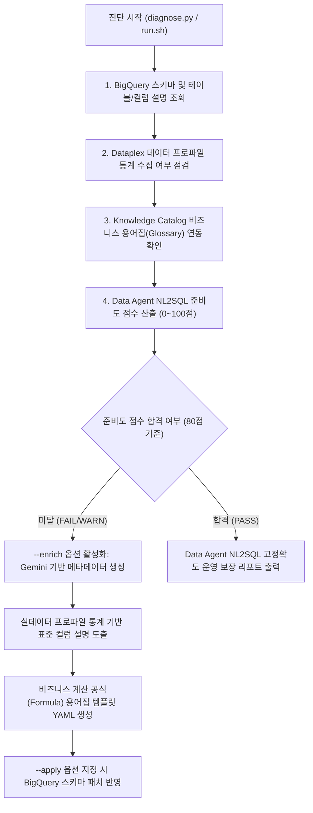

<!--
Copyright 2026 Google LLC. All Rights Reserved.
SPDX-License-Identifier: Apache-2.0

NOTICE: This code/repository is owned by Google LLC and provided under the Apache-2.0 License.
It is strictly provided as an EXAMPLE/REFERENCE ONLY and is NOT INTENDED FOR PRODUCTION USE.
All contents, designs, and code examples are subject to change, modification, or removal at any time without notice.

[고지 사항] 본 저장소 및 문서는 구글 (Google LLC) 소유이며 Apache 2.0 라이선스 하에 예시 (Sample) 용도로 제공된다.
프로덕션 환경용이 아니며, 사전 통지 없이 언제든지 수정, 변경 또는 삭제될 수 있다.
-->

> [!IMPORTANT]
> **구글 (Google LLC) 참조용 샘플 고지 사항**:
> 본 프로젝트의 모든 소스 코드와 문서는 Google LLC의 소유이며, Apache-2.0 라이선스에 따라 오직 **참조용 샘플 (Sample / Reference Only)** 목적으로만 제공된다. 프로덕션 환경에 그대로 사용할 수 없으며, 사전 통지 없이 언제든 내용이 수정, 변경 또는 삭제될 수 있다.

# BigQuery Data Agent 시맨틱 메타데이터 준비도 진단 및 지능형 보강 가이드

BigQuery Data Agent(Gemini in BigQuery, 자연어 기반 SQL 생성 도구, NL2SQL) 도입 시 발생하는 심각한 환각(Hallucination)과 테이블 오라우팅 문제를 해결하기 위해, 대상 데이터셋의 테이블 및 컬럼 설명, Dataplex 데이터 프로파일링 통계, Knowledge Catalog 비즈니스 용어집(Glossary) 계산 공식 바인딩 상태를 종합 진단하고 지능적으로 보강(Enrichment)하는 실무 진단 도구다. (As of 2026-09-10)

**Audience**: `#Architect`, `#DataEngineer`, `#Developer`  
**Concern**: `#Accuracy`, `#GenAI`, `#Governance`, `#Performance`  
**Service**: `#BigQuery`, `#Dataplex`, `#GeminiAPI`, `#KnowledgeCatalog`

---

## 1. 이 가이드가 필요한 상황 (증상 체크리스트)

다음과 같은 현상이 운영 또는 개발 환경에서 발생하고 있다면 즉시 본 진단 도구를 구동해야 한다:

- [ ] 자연어 질문 입력 시 Data Agent가 유사한 스키마를 가진 다른 테이블을 잘못 조인하거나 참조하는 경우
- [ ] 컬럼 설명(Description)이 비어 있어 LLM이 축약어(예: `amt`, `diff_qty`, `stat_cd`)의 의미를 임의로 날조하여 필터링하는 경우
- [ ] 순매출, 할인율, 결품 예상 시간 등 비즈니스 계산 공식(Formula)이 명시되지 않아 임의의 수식으로 계산 결과를 왜곡하는 경우
- [ ] Dataplex 데이터 프로파일링(Null 비율, 고유값 목록, 최솟값 및 최댓값)이 수행되지 않아 유효하지 않은 조건절을 생성하는 경우
- [ ] 수십 개 테이블의 메타데이터를 수작업으로 채우기 어려워 Data Agent 전사 확산이 지연되는 경우

---

## 2. 진단 및 해결 흐름



---

## 3. 사전 준비 사항 (필요 IAM 권한)

진단 및 메타데이터 보강을 실행하기 위해 사용자 계정 또는 서비스 계정에 요구되는 최소 IAM 권한은 다음과 같다:

| 역할 (Role) | 권한 (Permission) | 용도 |
| :--- | :--- | :--- |
| `roles/bigquery.metadataViewer` | `bigquery.tables.get`, `bigquery.tables.list` | 데이터셋 및 테이블 스키마, 기존 설명 조회 |
| `roles/bigquery.dataEditor` | `bigquery.tables.update` | 메타데이터 보강(`--apply`) 시 스키마 설명 반영 |
| `roles/dataplex.viewer` | `dataplex.dataScans.get`, `dataplex.dataScans.list` | 데이터 프로파일 스캔 결과 조회 |
| `roles/datacatalog.viewer` | `datacatalog.entries.get`, `datacatalog.glossaries.get` | 비즈니스 용어집 및 엔트리 바인딩 확인 |

---

## 4. 1분 퀵스타트

### 4.1 가상 실행 모드 (Dry-run 스모크 테스트)
실제 GCP 인증이나 프로젝트 권한이 없는 환경에서도 모의 데이터셋을 통해 3초 만에 진단 및 보강 시뮬레이션을 체험할 수 있다:

```bash
# 1. 시뮬레이션 진단 리포트 출력
python3 diagnose.py --dry-run

# 2. 지능형 메타데이터 보강 계획 및 용어집 YAML 생성 확인
python3 diagnose.py --dry-run --enrich
```

### 4.2 실제 환경 1클릭 실행 (Cloud Shell 및 로컬 터미널)

```bash
# 1. 원본 저장소 클론 및 디렉터리 이동
git clone https://github.com/jiangjun-forge/google-cloud-0-to-1.git
cd google-cloud-0-to-1/samples/bigquery-data-agent-semantic-enricher

# 2. 환경 변수 파일 복사 및 설정
cp .env.example .env
# vi .env (PROJECT_ID, DATASET_ID 입력)

# 3. 데이터셋 준비도 진단 실행
./run.sh --project=$PROJECT_ID --dataset=$DATASET_ID

# 4. 시맨틱 메타데이터 지능형 보강 계획 수립 및 템플릿 생성
./run.sh --project=$PROJECT_ID --dataset=$DATASET_ID --enrich

# 5. 생성된 메타데이터를 실제 BigQuery 테이블 스키마에 영구 반영
./run.sh --project=$PROJECT_ID --dataset=$DATASET_ID --enrich --apply
```

---

## 5. 결과 출력 예시

```text
==========================================================================================
BigQuery Data Agent 시맨틱 메타데이터 준비도 진단 결과 표
대상 데이터셋: cymbal_gold
==========================================================================================
테이블 ID                              테이블 설명       컬럼 설명율         데이터 프로파일       용어집 바인딩
------------------------------------------------------------------------------------------
pos_transactions_gold               X (누락/부실)    2/18 (11%)     X (미수행)        X (미연동)
gold_inventory_reconciliation_ledger X (누락/부실)    1/14 (7%)      X (미수행)        X (미연동)
pos_anomaly_alerts                  O (적합)       3/11 (27%)     O (수집됨)        X (미연동)
historical_transactional_data       X (누락/부실)    0/22 (0%)      X (미수행)        X (미연동)
------------------------------------------------------------------------------------------

[영역별 평가 세부 내역 및 준비도 점수]
1. 테이블 수준 설명 (Table Description)    : 1/4개 충족 -> 7.5 / 30.0점
2. 컬럼 수준 설명 (Column Description)      : 6/65개 충족 -> 2.8 / 30.0점
3. 데이터 프로파일 통계 (Data Profile Stats) : 1/4개 수집 -> 5.0 / 20.0점
4. 비즈니스 용어집 공식 (Glossary Formula)   : 0/4개 연동 -> 0.0 / 20.0점
------------------------------------------------------------------------------------------
종합 준비도 점수: 15.3 / 100.0점  [FAIL (미달: Data Agent 라우팅 실패 및 SQL 수식 날조 위험 극심)]
==========================================================================================

==========================================================================================
Gemini 및 Dataplex 기반 시맨틱 메타데이터 지능형 보강 계획 (Enrichment Plan)
==========================================================================================

[1. 테이블: pos_transactions_gold]
  * 추천 테이블 표준 설명 (AI 라우팅 최적화):
    "Real-time streaming intraday POS sales transactions with customer PII for daily store revenue and sales KPI monitoring."
  * 누락 컬럼 표준 설명 및 제약조건 자동 보강 내역:
    - subtotal_amount     : Pre-tax merchandise item subtotal before any discounts are deducted. Valid range: >= 0.00.
    - discount            : Promotional or coupon discount amount subtracted from subtotal. Range: >= 0.00.
    - tax_amount          : Local and state sales tax applied to transaction.
    - total               : Final net payment collected. Formula: subtotal_amount - discount + tax_amount. Must match tender total.
    - tender_type         : Primary payment method (Enum: CASH, CREDIT_CARD, MOBILE_PAY, GIFT_CARD).
  * Dataplex 비즈니스 용어집(Glossary) 계산 공식 매핑:
    - 공식: Net Revenue = subtotal_amount - discount + tax_amount (Filter: total > 0)
```

---

## 6. 결과 확인 후 즉각 조치 가이드

1. **테이블 및 컬럼 설명 패치 확인**:
   - Google Cloud 콘솔 BigQuery Studio에서 대상 테이블의 스키마 탭을 확인하여 각 필드에 구체적인 비즈니스 설명과 유효 범위가 반영되었는지 검증한다.
   - BigQuery Studio 콘솔 ( https://console.cloud.google.com/bigquery )
2. **Dataplex 데이터 프로파일링 실행**:
   - 통계 지표가 없는 테이블은 Dataplex Data Profile 스캔을 등록하고 실행하여 최솟값, 최댓값, 고유값 비율을 카탈로그에 게시한다.
   - Dataplex Data Profile 안내 ( https://cloud.google.com/dataplex/docs/data-profiling-overview )
3. **Knowledge Catalog 비즈니스 용어집 등록**:
   - 생성된 `dataplex_glossary_terms.yaml` 템플릿을 참조하여 Dataplex Knowledge Catalog에 비즈니스 용어와 계산 수식(`Formula`)을 등록하고 관련 테이블에 바인딩한다.
   - Dataplex Business Glossary 콘솔 ( https://console.cloud.google.com/dataplex/business-glossaries )

---

## 7. 자원 정리 (Teardown) 가이드

본 진단 도구는 BigQuery 스키마 메타데이터 및 카탈로그 설명만을 점검하고 보강하므로, 별도의 컴퓨팅 인스턴스나 영구 스토리지 과금을 유발하지 않는다.
가상 실행 과정에서 생성된 샘플 용어집 YAML 파일은 아래 명령어로 삭제한다:

```bash
rm -f dataplex_glossary_terms*.yaml
```

---

## 8. 관련 규격 문서

- [비즈니스 요구 사항 명세서 (BRD.md)](docs/BRD.md)
- [기술 상세 설계서 (TDD.md)](docs/TDD.md)
