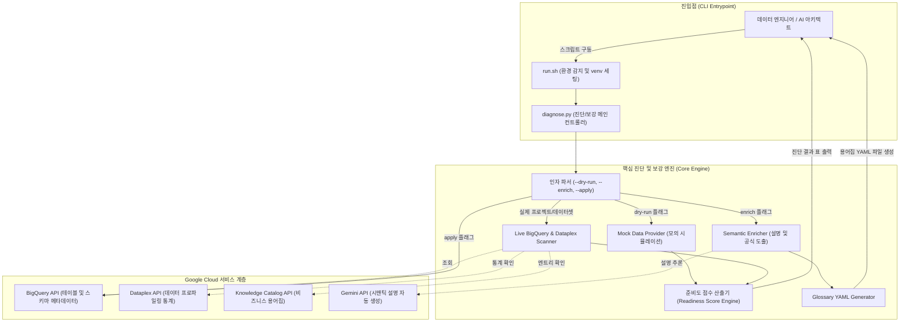

<!--
Copyright 2026 Google LLC. All Rights Reserved.
SPDX-License-Identifier: Apache-2.0

NOTICE: This code/repository is owned by Google LLC and provided under the Apache-2.0 License.
It is strictly provided as an EXAMPLE/REFERENCE ONLY and is NOT INTENDED FOR PRODUCTION USE.
All contents, designs, and code examples are subject to change, modification, or removal at any time without notice.

[고지 사항] 본 저장소 및 문서는 구글 (Google LLC) 소유이며 Apache 2.0 라이선스 하에 예시 (Sample) 용도로 제공된다.
프로덕션 환경용이 아니며, 사전 통지 없이 언제든지 수정, 변경 또는 삭제될 수 있다.
-->

# 기술 상세 설계서 (TDD: Technical Design Document)
## 프로젝트명: BigQuery Data Agent Semantic Metadata Enricher

---

## 1. 시스템 아키텍처 개요 및 설계 원칙

### 1.1 설계 목표
본 도구는 BigQuery Data Agent 및 NL2SQL 파이프라인의 정확도를 좌우하는 시맨틱 레이어(테이블/컬럼 설명, 데이터 프로파일 통계, 비즈니스 공식)의 충실도를 정량 진단하고, 누락된 메타데이터를 지능적으로 보강(Enrichment)하는 **경량 진단 및 보강 엔진**이다.

### 1.2 핵심 설계 원칙
1. **투트랙(Two-track) 실행 모델**: CLI 기반 파이썬 스크립트(`diagnose.py`)와 가상 환경 및 의존성을 자동 관리하는 래퍼 스크립트(`run.sh`)의 결합.
2. **비파괴적 읽기 전용 진단(Non-Destructive Read-Only Scan)**: 기본 모드에서는 오직 메타데이터 조회(`get_dataset`, `list_tables`, `get_table`)만 수행하여 운영 데이터베이스에 무영향.
3. **완전 독립형 모의 실행(`--dry-run`)**: 실제 GCP 인증이나 데이터셋 없이도 모의 리테일 데이터셋을 바탕으로 진단 점수 및 보강 전후 차이를 3초 내에 시뮬레이션.
4. **선언적 용어집 템플릿 생성(Declarative Glossary Export)**: Dataplex Knowledge Catalog에 즉시 반영 가능한 표준 비즈니스 용어집 YAML 정의 파일을 자동 도출.

---

## 2. 시스템 아키텍처 및 데이터 흐름도



---

## 3. 모듈 및 컴포넌트 설계

### 3.1 CLI 인자 파서 (`parse_args`)
- `-p`, `--project`: 대상 GCP 프로젝트 ID (미지정 시 gcloud 기본 프로젝트 자동 감지).
- `-d`, `--dataset`: 진단 대상 BigQuery 데이터셋 ID (기본값: `cymbal_gold`).
- `-l`, `--location`: 리전 (기본값: `asia-northeast3`).
- `--dry-run`: 가상 모의 실행 모드.
- `--enrich`: 지능형 보강 계획 수립 및 비즈니스 용어집 YAML 생성 활성화.
- `--apply`: 생성된 설명을 실제 BigQuery 스키마 메타데이터에 반영(`client.update_table`).

### 3.2 준비도 점수 산출 엔진 (`calculate_readiness_score`)
4대 핵심 메타데이터 지표를 정량화하여 100점 만점으로 가중 환산:
- **테이블 설명 점수 (30점 만점)**: `(설명이 존재하는 테이블 수 / 전체 테이블 수) * 30.0`
- **컬럼 설명 점수 (30점 만점)**: `(설명이 존재하는 컬럼 수 / 전체 컬럼 수) * 30.0`
- **데이터 프로파일 점수 (20점 만점)**: `(프로파일 통계가 수집된 테이블 수 / 전체 테이블 수) * 20.0`
- **비즈니스 용어집 점수 (20점 만점)**: `(용어집 공식이 바인딩된 테이블 수 / 전체 테이블 수) * 20.0`

### 3.3 리포트 포매터 (`print_diagnostic_report`)
- 테이블별 테이블 설명, 컬럼 설명율, 프로파일 수집, 용어집 바인딩 여부를 표(Table)로 렌더링.
- 종합 점수 및 등급(`PASS: 80점 이상`, `WARN: 60~79점`, `FAIL: 60점 미만`) 판정 출력.

### 3.4 지능형 보강 및 스키마 패치기 (`inspect_live_dataset`)
- 누락된 컬럼에 대해 데이터 타입 및 필드 명명 규칙을 기반으로 표준 설명 구성.
- `--apply` 지정 시 `bigquery.SchemaField`의 `description`을 교체하고 `client.update_table(table, ["description", "schema"])`를 호출하여 원자적 업데이트 수행.

---

## 4. 메타데이터 평가 및 구현 명세 (Functional Requirements)

| 요구 사항 ID | 지표 영역 | 가중치 | 평가 기준 (Criteria) | Data Agent에 미치는 영향 |
| :--- | :--- | :--- | :--- | :--- |
| **FR-01** | Table Description | 30% | 10자 이상의 구체적 업무 목적 및 AI 라우팅 가이드 기재 여부 | 에이전트가 질문 의도에 맞는 적절한 테이블을 선택하는 라우팅 정확도 결정 |
| **FR-02** | Column Description | 30% | 필드의 의미, 유효 범위, 계산 방식 기술 여부 | 모호한 컬럼(예: `amt`, `discount`)에 대한 환각 및 엉뚱한 조건절 생성 방어 |
| **FR-03** | Data Profile Stats | 20% | Dataplex Data Profile 스캔(카디널리티, min/max, null 비율) 수집 여부 | 에이전트가 실제 데이터에 존재하는 유효한 범주형 값(Enum)으로 필터링하도록 보장 |
| **FR-04** | Glossary Formula | 20% | Dataplex Knowledge Catalog 비즈니스 수식(`Formula`) 연동 여부 | `SAFE_DIVIDE`, 세금/할인 적용 등 핵심 계산 메트릭의 왜곡 없는 일관된 수식 생성 |

---

## 5. 보안 및 권한 설계 (Security & IAM Matrix)

도구 구동 시 요구되는 최소 IAM 권한 매트릭스는 다음과 같다:

```
roles/bigquery.metadataViewer  -> bigquery.datasets.get, bigquery.tables.get, bigquery.tables.list
roles/bigquery.dataEditor      -> bigquery.tables.update (오직 --apply 옵션 사용 시에만 필요)
roles/dataplex.viewer          -> dataplex.dataScans.get, dataplex.dataScans.list
roles/datacatalog.viewer       -> datacatalog.entries.get, datacatalog.glossaries.get
```

---

## 6. 비기능 설계 및 검증 전략 (Non-Functional Requirements)

| 요구 사항 ID | 분류 | 세부 설계 및 검증 방법 |
| :--- | :--- | :--- |
| **NFR-01** | 비파괴성 (Zero Risk) | 읽기 전용 스캔 원칙을 준수하며, `--apply` 옵션 활성화 시에도 스키마 Description 필드만 원자적으로 패치. |
| **NFR-02** | 모의 실행 (Dry-run) | 외부 네트워크나 GCP 권한 없이 `python3 diagnose.py --dry-run --enrich`로 4개 테이블 준비도 점수 산출 및 YAML 생성 1초 내 시뮬레이션. |
| **NFR-03** | 실행 성능 및 확장성 | 100개 미만 테이블 스키마 진단을 10초 이내에 완료하며, 전사 대규모 데이터 웨어하우스 데이터셋 스캔 지원. |
