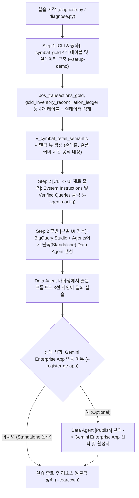

<!--
Copyright 2026 Google LLC. All Rights Reserved.
SPDX-License-Identifier: Apache-2.0

NOTICE: This code/repository is owned by Google LLC and provided under the Apache-2.0 License.
It is strictly provided as an EXAMPLE/REFERENCE ONLY and is NOT INTENDED FOR PRODUCTION USE.
All contents, designs, and code examples are subject to change, modification, or removal at any time without notice.

[고지 사항] 본 저장소 및 문서는 구글 (Google LLC) 소유이며 Apache 2.0 라이선스 하에 예시 (Sample) 용도로 제공된다.
프로덕션 환경용이 아니며, 사전 통지 없이 언제든지 수정, 변경 또는 삭제될 수 있다.
-->

> [!IMPORTANT]
> **구글 (Google LLC) 참조용 샘플 고지 사항**:
> 본 프로젝트의 모든 소스 코드와 문서는 Google LLC의 소유이며, Apache-2.0 라이선스에 따라 오직 **참조용 샘플 (Sample / Reference Only)** 목적으로만 제공된다. 프로덕션 환경에 그대로 사용할 수 없으며, 사전 통지 없이 언제든 내용이 수정, 변경 또는 삭제될 수 있다.

# BigQuery Conversational Analytics Data Agent 45분 완성 스타터 가이드 (Standalone & Optional GE App)

45분 핸즈온 워크숍 내에 참석자가 명령어 한 줄(`--setup-demo`)로 BigQuery 스몰셋 데이터셋(`cymbal_gold`)과 실데이터를 10초 만에 자동 구축하고, BigQuery Studio 내 Agents (Agent Catalog)에서 대화형 분석 에이전트인 Conversational Analytics Data Agent를 단독(Standalone)으로 생성 및 멀티턴 대화 질의를 실습하며, 필요 시 선택 사항(Optional)으로 Gemini Enterprise App에 게시하여 전사 대화 포털 시나리오를 즉시 시연할 수 있도록 설계된 실무 워크숍 스타터 키트다. (As of 2026-09-14)

**Audience**: `#Architect`, `#DataEngineer`, `#Developer`  
**Concern**: `#GenAI`, `#Governance`, `#Performance`  
**Service**: `#AgentPlatform`, `#BigQuery`, `#GeminiAPI`, `#VertexAI`

---

## 1. 이 가이드가 필요한 상황 (증상 체크리스트)

다음과 같은 요구 사항이 워크숍이나 사내 PoC에서 발생하고 있다면 즉시 본 스타터 키트를 활용해야 한다:

- [ ] 45분 내외의 짧은 핸즈온 세션 동안 참석자들이 BigQuery 데이터 준비부터 BigQuery Data Agent 생성 및 자연어 질의응답까지 막힘 없이 완주해야 하는 경우
- [ ] Gemini Enterprise App에 올리지 않고 BigQuery Studio 내에서 단독(Standalone)으로 Data Agent를 쓰는 고객과, Gemini Enterprise App에 게시(Publish)하려는 고객 모두를 하나의 워크숍 키트로 지원해야 하는 경우
- [ ] 별도의 GCP 과금이나 권한 부여 전, 가상 실행(`--dry-run`)으로 전체 SQL DDL/DML과 에이전트 시스템 지침을 사전 검토하고자 하는 경우

---

## 2. 45분 핸즈온 실습 흐름



---

## 3. 사전 준비 사항 (필요 IAM 권한)

45분 핸즈온 실습을 위해 참석자 계정 또는 서비스 계정에 요구되는 최소 IAM 권한은 다음과 같다:

| 역할 (Role) | 권한 (Permission) | 용도 |
| :--- | :--- | :--- |
| `roles/bigquery.dataEditor` | `bigquery.datasets.create`, `bigquery.tables.create` | `--setup-demo` 실행 시 `cymbal_gold` 4개 테이블, 실데이터, 시맨틱 뷰 생성 |
| `roles/bigquery.jobUser` | `bigquery.jobs.create` | BigQuery 쿼리 실행 및 Data Agent 시맨틱 뷰 조회 |
| `roles/geminidataanalytics.dataAgentCreator` | `geminidataanalytics.dataAgents.create` | BigQuery Studio > Agents (Agent Catalog)에서 BigQuery Data Agent 생성 및 관리 (UI 전용) |
| `roles/discoveryengine.admin` | `discoveryengine.engines.update`, `discoveryengine.agents.create` | `[선택 사항]` 생성된 Data Agent를 Gemini Enterprise App에 게시 및 활성화할 경우에만 필요 |

---

## 4. 45분 타임어택 핸즈온 실습 단계별 가이드

### 4.1 실습 환경 준비 (저장소 클론 및 디렉터리 이동)
Cloud Shell 또는 로컬 터미널에서 저장소를 클론하고 실습 샘플 디렉터리로 이동한다:

```bash
git clone https://github.com/jiangjun-forge/google-cloud-0-to-1.git
cd google-cloud-0-to-1/samples/bigquery-data-agent-starter
```

### 4.2 사전 가상 검증 모드 (Dry-run 스모크 테스트)
실제 GCP API 호출 없이 45분 실습 전체 흐름과 자동 생성될 SQL, UI 붙여넣기용 지침을 1초 만에 미리 확인할 수 있다:

```bash
# 전체 45분 워크숍 가이드 및 골든 프롬프트 3선 시뮬레이션
python diagnose.py --dry-run

# 스몰셋 테이블 생성 DDL 및 샘플 데이터 INSERT SQL 사전 확인
python diagnose.py --dry-run --setup-demo
```

### 4.3 Step 1 (00~05분, CLI 자동화): 스몰셋 데이터셋(`cymbal_gold`) 원클릭 구축
아래 명령어를 실행하면 BigQuery 데이터셋(`cymbal_gold`), 4개 스몰셋 테이블(`pos_transactions_gold`, `gold_inventory_reconciliation_ledger`, `pos_anomaly_alerts`, `historical_transactional_data`), 실제 샘플 데이터, 시맨틱 뷰(`v_cymbal_retail_semantic`)가 10초 내에 자동으로 구축된다:

```bash
# cymbal_gold 데이터셋 + 4개 테이블 + 실데이터 + 시맨틱 뷰 원클릭 구축
python diagnose.py --setup-demo
```

### 4.4 Step 2 (05~25분, 콘솔 UI 전용): BigQuery Studio > Agents (Agent Catalog) 단독(Standalone) 에이전트 생성
BigQuery Data Agent 생성 및 테이블/뷰 연결은 `gcloud` CLI 명령어가 지원되지 않으므로 콘솔 UI에서 진행한다. 먼저 아래 명령어를 실행하여 콘솔 UI에 복사하여 붙여넣을 **System Instructions**와 **Verified Queries**를 화면에 출력한다:

```bash
# BigQuery Studio > Agents 입력용 System Instructions 및 Verified Queries 출력
python diagnose.py --agent-config
```
- **콘솔 UI 클릭 순서**:
  1. Google Cloud 콘솔 > BigQuery 좌측 탐색 바에서 **Agents (에이전트 / Agent Catalog)** 메뉴를 클릭한다.
  2. 상단 **[+ Create Data Agent (데이터 에이전트 만들기)]** 버튼을 클릭한다.
  3. 에이전트 이름에 `cymbal-retail-data-agent`를 입력한다.
  4. **[Select data sources (데이터 소스 선택)]**에서 `cymbal_gold.v_cymbal_retail_semantic` 뷰(또는 4개 원천 테이블)를 체크한다.
  5. **[Instructions (지침)]** 입력란에 터미널에 출력된 **System Instructions**를 복사하여 붙여넣는다.
  6. **[Verified Queries (검증된 쿼리)]** 탭에서 터미널에 출력된 질문-SQL 2쌍을 추가한 후 **[Save (저장)]**를 클릭한다.
  7. 우측 대화창에서 즉시 단독(Standalone)으로 아래 **골든 프롬프트 3선**을 입력하여 자연어 SQL 생성 및 응답을 검증한다.
  8. 참조 문서: BigQuery Conversational Analytics 가이드 ( https://cloud.google.com/bigquery/docs/conversational-analytics )

### 4.5 Step 3 (선택 사항 / Optional): Gemini Enterprise App에 Data Agent 게시 및 A2A 연동
BigQuery Studio 내 단독 사용으로 충분한 경우 본 단계는 건너뛸 수 있다. 에이전트를 Gemini Enterprise 웹 앱 대화창에 붙여 전사 공유하고자 할 때만 아래 명령어로 최신 UI 절차를 확인하고 진행하라:

```bash
# [선택 사항] Gemini Enterprise App 게시 및 A2A 연동 콘솔 UI 절차 출력
python diagnose.py --register-ge-app --app-id <대상_GE_APP_ID>
```
- **콘솔 UI 최신 연동 절차 (A2A 프로토콜 기반)**:
  1. **BigQuery Studio > Agents (Agent Card JSON 복사)**:
     - 좌측 메뉴에서 **Agents (에이전트 / Agent Platform)**로 이동하여 생성한 `cymbal-retail-data-agent` 상세 페이지로 진입한다.
     - 상단 또는 설정 메뉴에서 **[Publish (게시)]**를 완료한 후 제공되는 **Agent Card (A2A JSON 명세)** 텍스트를 복사한다. (에이전트 엔드포인트, 기능 명세 및 인증 스키마 포함)
  2. **Gemini Enterprise 관리 콘솔에서 A2A 커스텀 에이전트 등록**:
     - Google Cloud 콘솔 탐색 메뉴에서 **Gemini Enterprise** (또는 **Agent Platform > Applications**)로 이동하여 대상 웹 앱(`omni-retail-ge-app`)을 선택한다.
     - 앱 관리 화면 좌측 메뉴에서 **[Agents (에이전트)]** 탭으로 이동한 뒤, 상단 **[+ Add agent (에이전트 추가)]** 버튼을 클릭한다.
     - "Choose an agent type" 화면에서 **[Custom agent via A2A (A2A 기반 맞춤 에이전트)]** 항목의 **[Add (추가)]** 버튼을 선택한다.
     - 입력창에 방금 복사한 **Agent Card JSON**을 붙여넣고, 필요한 인증 옵션을 확인한 후 **[Save / Register]**를 클릭한다.
     - 등록 완료 후 목록에서 에이전트의 상태 토글이 **[Enabled (활성)]**인지 확인한다.
  3. **대화창 호출 검증**:
     - 좌측 **[Preview (미리보기)]** 또는 발행된 Gemini Enterprise 웹 앱 대화창에서 `cymbal-retail-data-agent`를 멘션하거나 자연어로 골든 프롬프트를 질문하여 정상 연동을 검증한다.
  4. 참조 문서: BigQuery 데이터 에이전트 및 Gemini Enterprise A2A 에이전트 연동 가이드 ( https://cloud.google.com/bigquery/docs/conversational-analytics )

---

## 5. 실습 검증용 골든 프롬프트 3선

- **골든 프롬프트 1 (지점 및 결제 수단별 순매출 비교)**:
  ```text
  지점(store_branch) 및 결제 수단(tender_type)별 총상품 금액(subtotal_amount), 할인 금액(discount), 세금(tax_amount)을 반영한 순매출(Net Revenue)을 비교해 줘.
  ```
- **골든 프롬프트 2 (결품 예상 커버 시간 6시간 이하 긴급 보충 품목 탐지)**:
  ```text
  현재 진열 재고(shelf_qty)와 창고 재고(backroom_qty) 합계를 시간당 판매 속도로 나눴을 때, 결품 예상 커버 시간(est_cover_hours)이 6시간 이하인 긴급 보충 대상 지점과 품목(item_sku)을 알려 줘.
  ```
- **골든 프롬프트 3 (캐셔 프로모션 임의 할인 남용 이상 거래 진단)**:
  ```text
  이상 거래 경보 테이블(pos_anomaly_alerts)에서 프로모션 남용(cashier_promo_abuse) 경보가 발생한 지점과 담당 캐셔 ID, 심각도(severity)를 보여 줘.
  ```

---

## 6. 자원 정리 (Teardown)

45분 핸즈온 실습이 끝난 후 불필요한 클라우드 리소스 과금을 예방하기 위해 아래 명령어로 스몰셋 데이터셋을 즉시 정리한다:

```bash
# 생성된 실습 데이터셋(cymbal_gold) 및 하위 테이블/뷰 일괄 삭제
python diagnose.py --teardown
```
