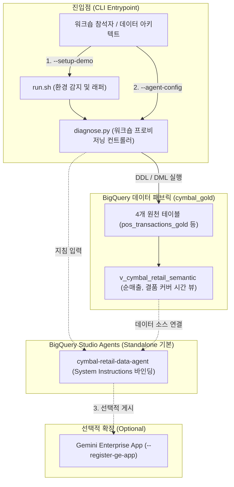

<!--
Copyright 2026 Google LLC. All Rights Reserved.
SPDX-License-Identifier: Apache-2.0

NOTICE: This code/repository is owned by Google LLC and provided under the Apache-2.0 License.
It is strictly provided as an EXAMPLE/REFERENCE ONLY and is NOT INTENDED FOR PRODUCTION USE.
All contents, designs, and code examples are subject to change, modification, or removal at any time without notice.

[고지 사항] 본 저장소 및 문서는 구글 (Google LLC) 소유이며 Apache 2.0 라이선스 하에 예시 (Sample) 용도로 제공된다.
프로덕션 환경용이 아니며, 사전 통지 없이 언제든지 수정, 변경 또는 삭제될 수 있다.
-->

# 기술 상세 설계서 (TDD: Technical Design Document)
## 프로젝트명: BigQuery Data Agent 45-Minute Hands-on Starter Kit (Standalone & Optional GE App)

---

## 1. 시스템 아키텍처 개요 및 설계 원칙

### 1.1 설계 목표
본 도구는 45분 핸즈온 워크숍 참석자가 BigQuery 스몰셋 데이터셋(`cymbal_gold`) 구축부터 BigQuery Data Agent 단독(Standalone) 생성, 선택적 Gemini Enterprise App 연동 및 골든 프롬프트 3선 검증까지 수행할 수 있도록 지원하는 **경량 워크숍 프로비저닝 및 연동 가이드 엔진**이다.

### 1.2 핵심 설계 원칙
1. **투트랙(Two-track) 실행 모델**: CLI 기반 파이썬 컨트롤러(`diagnose.py`)와 환경 변수 및 가상 환경을 자동 감지하는 배시 래퍼(`run.sh`) 결합.
2. **계층형 캐스케이드 설정 탐색(Cascade Fallback)**: CLI 인자 > `.env` > `gcloud config` > 대화형 번호 선택기(`interactive_select`) > 사내 권장 기본값(`asia-northeast3`) 순으로 무중단 설정 확정.
3. **독립 완결성(Zero Dependency)**: 외부 모듈이나 다른 샘플에 대한 코드 의존성 없이 100% 자체 완결적으로 동작.
4. **Standalone 기본 / GE App 선택형 구조**: BigQuery Studio 내 Agents (Agent Catalog) 단독 실습을 기본으로 하고, Gemini Enterprise App 연동(`--register-ge-app`)은 선택적 확장 단계로 구성.

---

## 2. 시스템 아키텍처 및 데이터 흐름도

---

## 3. 기능적 기술 요구 사항 명세 (Functional Requirements)

| 요구 사항 ID | 구현 모듈 | 상세 기술 설계 명세 |
| :--- | :--- | :--- |
| **FR-01** | `resolve_config` | CLI 인자, `.env`, `gcloud config get-value project`를 순차 탐색하고, 미지정 시 `sys.stdin.isatty()` 기반 번호 선택기를 제공하여야 한다. |
| **FR-02** | `setup_smallset_demo` | `cymbal_gold` 데이터셋 내에 4개 테이블(`pos_transactions_gold`, `gold_inventory_reconciliation_ledger`, `pos_anomaly_alerts`, `historical_transactional_data`) DDL과 샘플 데이터 `INSERT INTO`, `v_cymbal_retail_semantic` 뷰 SQL을 BigQuery API로 실행하여야 한다. |
| **FR-03** | `export_data_agent_config` | 순매출 및 결품 커버 시간 공식이 명시된 System Instructions와 Verified Queries를 출력하여야 한다. |
| **FR-04** | `register_agent_to_ge_app` | BigQuery Studio Agents에서 Gemini Enterprise로 게시하는 UI 단계를 선택 사항(Optional)으로 안내하여야 한다. |
| **FR-05** | `print_workshop_guide_and_prompts` | 45분 워크숍 타임라인과 골든 프롬프트 3선의 자연어 질문, 기대 SQL, 샘플 응답 행을 출력하여야 한다. |
| **FR-06** | `teardown_demo_environment` | `--teardown` 실행 시 `client.delete_dataset(..., delete_contents=True)`를 호출하여 실습 리소스를 안전하게 제거하여야 한다. |

---

## 4. 비기능 설계 및 검증 전략 (Non-Functional Requirements)

| 요구 사항 ID | 분류 | 세부 설계 및 검증 방법 |
| :--- | :--- | :--- |
| **NFR-01** | 모의 실행 (Dry-run) | 외부 네트워크나 GCP 권한 없이 `./run.sh --dry-run` 명령만으로 45분 타임라인, SQL DDL/DML, 골든 프롬프트 3선을 1초 내에 출력한다. |
| **NFR-02** | 보안 및 PII 배제 | 모든 소스 코드와 DDL, 샘플 데이터에는 특정 기업 고유 명칭이나 개인 식별 정보를 일절 포함하지 않으며 표준 엔터프라이즈 가명(`cymbal_gold`)만을 사용한다. |
| **NFR-03** | 코드 독립성 | 타 샘플이나 모듈을 참조하지 않고 100% 자체 완결적으로 실행된다. |
