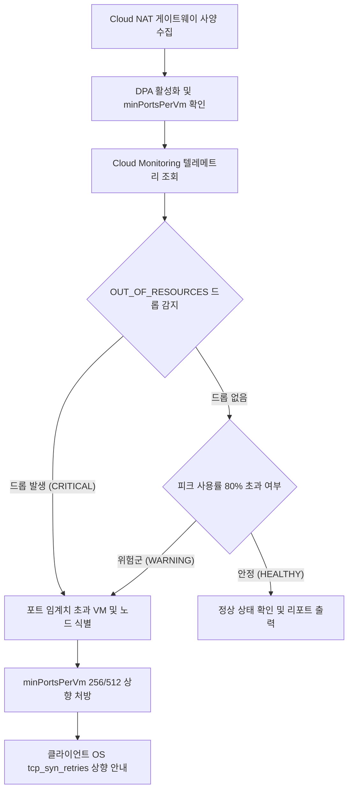

<!--
Copyright 2026 Google LLC. All Rights Reserved.
SPDX-License-Identifier: Apache-2.0

NOTICE: This code/repository is owned by Google LLC and provided under the Apache-2.0 License.
It is strictly provided as an EXAMPLE/REFERENCE ONLY and is NOT INTENDED FOR PRODUCTION USE.
All contents, designs, and code examples are subject to change, modification, or removal at any time without notice.

[고지 사항] 본 저장소 및 문서는 구글 (Google LLC) 소유이며 Apache 2.0 라이선스 하에 예시 (Sample) 용도로 제공된다.
프로덕션 환경용이 아니며, 사전 통지 없이 언제든지 수정, 변경 또는 삭제될 수 있다.
-->

> [!IMPORTANT]
> **구글 (Google LLC) 참조용 샘플 고지 사항**:
> 본 프로젝트의 모든 소스 코드와 문서는 Google LLC의 소유이며, Apache-2.0 라이선스에 따라 오직 **참조용 샘플 (Sample / Reference Only)** 목적으로만 제공된다. 프로덕션 환경에 그대로 사용할 수 없으며, 사전 통지 없이 언제든 내용이 수정, 변경 또는 삭제될 수 있다.

# Cloud NAT 포트 고갈 및 사일런트 패킷 드롭 진단기

GKE 클러스터 및 Compute Engine 환경에서 외부 API 호출 시 발생하는 간헐적 타임아웃 장애의 근본 원인을 규명하기 위해, Cloud NAT의 동적 포트 할당(DPA) 확장 지연과 자원 고갈 패킷 드롭(OUT_OF_RESOURCES)을 1분 만에 교차 진단하고 최적의 최소 할당 포트와 커널 재시도 파라미터를 도출하는 도구다. (As of 2026-09-10)

**Audience**: `#Architect`, `#Developer`, `#SecOps`  
**Concern**: `#Performance`, `#Resilience`  
**Service**: `#CloudMonitoring`, `#CloudNAT`, `#ComputeEngine`

---

## 1. 이 가이드가 필요한 상황

- 사내 GKE 파드 또는 가상 머신(VM)에서 외부 결제 PG사, 서드파티 API, 인증 서버로 나가는 아웃바운드 호출 시 간헐적인 `Connection timed out` 또는 `Connection reset by peer`가 발생하는 경우
- 콘솔 대시보드 상에서 Cloud NAT 게이트웨이가 정상(Running/OK) 상태로 표시되어 장애 원인을 외부 서버 문제나 일시적 망 장애로 오인하기 쉬운 경우
- 트래픽 급증(Burst) 시 Cloud NAT의 동적 포트 할당(Dynamic Port Allocation)이 새 포트 블록을 바인딩하는 동안 최대 240초의 프로비저닝 지연으로 인해 패킷이 유실되는 현상(NET-AV-2)을 점검하려는 경우
- 정적 포트 할당 환경에서 인스턴스당 기본 최소 포트(minPortsPerVm=64)를 초과하여 동시 아웃바운드 연결이 거부되는 병목을 진단하려는 경우
- 수동 IP 할당 모드(MANUAL_ONLY)에서 게이트웨이가 보유한 공인 IP 수 대비 총 인스턴스 요구 포트가 고갈 위험에 도달했는지 확인하려는 경우

---

## 2. 진단 및 해결 흐름



---

## 3. 사전 준비 사항

본 도구를 실행하려면 최소 아래의 IAM 권한이 필요하다:

| 서비스 | 필요 역할 (Role) | 최소 IAM 권한 |
| :--- | :--- | :--- |
| `Cloud Monitoring` | `roles/monitoring.viewer` | `monitoring.timeSeries.list` |
| `Compute Engine` | `roles/compute.networkViewer` | `compute.routers.get`, `compute.routers.list` |

---

## 4. 빠른 시작 및 실행 방법

### 단계 1: 환경 변수 설정
`.env.example` 파일을 복사하여 `.env` 파일을 생성한다:
```bash
cp .env.example .env
```
특정 리소스 고정이 필요하지 않다면 `.env` 값을 비워두어도 된다. gcloud 활성 설정과 사내 Cloud NAT 게이트웨이를 자동으로 감지한다.

### 단계 2: 모의 데이터 가상 실행 (Dry-Run)
실제 구글 클라우드 리소스 호출 없이 내장된 가상 인프라 데이터로 정상 동작을 확인한다:
```bash
./run.sh --dry-run
```

### 단계 3: 실제 사내 인프라 실시간 진단
```bash
./run.sh
```

특정 리전이나 라우터를 명시적으로 점검할 수도 있다:
```bash
./run.sh --region asia-northeast3 --router cr-prod-asia-northeast3 --nat nat-gw-prod-main --days 14
```

---

## 5. 핵심 아키텍처 및 NET-AV-2 신뢰성 원리

Cloud NAT는 외부 공인 IP가 없는 사설 서브넷의 가상 머신이나 GKE 노드가 인터넷으로 안전하게 나갈 수 있도록 지원한다. 이때 출발지 IP와 포트를 변환하여 전송하는데, 포트 할당 방식에 따라 다음과 같은 구조적 병목이 발생할 수 있다:

1. **동적 포트 할당(DPA) 확장 지연 (NET-AV-2)**:
   - DPA가 켜져 있더라도 각 인스턴스는 초기에 `minPortsPerVm`(기본 64개)으로 시작한다.
   - 트래픽이 순간적으로 급증하여 기존 포트를 소진하면, Cloud NAT는 2배씩 포트 블록(예: 64 -> 128 -> 256 -> 512)을 확장한다.
   - 하지만 사용량 감지 및 포트 블록 재할당에는 최대 240초(4분)의 전파 지연이 발생할 수 있다.
   - 이 지연 시간 동안 새로 생성되는 TCP SYN 패킷은 `OUT_OF_RESOURCES` 사유로 무음 폐기(Silent Drop)된다.

2. **클라이언트 OS 커널의 SYN 재시도 한계**:
   - 리눅스 기본 커널 설정에서 TCP SYN 재시도 횟수(`net.ipv4.tcp_syn_retries`)가 낮게 설정되어 있으면, Cloud NAT가 포트를 확장하기 전에 클라이언트가 연결을 포기하고 타임아웃 오류를 애플리케이션으로 반환한다.
   - 따라서 `minPortsPerVm`을 사전에 여유 있게 확보하고(예: 256개 이상), 커널 SYN 재시도 횟수를 상향 조정(예: 6회 이상)하는 조치가 병행되어야 한다.

---

## 6. 조치 가이드 및 권장 설정

진단 도구가 `CRITICAL` 또는 `WARNING` 상태를 출력한 경우 아래의 순서로 조치한다:

1. **최소 할당 포트(min-ports-per-vm) 상향**:
   ```bash
   gcloud compute routers nats update [NAT_NAME] \
     --router=[ROUTER_NAME] \
     --region=[REGION] \
     --enable-dynamic-port-allocation \
     --min-ports-per-vm=256 \
     --max-ports-per-vm=2048
   ```

2. **GKE 노드 및 VM 커널 파라미터 튜닝**:
   호스트 노드에서 임시 적용:
   ```bash
   sudo sysctl -w net.ipv4.tcp_syn_retries=6
   ```
   영구 반영 (`/etc/sysctl.d/99-gcp-nat.conf`):
   ```bash
   echo "net.ipv4.tcp_syn_retries = 6" | sudo tee -a /etc/sysctl.d/99-gcp-nat.conf
   sudo sysctl -p /etc/sysctl.d/99-gcp-nat.conf
   ```

3. **관련 공식 기술 문서**:
   - Cloud NAT 포트 할당 개요 ( https://cloud.google.com/nat/docs/ports-and-addresses )
   - Cloud NAT 구성 최적화 가이드 ( https://cloud.google.com/nat/docs/tune-nat-configuration )
   - Cloud NAT 모니터링 지표 참조 ( https://cloud.google.com/nat/docs/monitoring )

---

## 7. 리소스 정리 (Teardown) 안내

본 진단 도구는 읽기 전용(Read-Only) 명령어로 작동하므로 별도의 클라우드 인프라 자원을 생성하지 않는다. 로컬에서 생성된 가상 환경이나 임시 설정 파일만 정리하면 된다:
```bash
rm -f .env
```
