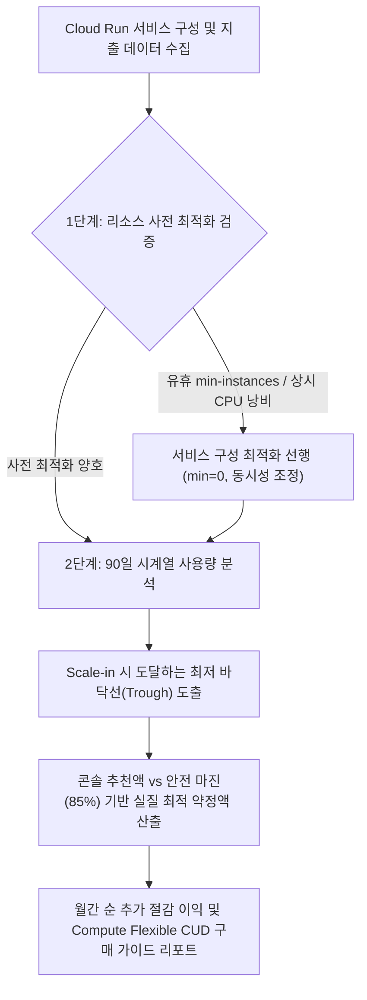

<!--
Copyright 2026 Google LLC. All Rights Reserved.
SPDX-License-Identifier: Apache-2.0

NOTICE: This code/repository is owned by Google LLC and provided under the Apache-2.0 License.
It is strictly provided as an EXAMPLE/REFERENCE ONLY and is NOT INTENDED FOR PRODUCTION USE.
All contents, designs, and code examples are subject to change, modification, or removal at any time without notice.

[고지 사항] 본 저장소 및 문서는 구글 (Google LLC) 소유이며 Apache 2.0 라이선스 하에 예시 (Sample) 용도로 제공된다.
프로덕션 환경용이 아니며, 사전 통지 없이 언제든지 수정, 변경 또는 삭제될 수 있다.
-->

> [!IMPORTANT]
> **구글 (Google LLC) 참조용 샘플 고지 사항**:
> 본 프로젝트의 모든 소스 코드와 문서는 Google LLC의 소유이며, Apache-2.0 라이선스에 따라 오직 **참조용 샘플 (Sample / Reference Only)** 목적으로만 제공된다. 프로덕션 환경에 그대로 사용할 수 없으며, 사전 통지 없이 언제든 내용이 수정, 변경 또는 삭제될 수 있다.

# Cloud Run Compute CUD 약정 할인 최적화 및 권장 엔진 과소 약정 분석

서버리스 Cloud Run 환경에서 자동 스케일링 특성으로 인해 GCP 콘솔 추천 엔진이 초래하는 과소 약정(Under-commitment) 트랩을 분석하고, 3개월 시계열 최저 바닥선(Trough) 기반의 최적 Compute Flexible CUD 약정액과 사전 리소스 최적화 가이드를 처방한다. (As of 2026-09-09)

**Audience**: `#Architect`, `#FinOps`  
**Concern**: `#Billing`, `#Performance`  
**Service**: `#CloudBilling`, `#CloudRun`  

---

## 1. 배경 및 문제 증상

Cloud Run을 대규모 배치 처리, 마이크로서비스 또는 이벤트 기반 워크로드로 운영할 때, 비용 최적화를 위해 약정 사용 할인(CUD, Committed Use Discounts)을 검토하게 된다.

- **추천 엔진의 과소 약정(Under-commitment) 유도**: Cloud Run의 동적 오토스케일링(Scale-in/Scale-out) 변동성 때문에 GCP 콘솔의 기본 CUD 추천 엔진(주황색 지표)이 극도로 보수적인 수치(안전 바닥선의 30~50% 수준)를 제안하여 실질적인 절감 기회를 크게 상실함.
- **과다 약정(Over-commitment) 공포**: 추천 수치보다 크게 약정하고 싶으나, 비수기나 트래픽 감소 시 스케일 인되어 약정 금액 밑으로 떨어져 유휴 비용(돈 낭비)을 지불할까 우려하여 의사 결정이 지연됨.
- **사전 최적화 부재**: CPU 상시 할당(Always allocated), 유휴 min-instances, 낮은 Concurrency 등 서비스 구성 최적화가 선행되지 않은 상태에서 CUD를 약정하여 불필요한 인프라 비용까지 1~3년간 고정 약정하는 오류.

---

## 2. 진단 워크플로우



---

## 3. 사전 요구 사항 및 IAM 권한

본 도구를 실행하고 결제 지표 및 서비스를 진단하기 위해 다음 권한이 필요하다:

- `roles/billing.viewer`: Cloud Billing 계정 지출 내역 및 CUD 현황 조회
- `roles/run.viewer`: Cloud Run 서비스 구성(min-instances, CPU 할당 방식, 동시성) 조회
- `roles/monitoring.viewer`: Cloud Monitoring 사용량 시계열 지표 조회

---

## 4. 원클릭 실행 및 검증

### (1) 가상 모의 진단 (`--dry-run`)
실제 Billing 호출 없이 과소 약정 갭 분석 및 절감액 리포트를 사전 검증한다:
```bash
./run.sh --dry-run
```

### (2) 운영 환경 진단
환경 변수 또는 CLI 인자를 지정하여 실행한다:
```bash
./run.sh --billing-account-id 012345-6789AB-CDEF01 --project-id demo-project --lookback-days 90 --safety-margin 0.85
```

---

## 5. 단계별 조치 가이드

### 1단계: Cloud Run 사전 최적화 선행
약정을 체결하기 전에 불필요한 고정 지출을 줄여 정밀한 베이스라인을 확보한다:
1. **CPU 할당 최적화**: 지속적인 백그라운드 처리가 필요한 서비스가 아니라면 **요청 처리 중에만 CPU 할당(Request-only)**을 적용한다.
2. **동시성(Concurrency) 튜닝**: 기본 80을 기준으로 애플리케이션의 메모리 및 I/O 특성에 맞춰 동시성을 상향 조정하여 불필요한 컨테이너 인스턴스 확장을 방지한다.
3. **min-instances 점검**: 상시 웜업이 필수적인 핵심 경로 외에 개발/테스트 환경의 `min-instances`를 0으로 설정한다.

### 2단계: 최적 베이스라인 기반 CUD 구매
1. GCP 콘솔에서 **결제(Billing) > 약정 사용 할인(CUD)** 메뉴로 이동한다.
2. **약정 구매(Purchase commitment)**를 선택하고 다음 옵션을 지정한다:
   - **약정 유형**: **Compute Flexible CUD** (Cloud Run, GKE, Compute Engine에 공통 적용되며 서비스별 종속 제약이 없음)
   - **약정 기간**: 1년 또는 3년 (약정 할인율은 구글 클라우드 공식 요금 페이지 참조)
   - **시간당 커밋 금액**: 콘솔의 보수적 추천액이 아닌, 진단 리포트에서 도출된 최적 권장 약정액을 입력한다.

### 공식 가이드 및 콘솔 링크
- [약정 사용 할인(CUD) 개요 및 플렉시블 약정] ( https://cloud.google.com/docs/cuds )
- [Cloud Run 비용 최적화 권장사항] ( https://docs.cloud.google.com/run/docs/tips/services-cost-optimization )

---

## 6. 리소스 정리 (Teardown)

본 도구는 순수 진단 및 계산 도구이므로 클라우드 상에 추가 리소스를 프로비저닝하지 않는다.
단, 실제 구매한 CUD 약정은 구매 후 취소가 불가능하므로 반드시 90일 이상의 트래픽 시계열과 안전 마진을 거친 후 신중히 구매를 확정해야 한다.
