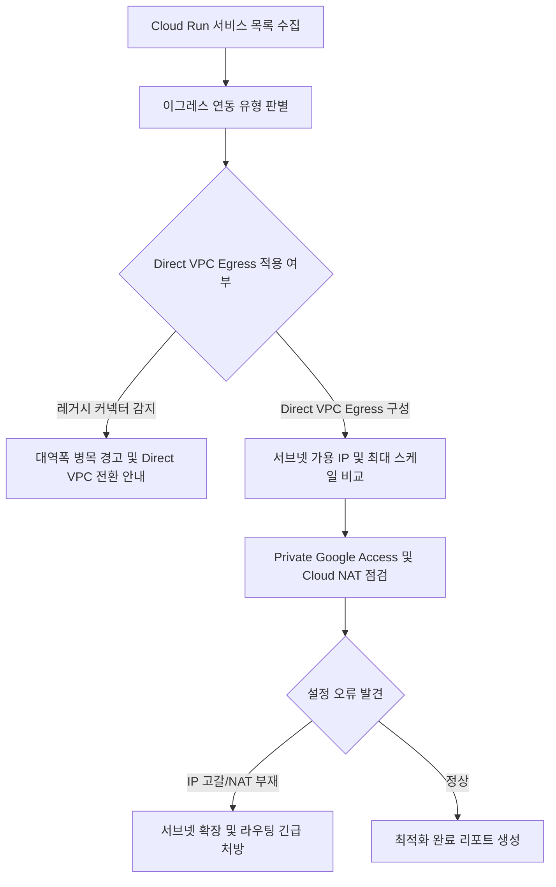

# Cloud Run Direct VPC Egress 구성 및 네트워크 연결성 진단기

Serverless VPC Access 커넥터의 병목과 인스턴스 비용을 제거하기 위한 Direct VPC Egress 구성 상태, 서브넷 가용 IP 고갈 위험, Private Google Access 및 Cloud NAT 라우팅 정합성을 1분 만에 일괄 진단하는 도구다. (As of 2026-09-09)

**Audience**: `#Architect`, `#Developer`  
**Concern**: `#Performance`, `#Resilience`  
**Service**: `#CloudRun`, `#ComputeEngine`

---

## 1. 이 가이드가 필요한 상황

- 기존 Serverless VPC Access 커넥터(VPC Connector)의 최대 처리량 제약이나 인스턴스 기동 지연(Cold Start) 병목을 해소하고자 하는 경우
- 커넥터 유지에 수반되는 고정 가상 머신(e2-micro 등) 인스턴스 비용을 절감하고 Direct VPC Egress 로 전환하고자 하는 경우
- Cloud Run 컨테이너가 급격히 수평 확장(Auto-scaling)될 때 할당된 서브넷의 사설 IP가 고갈되어 파드가 기동 실패(Crash)하는 위험을 사전에 방지하려는 경우
- `all-traffic` 옵션 설정 후 Cloud NAT 미구성으로 인해 외부 공용 API(결제 게이트웨이, 서드파티 웹훅) 통신이 차단되는 장애를 진단해야 하는 경우
- 서브넷의 Private Google Access(PGA) 설정 누락으로 `Cloud Storage`, `BigQuery` 등 구글 사설 API 호출이 실패하는 원인을 규명하려는 경우

---

## 2. 진단 및 해결 흐름



---

## 3. 사전 준비 사항

본 도구를 실행하려면 최소 아래의 IAM 권한이 필요하다:

| 서비스 | 필요 역할(Role) | 최소 IAM 권한 |
| :--- | :--- | :--- |
| `Cloud Run` | `roles/run.viewer` | `run.services.get`, `run.services.list` |
| `Compute Engine` | `roles/compute.networkViewer` | `compute.networks.get`, `compute.routers.get`, `compute.subnetworks.get` |

---

## 4. 1분 퀵스타트

### 가상 실행 (Dry-run)

실제 GCP API 호출이나 권한 없이도 모의 아키텍처 환경을 즉시 시뮬레이션할 수 있다:

```bash
./run.sh --dry-run
```

### 실제 환경 실행

```bash
# 기본 활성 프로젝트 및 기본 리전(asia-northeast3) 대상 실행
./run.sh

# 특정 프로젝트 및 특정 리전 지정 실행
./run.sh --project=my-prod-project --region=asia-northeast3

# 특정 서비스 단독 점검
./run.sh --project=my-prod-project --region=asia-northeast3 --service=order-api-prod
```

---

## 5. 결과 출력 예시

```text
================================================================================
Cloud Run Direct VPC Egress 구성 및 네트워크 연결성 진단 리포트
진단 모드: 가상 실행 (Dry-run)
대상 프로젝트: demo-vpc-egress-project
대상 리전: asia-northeast3
점검 대상 서비스 수: 4개
================================================================================

[1단계] Cloud Run 서비스별 VPC 이그레스 아키텍처 현황
--------------------------------------------------------------------------------
서비스 이름                   이그레스 방식        트래픽 범위             상태        
--------------------------------------------------------------------------------
order-api-prod           CONNECTOR      private-ranges-only WARNING   
payment-gateway-prod     DIRECT_VPC     private-ranges-only CRITICAL  
analytics-collector-prod DIRECT_VPC     all-traffic        CRITICAL  
user-auth-service-prod   DIRECT_VPC     private-ranges-only OK        
--------------------------------------------------------------------------------

[2단계] 서브넷 IP 고갈 위험 및 네트워크 라우팅 세부 진단
--------------------------------------------------------------------------------
- 서비스: order-api-prod
  * 연동 방식: CONNECTOR
  * VPC 커넥터: projects/demo-vpc-egress-project/locations/asia-northeast3/connectors/legacy-vpc-conn
  * 진단 결과: [WARNING] 레거시 Serverless VPC Access 커넥터 사용 중, 대역폭 병목 및 커넥터 유휴 비용 발생 (Direct VPC Egress 전환 권장)

- 서비스: payment-gateway-prod
  * 연동 방식: DIRECT_VPC
  * 대상 서브넷: sub-run-prod-01 (대역: 10.10.1.0/28)
  * Private Google Access: 비활성화 (경고)
  * Cloud NAT 구비 여부: 구성됨 (OK)
  * 최대 인스턴스(maxScale): 120개
  * 진단 결과: [CRITICAL] 서브넷 가용 IP 부족(/28 대역, 가용 IP 11개 < 최대 인스턴스 120개) 및 Private Google Access 미활성화

- 서비스: analytics-collector-prod
  * 연동 방식: DIRECT_VPC
  * 대상 서브넷: sub-run-prod-02 (대역: 10.10.2.0/24)
  * Private Google Access: 활성화 (OK)
  * Cloud NAT 구비 여부: 미구성 (위험)
  * 최대 인스턴스(maxScale): 40개
  * 진단 결과: [CRITICAL] 모든 아웃바운드 트래픽(all-traffic)을 VPC로 라우팅 중이나 Cloud NAT 게이트웨이가 없어 외부 API 통신 전면 실패 위험

- 서비스: user-auth-service-prod
  * 연동 방식: DIRECT_VPC
  * 대상 서브넷: sub-run-prod-03 (대역: 10.10.3.0/24)
  * Private Google Access: 활성화 (OK)
  * Cloud NAT 구비 여부: 구성됨 (OK)
  * 최대 인스턴스(maxScale): 50개
  * 진단 결과: [OK] Direct VPC Egress 정상 구성 (충분한 /24 대역 IP, Private Google Access 활성화, 온프레미스 연동 완료)

--------------------------------------------------------------------------------

[3단계] 아키텍처 현대화 및 즉각 조치 처방
1. Serverless VPC Access 커넥터에서 Direct VPC Egress 로 전환:
   gcloud run services update <SERVICE_NAME> \
     --region=asia-northeast3 \
     --network=<VPC_NETWORK> \
     --subnetwork=<SUBNET_NAME> \
     --vpc-egress=private-ranges-only \
     --clear-vpc-connector

2. 서브넷 Private Google Access 활성화 (구글 API 직결 보장):
   gcloud compute networks subnets update <SUBNET_NAME> \
     --region=asia-northeast3 \
     --enable-private-ip-google-access

3. all-traffic 라우팅 시 외부 통신용 Cloud NAT 생성:
   gcloud compute routers create nat-router --network=<VPC_NETWORK> --region=asia-northeast3
   gcloud compute routers nats create nat-gw --router=nat-router --auto-allocate-nat-external-ips --region=asia-northeast3
================================================================================
```

---

## 6. 결과 확인 후 즉각 조치 가이드

1. **Direct VPC Egress 마이그레이션 적용**:
   - Cloud Run 콘솔 ( https://console.cloud.google.com/run ) > 대상 서비스 선택 > 수정 및 새 버전 배포 > 네트워킹 탭
   - Cloud Run Direct VPC Egress 설정 가이드 ( https://cloud.google.com/run/docs/configuring/vpc-direct-vpc )
   - VPC 네트워크 연결 옵션 비교 ( https://cloud.google.com/run/docs/configuring/connecting-vpc )
2. **서브넷 Private Google Access 활성화**:
   - VPC 네트워크 ( https://console.cloud.google.com/networking/networks/list ) > 서브넷 선택 > 수정 > 비공개 Google 액세스 사용 설정
   - Private Google Access 개요 ( https://cloud.google.com/vpc/docs/private-google-access )
3. **Cloud NAT 게이트웨이 구성**:
   - Cloud NAT ( https://console.cloud.google.com/net-services/nat/list )
   - 외부 아웃바운드 트래픽(`all-traffic`)을 안전하게 처리하기 위한 Cloud NAT 게이트웨이를 배치한다.

---

## 7. 자원 정리 (Teardown) 가이드

본 진단 도구는 읽기 전용으로 Cloud Run 및 VPC 네트워크 메타데이터를 조회하므로 별도의 클라우드 인프라 자원을 생성하지 않는다. 실습을 위해 생성한 테스트용 Cloud Run 서비스나 서브넷이 있다면 아래 명령어로 정리한다:

```bash
# 테스트 Cloud Run 서비스 삭제
gcloud run services delete SERVICE_NAME --region=REGION --quiet

# 테스트 서브넷 삭제
gcloud compute networks subnets delete SUBNET_NAME --region=REGION --quiet
```
