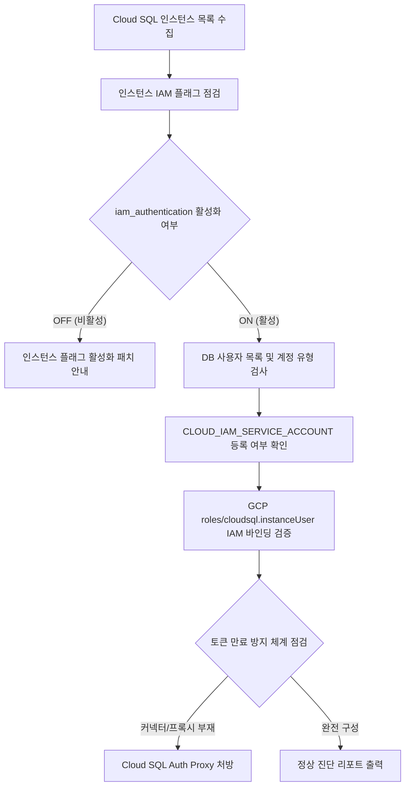

# Cloud SQL IAM 데이터베이스 인증 및 연결 장애 진단기

Cloud SQL 고정 데이터베이스 비밀번호를 폐기하고 IAM 데이터베이스 인증(Automatic IAM Authentication)으로 전환할 때 발생하는 인스턴스 플래그 누락, IAM DB 사용자 유형 불일치, 토큰 만료(1시간) 및 연결 권한 거부 장애를 1분 만에 일괄 진단하고 처방하는 도구다. (As of 2026-09-09)

**Audience**: `#Developer`, `#SecOps`  
**Concern**: `#IAM`, `#Security`  
**Service**: `#CloudIAM`, `#CloudSQL`

---

## 1. 이 가이드가 필요한 상황

- 하드코딩된 데이터베이스 비밀번호의 유출 위험을 없애고 GCP 서비스 계정 및 단기 OIDC 토큰 기반 IAM 인증으로 전환하려는 경우
- IAM 데이터베이스 사용자를 생성했음에도 불구하고 애플리케이션 접속 시 `password authentication failed` 또는 `Access denied` 에러가 발생하는 경우
- 인스턴스의 `cloudsql.iam_authentication` 데이터베이스 플래그 활성화 여부를 전수 점검해야 하는 경우
- 데이터베이스 사용자 계정이 `CLOUD_IAM_SERVICE_ACCOUNT` 가 아닌 일반 `BUILT_IN` 사용자로 잘못 등록된 경우를 탐색하고자 하는 경우
- IAM 토큰 기반으로 접속한 직후에는 정상 동작하나 1시간(3600초) 경과 후 연결 풀(Connection Pool)이 강제 단절되는 원인을 규명하려는 경우

---

## 2. 진단 및 해결 흐름



---

## 3. 사전 준비 사항

본 도구를 실행하려면 최소 아래의 IAM 권한이 필요하다:

| 서비스 | 필요 역할(Role) | 최소 IAM 권한 |
| :--- | :--- | :--- |
| `Cloud IAM` | `roles/iam.securityReviewer` | `resourcemanager.projects.getIamPolicy` |
| `Cloud SQL` | `roles/cloudsql.viewer` | `cloudsql.instances.get`, `cloudsql.instances.list`, `cloudsql.users.list` |

---

## 4. 1분 퀵스타트

### 가상 실행 (Dry-run)

실제 GCP API 호출이나 권한 없이도 모의 장애 시나리오를 즉시 시뮬레이션할 수 있다:

```bash
./run.sh --dry-run
```

### 실제 환경 실행

```bash
# 기본 활성 프로젝트 대상 전체 인스턴스 점검
./run.sh

# 특정 프로젝트 및 특정 인스턴스 지정 실행
./run.sh --project=my-prod-project --instance=prod-postgres-main

# 특정 IAM 사용자 계정 지정 점검
./run.sh --project=my-prod-project --instance=prod-postgres-main --user-email=app-backend-sa@my-prod-project.iam
```

---

## 5. 결과 출력 예시

```text
================================================================================
Cloud SQL IAM 데이터베이스 인증 및 연결 장애 진단 리포트
진단 모드: 가상 실행 (Dry-run)
대상 프로젝트: demo-cloudsql-iam-project
점검 대상 인스턴스 수: 4개
================================================================================

[1단계] Cloud SQL 인스턴스별 IAM 인증 플래그 활성화 현황
--------------------------------------------------------------------------------
인스턴스 이름                  엔진 버전            리전                 IAM 인증 플래그    
--------------------------------------------------------------------------------
prod-postgres-main       POSTGRES_15      asia-northeast3    OFF (비활성, 오류) 
order-mysql-db           MYSQL_8_0        asia-northeast3    ON (활성)       
billing-postgres-db      POSTGRES_14      asia-northeast3    ON (활성)       
auth-mysql-replica       MYSQL_8_0        asia-northeast3    ON (활성)       
--------------------------------------------------------------------------------

[2단계] 등록된 DB 계정 유형 및 GCP IAM 역할 바인딩 정밀 진단
--------------------------------------------------------------------------------
- 인스턴스: prod-postgres-main (POSTGRES_15)
  * IAM 플래그 상태: OFF (조치 필요)
  * SSL/TLS 모드: ENCRYPTED_ONLY
  * 사용자: app-backend-sa@demo-cloudsql-iam-project.iam
    - 등록 유형: CLOUD_IAM_SERVICE_ACCOUNT
    - IAM 역할(roles/cloudsql.instanceUser): 부여됨 (OK)
    - 진단 결과: [CRITICAL] 인스턴스에 cloudsql.iam_authentication 플래그가 off 상태여서 IAM 토큰 로그인 실패

- 인스턴스: order-mysql-db (MYSQL_8_0)
  * IAM 플래그 상태: ON
  * SSL/TLS 모드: ENCRYPTED_ONLY
  * 사용자: order-sa@demo-cloudsql-iam-project.iam.gserviceaccount.com
    - 등록 유형: BUILT_IN
    - IAM 역할(roles/cloudsql.instanceUser): 누락됨 (거부)
    - 진단 결과: [CRITICAL] 계정 유형이 CLOUD_IAM_SERVICE_ACCOUNT 가 아닌 BUILT_IN 으로 등록되었고 roles/cloudsql.instanceUser 권한 누락

- 인스턴스: billing-postgres-db (POSTGRES_14)
  * IAM 플래그 상태: ON
  * SSL/TLS 모드: TRUSTED_CLIENT_CERTIFICATE_REQUIRED
  * 사용자: billing-reader-sa@demo-cloudsql-iam-project.iam
    - 등록 유형: CLOUD_IAM_SERVICE_ACCOUNT
    - IAM 역할(roles/cloudsql.instanceUser): 부여됨 (OK)
    - 진단 결과: [WARNING] IAM 구성은 정상이나 애플리케이션 연결 풀(Connection Pool)에서 토큰 갱신 커넥터 부재 시 1시간 후 연결 끊김 발생

- 인스턴스: auth-mysql-replica (MYSQL_8_0)
  * IAM 플래그 상태: ON
  * SSL/TLS 모드: ENCRYPTED_ONLY
  * 사용자: auth-worker-sa
    - 등록 유형: CLOUD_IAM_SERVICE_ACCOUNT
    - IAM 역할(roles/cloudsql.instanceUser): 부여됨 (OK)
    - 진단 결과: [OK] IAM 인증 플래그 on, CLOUD_IAM_SERVICE_ACCOUNT 유형, Cloud SQL Auth Proxy(-enable-iam-login) 연동 정상

--------------------------------------------------------------------------------

[3단계] IAM 데이터베이스 인증 표준 처방 및 즉각 조치 가이드
1. Cloud SQL 인스턴스 IAM 인증 플래그 활성화:
   gcloud sql instances patch <INSTANCE_NAME> \
     --database-flags=cloudsql.iam_authentication=on

2. IAM 서비스 계정 DB 사용자 추가:
   # PostgreSQL 환경 (도메인 제외한 SA 이메일 접두사 사용):
   gcloud sql users create <SA_NAME>@<PROJECT_ID>.iam \
     --instance=<INSTANCE_NAME> \
     --type=CLOUD_IAM_SERVICE_ACCOUNT

   # MySQL 환경 (앞 32자 제한, .gserviceaccount.com 제외):
   gcloud sql users create <TRUNCATED_SA_NAME> \
     --instance=<INSTANCE_NAME> \
     --type=CLOUD_IAM_SERVICE_ACCOUNT

3. 호출자(SA 또는 개발자)에게 필수 IAM 역할 부여:
   gcloud projects add-iam-policy-binding <PROJECT_ID> \
     --member="serviceAccount:<SA_EMAIL>" \
     --role="roles/cloudsql.instanceUser"

4. 토큰 만료(1시간) 방지를 위한 Cloud SQL Auth Proxy 실행:
   ./cloud-sql-proxy <PROJECT_ID>:<REGION>:<INSTANCE_NAME> --enable-iam-login --port=5432
================================================================================
```

---

## 6. 결과 확인 후 즉각 조치 가이드

1. **인스턴스 IAM 인증 활성화**:
   - Cloud SQL 인스턴스 ( https://console.cloud.google.com/sql/instances ) > 대상 인스턴스 선택 > 구성 수정 > 플래그 추가 > `cloudsql.iam_authentication=on`
   - Cloud SQL MySQL IAM 인증 ( https://cloud.google.com/sql/docs/mysql/iam-authentication )
   - Cloud SQL PostgreSQL IAM 인증 ( https://cloud.google.com/sql/docs/postgres/iam-authentication )
2. **Cloud SQL Auth Proxy 연동 및 토큰 자동 갱신**:
   - 직접 고정 토큰을 전달하는 방식은 1시간 후 만료되므로, Cloud SQL Auth Proxy의 `-enable-iam-login` 옵션 또는 공식 언어별 커넥터(Cloud SQL Python/Java/Go Connector)를 사용하여 단기 토큰을 주기적으로 자동 재발급하도록 구성한다.
   - Cloud SQL Auth Proxy 연결 가이드 ( https://cloud.google.com/sql/docs/mysql/connect-auth-proxy )
3. **데이터베이스 내부 권한(GRANT) 부여**:
   - IAM 인증으로 데이터베이스에 로그인한 이후에도 테이블 조회/수정을 위한 내부 권한이 필요하므로 관리자 권한으로 로그인하여 `GRANT SELECT, INSERT ON ALL TABLES IN SCHEMA public TO "sa-name";` 등의 SQL을 수행한다.

---

## 7. 자원 정리 (Teardown) 가이드

본 진단 도구는 읽기 전용으로 Cloud SQL 인스턴스 설정 및 IAM 사용자 목록만 조회하므로 별도의 클라우드 인프라 자원을 생성하지 않는다. 실습을 위해 생성한 테스트용 Cloud SQL 사용자가 있다면 아래 명령어로 삭제한다:

```bash
gcloud sql users delete USER_NAME --instance=INSTANCE_NAME --quiet
```
