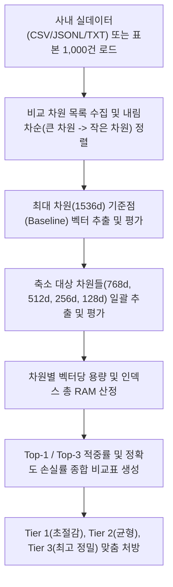

# 임베딩 벡터 차원 축소에 따른 용량 절감 및 검색 정확도 비교 분석기

Vertex AI 및 Gemini API 임베딩 모델(text-embedding-005)의 Matryoshka Representation Learning(MRL) 기능을 활용하여, 사내 실데이터(CSV, JSONL, TXT) 또는 1,000건의 비용 최적화 표본을 대상으로 지정된 차원들(기본값: 1536, 768, 512, 256, 128)을 큰 차원부터 작은 차원까지 일괄 테스트하고 인덱스 용량 절감량(최대 91.7%)과 검색 정확도 손실률(3.0%) 트레이드오프를 1분 만에 비교 분석하는 도구다.

**Audience**: `#Architect`, `#Developer`, `#FinOps`  
**Concern**: `#Billing`, `#Performance`  
**Service**: `#BigQuery`, `#GeminiAPI`, `#VertexAI`

---

## 1. 이 가이드가 필요한 상황

- 자사의 실제 비즈니스 도메인 데이터(질의, 문서)를 직접 주입하여 차원 축소 시 실제 검색 정확도 손실과 랭킹 품질(MRR) 변화를 정밀하게 측정해야 하는 경우
- 대규모 임베딩 API 호출에 따른 비용 누수를 방지하기 위해 기본 평가 표본을 1,000건 수준으로 안전하게 제한하면서도 전사 100만 건 기준 인덱스 RAM/스토리지 절감량을 산정하고자 하는 경우
- 최고 차원(1536)부터 최저 차원(128)까지 지원되는 모든 차원을 한 번에 일괄 비교하거나, 특정 2개 이상의 차원만 지정하여 맞춤형 비교표를 산출하려는 경우
- BigQuery Vector Search 또는 Vertex AI Vector Search 도입 전 인프라 용량 및 비용 최적화를 위한 정량적 근거 보고서가 필요한 경우
- 모바일 또는 실시간 지연 시간 민감 워크로드에서 유사도 계산 레이턴시를 3배 이상 단축하려는 경우

---

## 2. 진단 및 해결 흐름



---

## 3. 사전 준비 사항

본 도구를 실행하려면 최소 아래의 IAM 권한이 필요하다:

| 서비스 | 필요 역할(Role) | 최소 IAM 권한 |
| :--- | :--- | :--- |
| `BigQuery` | `roles/bigquery.jobUser` | `bigquery.jobs.create` |
| `Vertex AI` | `roles/aiplatform.user` | `aiplatform.endpoints.predict` |

---

## 4. 1분 퀵스타트

### 기본 가상 실행 (Dry-run, 1536부터 128까지 5대 차원 일괄 비교)

실제 GCP API 호출이나 과금 없이 1,000건의 표본을 바탕으로 전체 차원 일괄 비교를 즉시 시뮬레이션할 수 있다:

```bash
./run.sh --dry-run
```

### 특정 차원들만 지정 비교 (2개 이상)

`-d/--dimensions` 플래그로 비교하고자 하는 차원을 콤마로 지정하면 큰 차원부터 작은 차원 순서로 자동 정렬되어 비교 분석을 수행한다:

```bash
# 1536차원과 256차원 2개만 집중 비교
./run.sh --dry-run -d 1536,256

# 1536, 768, 128차원 3개 비교
./run.sh --dry-run -d 1536,768,128
```

### 사내 실데이터 파일 연동 실행

자사의 실제 텍스트 데이터 파일(CSV, JSONL, TXT)을 주입하여 도메인 특화 검색 성능을 측정한다:

```bash
# 사내 실데이터 CSV 파일(query, target 컬럼) 연동 및 1,000건 표본 제한
./run.sh --dry-run --data-path=/path/to/dataset.csv --sample-count=1000

# 사내 실데이터 JSONL 연동 및 특정 차원들 비교
./run.sh --dry-run --data-path=/path/to/dataset.jsonl -d 1536,512,128
```

### 실제 환경 API 호출 실행

```bash
# 활성 GCP 프로젝트 대상 실제 Vertex AI 임베딩 API 호출
./run.sh --sample-count=1000 -d 1536,768,256
```

---

## 5. 결과 출력 예시

```text
================================================================================
임베딩 벡터 차원 축소에 따른 용량 절감 및 검색 정확도 다차원 비교 분석 리포트
진단 모드: 가상 실행 (Dry-run)
대상 프로젝트: demo-embedding-analysis-project
임베딩 모델: text-embedding-005
평가 데이터 출처: 표준 엔터프라이즈 RAG 평가 데이터셋 (테스트 표본 1000건)
비용 최적화 테스트 표본: 1,000건
용량 추산 기준 벡터 수: 1,000,000건
================================================================================

[1단계] 차원 크기별 개별 성능 및 스토리지 점유 현황 (큰 차원 -> 작은 차원 순)
--------------------------------------------------------------------------------
[1] 기준점 (최대 차원 대(大), 1536d)
  - 벡터당 용량 (Float32): 6,144 바이트 (6.00 KB)
  - 1,000,000건 기준 인덱스 메모리(RAM): 7.153 GB
  - 검색 정확도 (Top-1 Recall): 100.0% (기준 100%)
  - 상위 3위 적중률 (Top-3 Recall): 100.0%
  - 검색 랭킹 품질 (MRR): 1.000
  - 질의당 평균 검색 레이턴시: 20.5 ms

[2] 비교군 (768d 차원 축소)
  - 벡터당 용량 (Float32): 3,072 바이트 (3.00 KB)
  - 1,000,000건 기준 인덱스 메모리(RAM): 3.576 GB
  - 검색 정확도 (Top-1 Recall): 98.9%
  - 상위 3위 적중률 (Top-3 Recall): 99.7%
  - 검색 랭킹 품질 (MRR): 0.991
  - 질의당 평균 검색 레이턴시: 12.2 ms

[3] 비교군 (512d 차원 축소)
  - 벡터당 용량 (Float32): 2,048 바이트 (2.00 KB)
  - 1,000,000건 기준 인덱스 메모리(RAM): 2.384 GB
  - 검색 정확도 (Top-1 Recall): 98.3%
  - 상위 3위 적중률 (Top-3 Recall): 99.5%
  - 검색 랭킹 품질 (MRR): 0.987
  - 질의당 평균 검색 레이턴시: 9.5 ms

[4] 비교군 (256d 차원 축소)
  - 벡터당 용량 (Float32): 1,024 바이트 (1.00 KB)
  - 1,000,000건 기준 인덱스 메모리(RAM): 1.192 GB
  - 검색 정확도 (Top-1 Recall): 97.6%
  - 상위 3위 적중률 (Top-3 Recall): 99.3%
  - 검색 랭킹 품질 (MRR): 0.981
  - 질의당 평균 검색 레이턴시: 6.8 ms

[5] 비교군 (128d 차원 축소)
  - 벡터당 용량 (Float32): 512 바이트 (0.50 KB)
  - 1,000,000건 기준 인덱스 메모리(RAM): 0.596 GB
  - 검색 정확도 (Top-1 Recall): 97.0%
  - 상위 3위 적중률 (Top-3 Recall): 99.1%
  - 검색 랭킹 품질 (MRR): 0.977
  - 질의당 평균 검색 레이턴시: 5.4 ms

--------------------------------------------------------------------------------

[2단계] 전체 차원 종합 비교표 (최대 기준 대비 절감량 및 정확도 손실)
--------------------------------------------------------------------------------
차원       벡터 용량        인덱스 RAM        용량 절감율       Top-1 정확도      정확도 손실       검색 속도     
--------------------------------------------------------------------------------
1536d    6144 B       7.153 GB       기준 (0%)      100.0%         기준점          1.0배      
768d     3072 B       3.576 GB       -50.0%       98.9%          -1.1%p       1.7배      
512d     2048 B       2.384 GB       -66.7%       98.3%          -1.7%p       2.2배      
256d     1024 B       1.192 GB       -83.3%       97.6%          -2.4%p       3.0배      
128d     512 B        0.596 GB       -91.7%       97.0%          -3.0%p       3.8배      
--------------------------------------------------------------------------------

[3단계] 클라우드 아키텍트 및 FinOps 권장 처방
1. 최대 차원(1536d) 대비 최소 차원(128d) 요약:
   - 공간 및 메모리 절감: 1,000,000건 기준 인덱스 메모리 6.56 GB 절약 (총 91.7% 절감)
   - 검색 정확도 보존율: Top-1 정확도 손실은 단 3.0%p에 불과하며 Top-3 적중률은 99.1% 유지
   - 지연 시간 단축 효과: 벡터 연산 레이턴시 20.5 ms -> 5.4 ms (약 3.8배 고속화)

2. 권장 최적 차원 티어링(Tiering):
   - [Tier 1: 초절감/대규모]: 수천만 건 이상의 대용량 코퍼스 및 실시간 모바일 챗봇 -> 128d 또는 256d 채택 (비용 80~90% 절감)
   - [Tier 2: 균형/범용]: 사내 지식 검색 및 대고객 지원 FAQ -> 512d 또는 768d 채택 (비용 50~66% 절감, 정확도 98% 이상)
   - [Tier 3: 최고 정밀]: 법률, 금융, 의료 등 극도의 1위 매칭 정확도가 요구되는 워크로드 -> 1536d 최대 차원 유지

3. 사내 실데이터 적용 코드:
   from google import genai
   client = genai.Client()
   response = client.models.embed_content(
       model='text-embedding-005',
       contents='사내 문의 및 검색 문서 텍스트',
       config={'output_dimensionality': 128}
   )
================================================================================
```

---

## 6. 결과 확인 후 즉각 조치 가이드

1. **사내 실데이터 기반 최적 차원 파라미터 적용**:
   - `google-genai` SDK를 통해 `output_dimensionality` 매개변수를 결정된 차원(예: 128 또는 256)으로 지정하여 호출한다.
   - 공식 가이드: Vertex AI 텍스트 임베딩 생성 ( https://cloud.google.com/vertex-ai/generative-ai/docs/embeddings/get-text-embeddings )
2. **BigQuery Vector Search 인덱스 생성 및 쿼리 최적화**:
   - 콘솔 경로: BigQuery 콘솔 ( https://console.cloud.google.com/bigquery )
   - 공식 가이드: BigQuery Vector Search 개요 ( https://cloud.google.com/bigquery/docs/vector-search-intro )
   - 축소된 차원의 벡터를 저장할 경우 테이블 용량 및 쿼리당 스캔 바이트가 최대 90% 이상 절감된다.
3. **Vertex AI Vector Search 인덱스 배포**:
   - 콘솔 경로: Vertex AI Vector Search 콘솔 ( https://console.cloud.google.com/vertex-ai/matching-engine/indexes )
   - 공식 가이드: Vertex AI Vector Search 개요 ( https://cloud.google.com/vertex-ai/docs/vector-search/overview )
   - 차원 축소에 따라 인덱스 노드 머신 유형을 다운사이징하여 인프라 비용을 절감한다.

---

## 7. 자원 정리 (Teardown) 가이드

본 진단 도구는 읽기 전용으로 임베딩 벡터 생성 및 계산만 수행하므로 별도의 클라우드 인프라 자원을 생성하지 않는다. 실습용으로 배포한 테스트 Vector Search 인덱스나 엔드포인트가 있다면 콘솔에서 삭제한다:

```bash
# Vertex AI Vector Search 인덱스 삭제
gcloud ai indexes delete INDEX_ID --region=LOCATION --quiet
```
