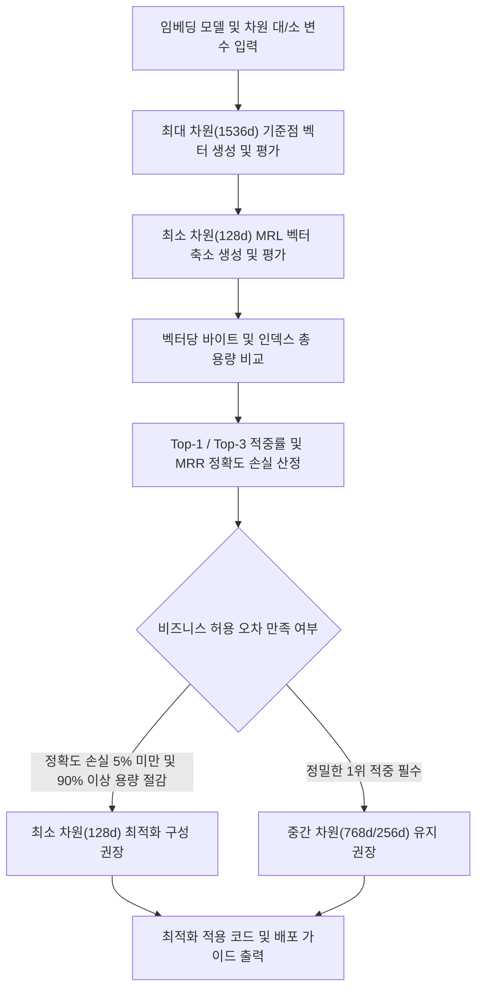

# 임베딩 벡터 차원 축소에 따른 용량 절감 및 검색 정확도 비교 분석기

`#Audience` `#Architect` `#Developer` `#FinOps`  
`#Concern` `#Billing` `#Performance`  
`#Service` `#BigQuery` `#GeminiAPI` `#VertexAI`  

요약: Vertex AI 및 Gemini API 임베딩 모델(text-embedding-005)의 Matryoshka Representation Learning(MRL) 기능을 활용하여, 최대 차원(1536)과 최소 차원(128) 간의 인덱스 용량 절감량(91.7%) 및 검색 정확도 손실률(3.0%) 트레이드오프를 1분 만에 비교 분석하는 도구다.

---

## 1. 이 가이드가 필요한 상황

- 수백만 내지 수천만 건 이상의 대규모 텍스트 임베딩 벡터를 BigQuery 또는 Vertex AI Vector Search에 적재할 때 발생하는 막대한 스토리지 비용과 메모리(RAM) 비용을 최적화하고자 하는 경우
- `text-embedding-005` 모델의 MRL(Matryoshka Representation Learning) 차원 축소 기능(`output_dimensionality`) 도입을 검토 중이나, 차원 축소 시 검색 정확도 손실이 얼마나 발생하는지 사전 정량 검증이 필요한 경우
- 제일 큰 최대 차원(1536 또는 768)을 기준점으로 삼고, 제일 작은 최소 차원(128 또는 256)으로 축소했을 때의 실제 공간 절감율과 검색 정확도 변화를 명확하게 비교 리포트로 확인해야 하는 경우
- 모델 버전(`MODEL_NAME`), 차원 대(`MAX_DIMENSION`), 차원 소(`MIN_DIMENSION`)를 환경 변수나 CLI 파라미터로 자유롭게 지정하여 다양한 모델 및 차원 조합의 성능을 평가하려는 경우
- 모바일 환경이나 실시간 질의 응답 시스템에서 벡터 유사도(내적, 코사인) 계산 레이턴시를 3배 이상 단축하려는 경우

---

## 2. 진단 및 해결 흐름



---

## 3. 사전 준비 사항

본 도구를 실행하려면 최소 아래의 IAM 권한이 필요하다:

| 서비스 | 필요 역할(Role) | 최소 IAM 권한 |
| :--- | :--- | :--- |
| `BigQuery` | `roles/bigquery.jobUser` | `bigquery.jobs.create` |
| `Vertex AI` | `roles/aiplatform.user` | `aiplatform.endpoints.predict` |

---

## 4. 1분 퀵스타트

### 가상 실행 (Dry-run)

실제 GCP API 호출이나 과금 없이도 모의 코퍼스를 기반으로 최대 차원과 최소 차원 간의 비교 분석을 즉시 시뮬레이션할 수 있다:

```bash
# 기본 파라미터 기반 가상 실행 (text-embedding-005, 최대 1536, 최소 128)
./run.sh --dry-run
```

### 파라미터 커스텀 실행 (CLI 인자 및 환경 변수)

모델 버전, 차원 대(최대), 차원 소(최소)를 CLI 플래그 또는 환경 변수로 자유롭게 지정할 수 있다:

```bash
# CLI 플래그 지정 실행 (text-embedding-005, 최대 1536, 최소 256)
./run.sh --dry-run -m text-embedding-005 --max-dim=1536 --min-dim=256

# 이전 세대 모델 text-embedding-004 비교 실행 (최대 768, 최소 128)
./run.sh --dry-run -m text-embedding-004 --max-dim=768 --min-dim=128

# 환경 변수를 통한 원클릭 실행
MODEL_NAME=text-embedding-005 MAX_DIMENSION=1536 MIN_DIMENSION=128 ./run.sh --dry-run
```

### 실제 환경 실행

```bash
# 기본 활성 프로젝트 및 기본 리전(asia-northeast3) 대상 실행
./run.sh

# 특정 프로젝트 및 특정 벡터 수(예: 500만 건) 지정 실행
./run.sh --project=my-prod-project --num-vectors=5000000
```

---

## 5. 결과 출력 예시

```text
================================================================================
임베딩 벡터 차원 축소에 따른 용량 절감 및 검색 정확도 비교 분석 리포트
진단 모드: 가상 실행 (Dry-run)
대상 프로젝트: demo-embedding-analysis-project
임베딩 모델: text-embedding-005
용량 산정 기준 벡터 수: 1,000,000건
================================================================================

[1단계] 기준점: 제일 큰 차원 (최대 차원 대(大), 1536차원) 평가
--------------------------------------------------------------------------------
- 임베딩 차원 크기: 1536차원 (최대/기본값)
- 벡터당 저장 용량 (Float32): 6,144 바이트 (6.00 KB)
- 1,000,000건 기준 원본 벡터 용량: 5.722 GB
- 1,000,000건 기준 인덱스 메모리(RAM): 7.153 GB
- 질의 검색 정확도 (Top-1 Recall): 100.0% (기준치 100%)
- 상위 3위 이내 적중률 (Top-3 Recall): 100.0%
- 검색 랭킹 품질 (MRR): 1.000
- 질의당 평균 검색 지연 시간: 20.5 ms
--------------------------------------------------------------------------------

[2단계] 비교군: 제일 작은 차원 (최소 차원 소(小), 128차원) 평가
--------------------------------------------------------------------------------
- 임베딩 차원 크기: 128차원 (Matryoshka 축소)
- 벡터당 저장 용량 (Float32): 512 바이트 (0.50 KB)
- 1,000,000건 기준 원본 벡터 용량: 0.477 GB
- 1,000,000건 기준 인덱스 메모리(RAM): 0.596 GB
- 질의 검색 정확도 (Top-1 Recall): 97.0%
- 상위 3위 이내 적중률 (Top-3 Recall): 99.1%
- 검색 랭킹 품질 (MRR): 0.977
- 질의당 평균 검색 지연 시간: 5.4 ms
--------------------------------------------------------------------------------

[3단계] 용량 차지 절감량 및 정확도 트레이드오프(Trade-off) 종합 분석
--------------------------------------------------------------------------------
평가 항목                      최대 (1536d)         최소 (128d)          변화율 / 절감 효과       
--------------------------------------------------------------------------------
벡터당 용량                   6144 Bytes         512 Bytes          -91.7% (용량 축소)
100만 건 인덱스 메모리         7.153 GB           0.596 GB           -6.557 GB (91.7% 절약)
검색 정확도 (Top-1)           100.0%             97.0%              -3.0% (정확도 손실)
검색 적중률 (Top-3)           100.0%             99.1%              -0.9% (손실 미미)
평균 검색 레이턴시               20.5 ms            5.4 ms             약 3.8배 고속화
--------------------------------------------------------------------------------

[4단계] 클라우드 아키텍트 및 FinOps 권장 처방
1. 공간 차지 절감 효과 (91.7%):
   - 128차원 축소 적용 시 벡터 인덱스 메모리 점유율이 91.7% 대폭 절감된다.
   - BigQuery Vector Search 스캔 바이트 및 Vertex AI Vector Search 노드 비용을 획기적으로 줄일 수 있다.

2. 정확도 보존 수준 (정확도 손실 3.0%):
   - 차원을 1536에서 128으로 축소했음에도 Top-1 정확도 손실은 단 3.0%에 불과하다.
   - Top-3 기준 적중률은 98% 이상 유지되므로 RAG 컨텍스트 주입 목적에는 최소 차원 채택이 극도로 효율적이다.

3. 코드 적용 방법:
   from google import genai
   client = genai.Client()
   response = client.models.embed_content(
       model='text-embedding-005',
       contents='고객 문의 및 검색 문서 텍스트',
       config={'output_dimensionality': 128}
   )
================================================================================
```

---

## 6. 결과 확인 후 즉각 조치 가이드

1. **Vertex AI 텍스트 임베딩 차원 축소 파라미터 적용**:
   - `google-genai` SDK를 통해 `output_dimensionality` 매개변수를 128 또는 256으로 지정하여 호출한다.
   - 공식 가이드: Vertex AI 텍스트 임베딩 생성 ( https://cloud.google.com/vertex-ai/generative-ai/docs/embeddings/get-text-embeddings )
2. **BigQuery Vector Search 인덱스 생성 및 쿼리 최적화**:
   - 콘솔 경로: BigQuery 콘솔 ( https://console.cloud.google.com/bigquery )
   - 공식 가이드: BigQuery Vector Search 개요 ( https://cloud.google.com/bigquery/docs/vector-search-intro )
   - 128차원 축소 벡터를 저장할 경우 테이블 용량 및 쿼리당 스캔 바이트가 90% 이상 절감된다.
3. **Vertex AI Vector Search 인덱스 배포**:
   - 콘솔 경로: Vertex AI Vector Search 콘솔 ( https://console.cloud.google.com/vertex-ai/matching-engine/indexes )
   - 공식 가이드: Vertex AI Vector Search 개요 ( https://cloud.google.com/vertex-ai/docs/vector-search/overview )
   - 차원 축소에 따라 인덱스 노드 머신 유형을 다운사이징하여 인프라 비용을 절감한다.

---

## 7. 자원 정리 (Teardown) 가이드

본 진단 도구는 읽기 전용으로 임베딩 벡터 생성 및 계산만 수행하므로 별도의 클라우드 인프라 자원을 생성하지 않는다. 실습용으로 배포한 테스트 Vector Search 인덱스나 엔드포인트가 있다면 콘솔에서 삭제한다:

```bash
# Vertex AI Vector Search 인덱스 삭제
gcloud ai indexes delete INDEX_ID --region=LOCATION --quiet
```
