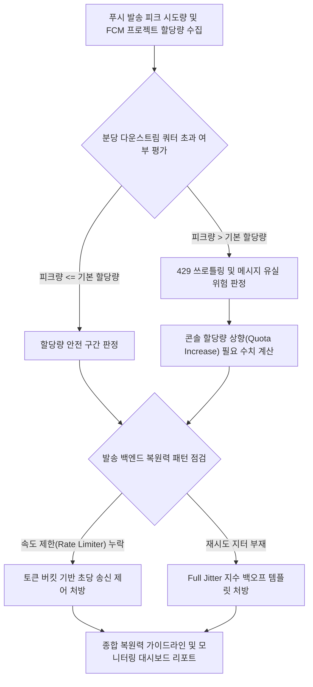

# FCM 대량 푸시 쿼터 고갈 방어 및 429 쓰로틀링 복원력 진단

모바일 앱 대규모 마케팅이나 긴급 공지 발송 시 FCM(Firebase Cloud Messaging) HTTP v1 API의 다운스트림 메시지 할당량 초과로 발생하는 429 Quota Exceeded 쓰로틀링과 메시지 유실을 진단하고, 사전 쿼터 증설 및 토큰 버킷 속도 제한, Full Jitter 지수 백오프 복원력 패턴을 처방한다.

**Audience**: `#Developer`, `#FinOps`  
**Concern**: `#Performance`, `#Resilience`  
**Date**: `2026-09-09`  
**Service**: `#CloudMonitoring`  

---

## 1. 배경 및 문제 증상

대규모 사용자 기반 모바일 서비스에서 프로모션, 라이브 커머스, 재난 알림 등으로 수십만~수백만 건의 푸시 메시지를 일시에 발송할 때 다음과 같은 장애가 발생한다:

- **FCM API 429 할당량 초과**: FCM HTTP v1 API의 프로젝트당 분당 다운스트림 메시지 기본 전송 한도(600,000+건/분)를 초과하여 대량의 `429 RESOURCE_EXHAUSTED` 에러 발생 및 푸시 전송 실패.
- **재시도 폭풍(Retry Storm)과 지연 누적**: 실패한 요청에 대해 고정 지연 또는 즉시 무제한 재시도를 수행하여 FCM 인프라 쓰로틀링이 가중되고 알림이 제때 전달되지 않는 사고.
- **기기 토큰 팬아웃 병목**: 단일 기기 토큰에 대한 개별 API 루프 호출로 인해 백엔드 연결 고갈 및 불필요한 네트워크 지연 초래.

---

## 2. 진단 워크플로우



---

## 3. 사전 요구 사항 및 IAM 권한

본 도구를 실행하고 할당량 및 모니터링 지표를 진단하기 위해 다음 권한이 필요하다:

- `roles/serviceusage.serviceUsageViewer`: FCM API 할당량 및 제한 수치 조회
- `roles/monitoring.viewer`: Cloud Monitoring 다운스트림 메시지 전송량 및 429 에러율 지표 조회
- `roles/serviceusage.quotaAdmin`: (선택) 콘솔에서 할당량 상향 요청 승인 및 관리

---

## 4. 원클릭 실행 및 검증

### (1) 가상 모의 진단 (`--dry-run`)
실제 트래픽 유발 없이 피크 발송량 대비 429 실패율 및 복원력 처방을 사전 검증한다:
```bash
./run.sh --dry-run
```

### (2) 운영 환경 진단
환경 변수 또는 CLI 인자를 지정하여 실행한다:
```bash
./run.sh --project-id demo-project --peak-msg-per-min 750000 --quota-limit-per-min 600000
```

---

## 5. 단계별 조치 가이드

### 1단계: Google Cloud 콘솔 할당량 상향(Quota Increase) 신청
1. 구글 클라우드 콘솔의 **IAM 및 관리자 > 할당량 및 시스템 한도** 메뉴로 이동한다.
2. 서비스 필터에서 `Firebase Cloud Messaging API`를 선택한다.
3. 지표 `Downstream messages per minute`를 선택하고 **할당량 수정**을 클릭한다.
4. 비즈니스 정당성(대규모 프로모션 일정, 예상 동시 발송량)과 함께 최소 피크 대비 1.5배의 수치를 입력하여 상향을 요청한다.

### 2단계: 발송 큐 토큰 버킷 속도 제한(Rate Limiting) 구현
발송 백엔드(Celery, Kafka Consumer 등)에서 초당 최대 송신 속도를 현재 분당 할당량의 1/60 수준으로 억제한다:
```python
# 초당 최대 발송량 제한 (예: 10,000 msg/sec)
from ratelimit import limits, sleep_and_retry

@sleep_and_retry
@limits(calls=10000, period=1)
def send_fcm_batch(messages):
    response = messaging.send_each(messages)
    return response
```

### 3단계: Full Jitter 지수 백오프 재시도 적용
429 응답 수신 시 무작위 지터를 결합하여 백엔드가 동시에 재시도하지 않도록 방어한다:
```python
import time, random

def exponential_backoff_retry(attempt, base=1.0, max_backoff=32.0):
    sleep_time = min(max_backoff, base * (2 ** attempt))
    jitter = random.uniform(0.5, 1.5)
    time.sleep(sleep_time * jitter)
```

### 공식 가이드 및 콘솔 링크
- [FCM 스로틀링 및 할당량 공식 가이드] ( https://firebase.google.com/docs/cloud-messaging/throttling-and-quotas )
- [Cloud Monitoring Firebase 및 FCM 지표 목록] ( https://cloud.google.com/monitoring/api/metrics_gcp )

---

## 6. 리소스 정리 (Teardown)

본 도구는 순수 진단 도구이므로 별도의 클라우드 인프라 자원을 생성하지 않는다.
상향된 FCM 할당량은 별도 비용이 발생하지 않으며, 이벤트 종료 후 필요 시 콘솔에서 기본값으로 다시 하향 조정할 수 있다.
