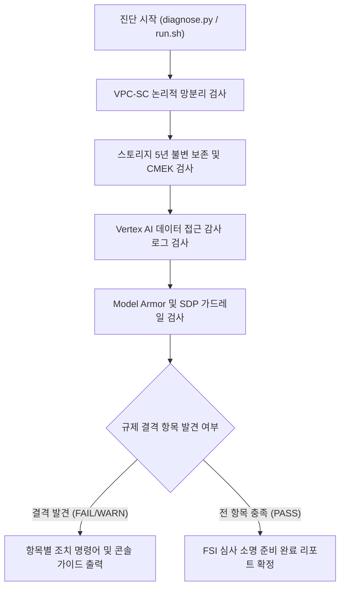

<!--
Copyright 2026 Google LLC. All Rights Reserved.
SPDX-License-Identifier: Apache-2.0

NOTICE: This code/repository is owned by Google LLC and provided under the Apache-2.0 License.
It is strictly provided as an EXAMPLE/REFERENCE ONLY and is NOT INTENDED FOR PRODUCTION USE.
All contents, designs, and code examples are subject to change, modification, or removal at any time without notice.

[고지 사항] 본 저장소 및 문서는 구글 (Google LLC) 소유이며 Apache 2.0 라이선스 하에 예시 (Sample) 용도로 제공된다.
프로덕션 환경용이 아니며, 사전 통지 없이 언제든지 수정, 변경 또는 삭제될 수 있다.
-->

> [!IMPORTANT]
> **구글 (Google LLC) 참조용 샘플 고지 사항**:
> 본 프로젝트의 모든 소스 코드와 문서는 Google LLC의 소유이며, Apache-2.0 라이선스에 따라 오직 **참조용 샘플 (Sample / Reference Only)** 목적으로만 제공된다. 프로덕션 환경에 그대로 사용할 수 없으며, 사전 통지 없이 언제든 내용이 수정, 변경 또는 삭제될 수 있다.

# 혁신 금융 서비스 규제 준수 보안 경계 진단 가이드

대한민국 금융위원회의 금융 분야 망분리 개선 로드맵(1단계 특례) 및 혁신 금융 서비스 지정 심사 기준에 따라, 퍼블릭 클라우드 상에 물리적 망분리에 준하는 논리적 망분리 및 데이터 보호 통제(VPC Service Controls, Cloud Storage 5년 Bucket Lock, 고객 관리 암호화 키, 감사 로그, Model Armor 가드레일, Sensitive Data Protection)를 종합 점검하고 현장 실사 및 보안성 심의 결격 사유를 사전에 예방하는 진단 도구다. (As of 2026-09-10)

**Audience**: `#Architect`, `#Compliance`, `#SecOps`
**Concern**: `#Compliance`, `#IAM`, `#Resilience`, `#Security`
**Service**: `#CloudKMS`, `#CloudStorage`, `#ModelArmor`, `#SensitiveDataProtection`, `#VertexAI`

---

## 1. 이 가이드가 필요한 상황

- 금융감독원 및 금융보안원(FSI)의 혁신 금융 서비스(금융규제 샌드박스) 지정 심사 및 현장 실사를 앞두고 클라우드 보안 통제 상태를 사전 검증해야 하는 경우
- Vertex AI 및 생성형 AI 워크로드 도입 시 물리적 망분리에 준하는 논리적 망분리 요건(VPC-SC, PSC 엔드포인트) 충족 여부를 확인해야 하는 경우
- 감사 로그 및 AI 입출력 데이터가 금융 규제 기준인 최소 5년 불변 보존(Retention Lock) 및 고객 관리 암호화 키(CMEK)로 안전하게 보호되고 있는지 소명해야 하는 경우
- VPC-SC 내부에서 실시간 구글 웹 검색(Web Search Grounding) 호출 시 발생할 수 있는 보안 경계 차단 위험과 우회 아키텍처(DMZ 비동기 적재)를 점검해야 하는 경우
- 프롬프트 인젝션, 탈옥(Jailbreak), 주민등록번호 등 민감 정보 누출을 방지하기 위한 AI 특화 가드레일(Model Armor, Sensitive Data Protection)의 적용 여부를 전수 감사해야 하는 경우

---

## 2. 진단 및 해결 흐름



---

## 3. 사전 준비 사항

본 도구 구동을 위해 필요한 최소 IAM 권한은 다음과 같다.

| 권한 역할 | 역할 명칭 | 필요 사유 |
| :--- | :--- | :--- |
| `roles/accesscontextmanager.reader` | Access Context Manager 독자 | VPC-SC 서비스 보안 경계 설정 조회 |
| `roles/dlp.inspectTemplatesReader` | DLP 검사 템플릿 독자 | Sensitive Data Protection 가명처리 템플릿 조회 |
| `roles/logging.viewer` | 로그 뷰어 | 프로젝트 IAM 감사 로그(auditConfigs) 설정 조회 |
| `roles/resourcemanager.organizationViewer` | 조직 뷰어 | 조직 차원의 리소스 보안 바인딩 조회 |
| `roles/storage.admin` | 스토리지 관리자 | Cloud Storage 버킷 보존 정책(Retention Policy) 및 잠금 상태 조회 |

---

## 4. 1분 퀵스타트

### 옵션 A: Google Cloud Shell에서 바로 실행

```bash
# 저장소 클론 및 폴더 이동
git clone https://github.com/jiangjun-forge/google-cloud-0-to-1.git
cd google-cloud-0-to-1/samples/fsi-regulatory-perimeter-guard

# 모의 가상 데이터 기반 스모크 테스트 (--dry-run)
./run.sh --dry-run

# 실제 사내 프로젝트 대상 보안 경계 전수 진단
./run.sh --project=example-fsi-corp --location=asia-northeast3
```

### 옵션 B: 로컬 파이썬 가상 환경에서 실행

```bash
# 가상 환경 생성 및 의존성 설치
python3 -m venv .venv
source .venv/bin/activate
pip install -r requirements.txt

# 진단 실행
python3 diagnose.py --dry-run
```

---

## 5. 결과 출력 예시

```text
========================================================================================
 혁신 금융 서비스(FSI) 규제 준수 보안 경계 진단 리포트
 대상 프로젝트: example-fsi-corp | 점검 리전: asia-northeast3 | 실행 모드: 가상 진단 (Dry-Run)
========================================================================================

진단 요약: 총 7개 규제 항목 중 충족 3건, 주의 2건, 미달 2건
----------------------------------------------------------------------------------------
ID           | 분류             | 상태     | 진단 항목 및 현황
----------------------------------------------------------------------------------------
FSI-SEC-01   | 논리적 망분리        | [PASS] | VPC-SC 보안 경계 내 Vertex AI 보호 여부
  - 현재 상태: aiplatform.googleapis.com 이 서비스 경계(accessPolicies/123456/servicePerimeters/fsi_perimeter)에 등록됨

FSI-SEC-02   | 논리적 망분리        | [WARN] | VPC-SC 내부 실시간 웹 검색(Web Search Grounding) 격리 여부
  - 현재 상태: VPC-SC 내부에서 web_search_tool 호출 시 egress 차단 위험 존재
  - 규제 요건: 외부 인터넷 웹 검색이 필요한 워크로드는 DMZ 전용 프로젝트로 분리 후 비동기 벡터 DB 적재 아키텍처 적용 필요
  - 조치 권고: 외부 검색 연동 워크로드를 VPC-SC 외부 DMZ 프로젝트로 이관하고 내부 인스턴스로의 비동기 적재 파이프라인 구성 권장

FSI-SEC-03   | 데이터 보호         | [FAIL] | Cloud Storage 불변 보존(Retention Policy / Bucket Lock) 5년 충족 여부
  - 현재 상태: 지정 버킷에 보존 정책 미설정 (retention_period: 0s)
  - 규제 요건: 금융 규제 요건에 따라 감사 로그 및 AI 입출력 저장 버킷은 최소 5년(157,680,000초) 보존 및 잠금(Bucket Lock) 필수
  - 조치 권고: gcloud storage buckets update gs://example-fsi-corp-audit-logs --retention-period=157680000s && gcloud storage buckets lock gs://example-fsi-corp-audit-logs

FSI-SEC-04   | 데이터 보호         | [PASS] | 고객 관리 암호화 키(CMEK) 전면 적용 여부
  - 현재 상태: Cloud KMS 키(projects/example-fsi-corp/locations/asia-northeast3/keyRings/fsi-ring/cryptoKeys/cmek-key) 정상 바인딩 확인

FSI-SEC-05   | 감사 추적          | [FAIL] | 데이터 접근 감사 로그(DATA_READ, DATA_WRITE) 활성화 여부
  - 현재 상태: aiplatform.googleapis.com 데이터 접근 로그 미설정 (ADMIN_READ 만 활성화됨)
  - 규제 요건: 금융 거래 및 AI 추론 데이터 조회를 위해 DATA_READ, DATA_WRITE 로그 감사 필수 수집
  - 조치 권고: gcloud projects get-iam-policy $PROJECT_ID 후 auditConfigs 에 aiplatform.googleapis.com 및 storage.googleapis.com 추가

FSI-SEC-06   | AI 모델 거버넌스     | [PASS] | Model Armor 실시간 프롬프트 인젝션 및 탈옥 방어 가드레일
  - 현재 상태: Model Armor 템플릿(fsi-prompt-guard) 활성화 및 프롬프트 인젝션 탐지 필터 적용됨

FSI-SEC-07   | AI 모델 거버넌스     | [WARN] | Sensitive Data Protection (SDP) 개인신용정보 가명처리 템플릿
  - 현재 상태: 기본 민감 정보 템플릿 존재하나 주민등록번호(RRN) 및 계좌번호 특화 커스텀 InfoType 미등록
  - 규제 요건: 금융보안원 가명처리 기술 가이드라인에 따른 주민등록번호, 계좌번호, 카드번호 특화 검사 및 마스킹 규칙 등록
  - 조치 권고: gcloud dlp inspect-templates create --display-name='fsi-rrn-filter' --info-types=KOREA_RESIDENT_REGISTRATION_NUMBER

========================================================================================
종합 평가 및 감사 준비 가이드:
본 진단 결과 규제 필수 요건에 미달하는 항목이 존재한다.
금융감독원 현장 실사 및 금융보안원 보안성 심의 전 미달(FAIL) 항목을 우선 조치해야 한다.
특히 스토리지 5년 불변 보존(Bucket Lock) 및 Vertex AI 감사 로깅은 필수 소명 대상이다.
========================================================================================
```

---

## 6. 결과 확인 후 즉각 조치 가이드

1. **Cloud Storage 5년 보존 정책 및 Bucket Lock 적용**:
   - 금융 관련 감사 로그 및 AI 입출력 데이터가 저장되는 버킷에 최소 5년(157,680,000초) 불변 보존을 설정하고 잠근다.
   - [Cloud Storage 콘솔](https://console.cloud.google.com/storage/browser )
   ```bash
   # 보존 기간 5년 설정
   gcloud storage buckets update gs://<AUDIT_BUCKET_NAME> --retention-period=157680000s

   # 버킷 잠금 (주의: 잠금 후에는 보존 기간 단축 또는 해제가 불가능하다)
   gcloud storage buckets lock gs://<AUDIT_BUCKET_NAME>
   ```

2. **Vertex AI 데이터 접근 감사 로그 강제**:
   - 프로젝트 IAM 정책에 `aiplatform.googleapis.com` 데이터 접근 로그(`DATA_READ`, `DATA_WRITE`)를 추가하여 모든 추론 및 모델 호출 이력을 보존한다.
   - [IAM 감사 로그 콘솔](https://console.cloud.google.com/iam-admin/audit )

3. **VPC-SC 내부 실시간 웹 검색(Web Search Grounding) 격리 아키텍처 수립**:
   - VPC-SC 보안 경계 내부에서 `web_search_tool`을 직접 호출할 경우 Egress 차단이 발생하므로, 외부 인터넷 검색 전용 DMZ 프로젝트를 별도로 분리하고 수집된 정보를 내부 벡터 데이터베이스로 비동기 동기화하는 배치 파이프라인 구조로 전환한다.
   - [VPC Service Controls 콘솔](https://console.cloud.google.com/security/service-perimeter )

4. **Model Armor 및 Sensitive Data Protection(SDP) 가드레일 연동**:
   - 프롬프트 인젝션 및 탈옥 시도를 엔드포인트 도달 전 선제 차단하기 위해 Model Armor 템플릿을 생성하고, 주민등록번호(`KOREA_RESIDENT_REGISTRATION_NUMBER`) 특화 마스킹 규칙을 등록한다.
   - [Sensitive Data Protection 콘솔](https://console.cloud.google.com/security/dlp )

---

## 7. 자원 정리 가이드

본 도구는 순수 진단 및 상태 점검을 수행하므로 자체적으로 영구 리소스를 생성하거나 과금을 유발하지 않는다.
진단 과정에서 테스트용으로 생성한 모의 버킷이나 키가 있는 경우 아래 명령어로 정리한다.

```bash
# 테스트용 버킷 삭제 (잠금되지 않은 버킷에 한함)
gcloud storage rm -r gs://<TEST_BUCKET_NAME>
```
