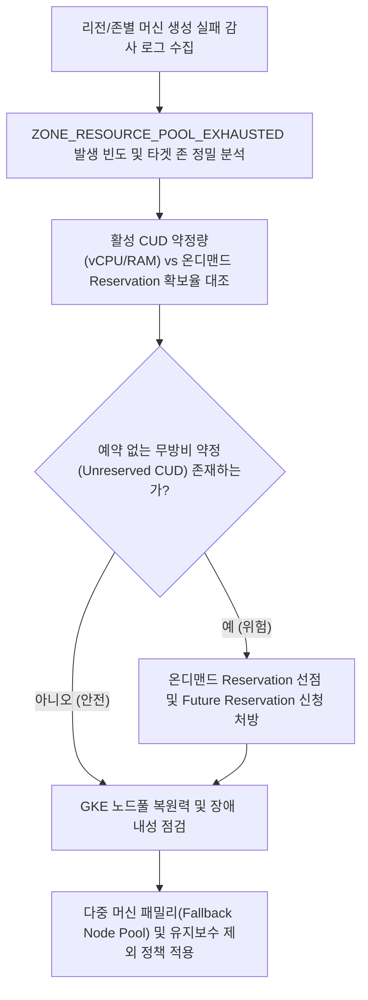

# Compute Engine 리전 용량 고갈 장애 방어 및 CUD, Reservation 정합성 진단기

Compute Engine 특정 리전 및 존에서 발생하는 머신 패밀리 용량 고갈(ZONE_RESOURCE_POOL_EXHAUSTED) 사태를 감사 로그로 역추적하고, 요금 할인만 적용되고 물리적 용량 확보가 없는 무방비 약정(Unreserved CUD) 위험과 GKE 자동 복구/업그레이드로 인한 노드 영구 결손을 방어하는 엔터프라이즈 인프라 진단 도구다.

**Audience**: `#Architect`, `#Developer`, `#FinOps`  
**Concern**: `#Billing`, `#Performance`, `#Resilience`  
**Service**: `#ComputeEngine`, `#GoogleKubernetesEngine`  

---

## 1. 이 가이드가 필요한 상황

- `us-central1` 등 주요 대형 리전에서 N4, N2 등 주력 머신 패밀리 프로비저닝 시 `ZONE_RESOURCE_POOL_EXHAUSTED` 에러로 VM 생성이 중단될 때
- GKE 클러스터 오토스케일러가 노드를 증설하지 못해 대량의 파드가 `Pending` 상태로 적체될 때
- GKE Auto-repair 기능에 의해 비정상 노드가 삭제되었으나 신규 용량 부족으로 수일간 복구되지 않아 서비스 쿼럼(Quorum) 위험이 발생할 때
- GKE 롤링 버전 업그레이드 시 새 노드를 확보하지 못해 업그레이드가 무한 지연되거나 서비스 다운타임이 우려될 때
- 1년 또는 3년 CUD(지속 사용 약정)를 체결했음에도 물리적 하드웨어 용량을 보장받지 못해 요금은 계속 나가면서 인스턴스를 띄우지 못하는 FinOps 이중 손실을 겪을 때

---

## 2. 진단 및 해결 흐름



---

## 3. 사전 준비 사항

본 도구를 실행하려면 최소 아래의 IAM 권한이 필요하다:

| 서비스 | 필요 역할(Role) | 최소 IAM 권한 |
| :--- | :--- | :--- |
| `Compute Engine` | `roles/compute.viewer` | `compute.commitments.list`, `compute.reservations.list` |
| `Cloud Logging` | `roles/logging.viewer` | `logging.logEntries.list` |
| `Google Kubernetes Engine` | `roles/container.viewer` | `container.clusters.list`, `container.clusters.get` |

---

## 4. 1분 퀵스타트

### 기본 가상 실행 (Dry-run)

실제 GCP API 호출이나 권한 없이 가상의 N4/N2 용량 고갈 시나리오와 CUD 정합성을 즉시 시뮬레이션할 수 있다:

```bash
./run.sh --dry-run
```

### 특정 리전 및 머신 패밀리 지정 진단

```bash
# us-central1 리전의 N4, N2 머신 패밀리 대상 최근 14일간 로그 진단
./run.sh --region=us-central1 --machine-families=n4,n2 --days=14

# 특정 프로젝트 대상 실행
./run.sh -p my-production-project -r us-central1 -m n4,c4,n2
```

---

## 5. 결과 출력 예시

```text
================================================================================
Compute Engine 리전 용량 고갈(Stockout) 장애 방어 및 CUD/Reservation 정합성 진단 리포트
진단 모드: 가상 실행 (Dry-run)
대상 프로젝트: demo-capacity-resilience-project
대상 리전: us-central1
점검 머신 패밀리: n4, n2
감사 로그 조회 기간: 최근 14일
================================================================================

[1단계] 최근 14일간 리전 내 용량 고갈(ZONE_RESOURCE_POOL_EXHAUSTED) 발생 내역
--------------------------------------------------------------------------------
존(Zone)         머신 유형              실패 횟수      호출 주체                     상태
--------------------------------------------------------------------------------
us-central1-a   n4-highmem-4       144건       GKE Cluster Autoscaler    ZONE_RESOURCE_POOL_E
us-central1-b   n4-standard-4      121건       GKE Cluster Autoscaler    ZONE_RESOURCE_POOL_E
us-central1-c   n4-highmem-8       5건         Manual gcloud compute i   ZONE_RESOURCE_POOL_E
us-central1-f   n4-standard-4      42건        GKE Cluster Autoscaler    ZONE_RESOURCE_POOL_E
us-central1-a   n2-highmem-4       28건        GKE Cluster Autoscaler    ZONE_RESOURCE_POOL_E
--------------------------------------------------------------------------------
  총 고갈 에러 감지 건수: 340건
  영향 존: us-central1-a, us-central1-b, us-central1-c, us-central1-f

[2단계] CUD(지속 사용 약정) 대비 실제 Reservation(용량 예약) 구비율 분석
--------------------------------------------------------------------------------
약정명                            패밀리      약정 vCPU      약정 메모리         약정 기간
--------------------------------------------------------------------------------
n4-committed-use-discount-3y   N4       98 vCPU      685.0 GB       2026-06-30 ~ 2029-06-30
--------------------------------------------------------------------------------
  - 구매된 CUD 총 규모: vCPU 98 코어
  - 실제 확보된 온디맨드 Reservation: 0개 예약 (총 0대 인스턴스)

  [위험 경고: UNRESERVED CUD DETECTED]
  - 자사는 장기 CUD(요금 할인)를 보유하고 있으나 물리적 온디맨드 Reservation(용량 예약)이 0건이다.
  - CUD는 요금 감면 제도일 뿐 인프라 가용성(Capacity)을 보장하지 않는다.
  - 리전 재고 고갈 시 약정 할인 요금은 계속 청구되면서 신규 VM 생성이 불가능한 이중 손실 위험이 존재한다.

[3단계] GKE 노드풀 구성 및 고갈 취약점(SPOF) 평가
--------------------------------------------------------------------------------
  * 클러스터: prod-core-cluster (노드풀: n4-workload-pool)
    - 현재 머신 유형: n4-highmem-4 (26대 운영 중)
    - 자동 복구(Auto-repair): True | 자동 업그레이드(Auto-upgrade): True
    - 다중 패밀리 대체 노드풀(Multi-family Fallback): False
    - 진단 결과: [CRITICAL] 신규 N4 용량 고갈 상태에서 노드 auto-repair 발생 시 노드 영구 결손 및 롤링 업그레이드 무한 지연 위험
--------------------------------------------------------------------------------

[4단계] 장애 방어 및 CUD 보호를 위한 즉각 조치 처방 가이드
================================================================================
1. CUD 보호를 위한 온디맨드 Reservation 즉시 생성:
   - 재고가 존재하는 존 또는 공급 재개 즉시 온디맨드 예약을 생성하여 물리적 슬롯을 선점한다.
   gcloud compute reservations create res-us-central1-n4-guard \
     --project=demo-capacity-resilience-project \
     --zone=us-central1-a \
     --vm-count=10 \
     --machine-type=n4-highmem-4 \
     --require-specific-reservation=false

2. GKE 자동 복구/업그레이드로 인한 노드 삭제 및 결손 방지:
   - 신규 용량 수급이 불안정한 기간 동안 GKE 유지보수 제외(Maintenance Exclusion)를 선언하여
     Auto-upgrade/Auto-repair로 기존 노드가 제거된 후 재할당받지 못하는 참사를 방지한다.
   gcloud container clusters update prod-core-cluster \
     --project=demo-capacity-resilience-project \
     --location=us-central1 \
     --add-maintenance-exclusion-name=freeze-capacity-shortage \
     --add-maintenance-exclusion-start=2026-09-10T00:00:00Z \
     --add-maintenance-exclusion-end=2026-09-24T00:00:00Z \
     --add-maintenance-exclusion-scope=no_upgrades

3. GKE 다중 머신 패밀리 백업 노드풀(Fallback Node Pool) 구축:
   - N4 단일 패밀리 의존성을 제거하고 N2, C4, C3 기반의 보조 노드풀을 생성하여
     오토스케일러 실패 시 우선순위(PriorityClass)에 따라 보조 노드풀로 파드가 분산 배치되도록 구성한다.

4. Future Reservation(FR) 또는 Flexible CUD 전환 검토:
   - 장기적으로 고갈 위험이 높은 리전은 60~90일 전 Google 계정팀을 통해 Future Reservation을 제출한다.
   - 특정 머신 패밀리에 종속되지 않으려면 재계약 시 Flexible CUD로 전환을 검토한다.
================================================================================
```

---

## 6. 결과 확인 후 즉각 조치 가이드

1. **물리적 온디맨드 Reservation(용량 예약) 생성**:
   - Compute Engine 예약 콘솔 ( https://console.cloud.google.com/compute/reservations )
   - Compute Engine 용량 예약 개요 ( https://cloud.google.com/compute/docs/instances/reservations-overview )
   - CUD 약정 수량만큼 온디맨드 예약을 생성하면 약정 할인 혜택이 예약된 인스턴스에 우선 적용되면서 물리적 슬롯이 선점된다.
2. **GKE 유지보수 제외(Maintenance Exclusion) 설정**:
   - GKE 클러스터 콘솔 ( https://console.cloud.google.com/kubernetes/list )
   - GKE 유지보수 기간 및 제외 구성 ( https://cloud.google.com/kubernetes-engine/docs/concepts/maintenance-windows-and-exclusions )
   - 용량 고갈 기간 동안 `no_upgrades` 스코프의 유지보수 제외 기간을 설정하여 노드 삭제 후 재생성 실패 사고를 방지한다.
3. **GKE 다중 머신 패밀리 노드풀 및 우선순위 스케줄링**:
   - GKE 노드풀 생성 및 관리 ( https://cloud.google.com/kubernetes-engine/docs/how-to/node-pools )
   - Kubernetes Pod Priority 및 Preemption ( https://kubernetes.io/docs/concepts/scheduling-eviction/pod-priority-preemption )
   - 보조 머신 패밀리(C4, N2 등) 노드풀을 추가하고 파드 스케줄러가 주 노드풀 고갈 시 자동으로 백업 노드풀로 확장되도록 구성한다.
4. **Future Reservation(사전 예약) 및 CUD 약정 관리**:
   - Compute Engine Future Reservation 가이드 ( https://cloud.google.com/compute/docs/instances/future-reservations-overview )
   - Compute Engine CUD 약정 가이드 ( https://cloud.google.com/compute/docs/instances/signing-up-committed-use-discounts )
   - 단일 머신 유형 종속을 탈피하고 장기적인 가용성을 확보한다.

---

## 7. 자원 정리 (Teardown) 가이드

본 진단 도구는 읽기 전용으로 Cloud Logging 및 Compute Engine 메타데이터만 쿼리하므로 별도의 인프라 리소스를 생성하지 않는다. 테스트 목적으로 생성한 온디맨드 Reservation이 있다면 유휴 비용 방지를 위해 삭제한다:

```bash
# 테스트용 Reservation 삭제
gcloud compute reservations delete res-us-central1-n4-guard --zone=us-central1-a --quiet
```
