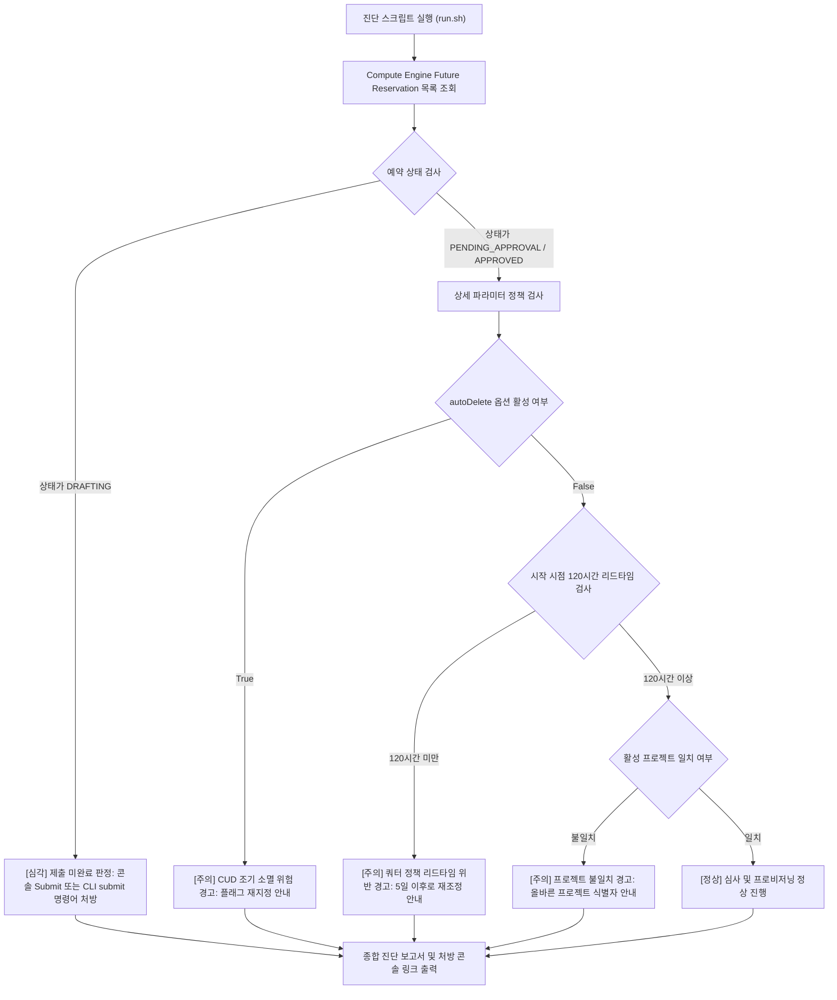

# Compute Engine GPU 및 특수 인스턴스 Future Reservation 사전 예약 진단기 (`gce-future-reservation-checker`)

Compute Engine GPU 및 특수 머신 타입 Future Reservation(FR) 신청 현황을 전수 점검하여 콘솔 제출 누락(DRAFTING 잔류), 프로젝트 식별자 불일치, CUD 연계 필수 옵션 누락 여부를 1분 만에 자동 진단하고 즉시 복구 명령어를 처방하는 도구다.

**Audience**: `#Architect`, `#Developer`  
**Concern**: `#Billing`, `#Resilience`  
**Service**: `#ComputeEngine`

---

## 1. 문제 증상 체크리스트
- 콘솔 UI에서 GPU 및 대규모 인스턴스 Future Reservation 신청을 완료했다고 생각했으나 수일이 지나도 심사 결과가 나오지 않고 승인 심사 큐에서 조회가 되지 않는다.
- 예약 상태가 `DRAFTING`에 머물러 있어 승인 큐(`PENDING_APPROVAL`)로 진입하지 못하고 GPU 및 특수 인스턴스 리소스 확보가 지연된다.
- 여러 개의 GCP 프로젝트를 운용하는 과정에서 실제 예약을 생성한 프로젝트와 심사를 요청한 프로젝트 번호가 불일치하여 조회가 누락된다.
- 1년 또는 3년 약정 할인(CUD)을 염두에 두고 예약을 생성했으나, CUD 연계 필수 플래그인 `--no-auto-delete-auto-created-reservations`가 누락되어 예약 만료 시 자동 소멸 위험이 발생한다.
- 최소 권장 사전 신청 기간(120시간/5일)을 준수하지 않아 쿼터 정책 검증에서 자동 반려된다.

---

## 2. 처리 흐름도



---

## 3. 필요 IAM 권한
- `roles/compute.viewer` (Compute Engine 읽기 권한)
- 세부 권한:
  - `compute.futureReservations.get`
  - `compute.futureReservations.list`

---

## 4. 원클릭 실행법

### 가상 검증 실행 (--dry-run)
실제 GCP 환경 호출 없이 사전 정의된 시뮬레이션 데이터를 바탕으로 결함 탐지 로직을 즉시 검증한다.
```bash
./run.sh --dry-run
```

### 실제 환경 진단
기본 활성 프로젝트의 모든 영역 Future Reservation을 조회하고 정책 위반 사항을 진단한다.
```bash
./run.sh
```

특정 프로젝트 및 특정 영역을 지정하여 진단할 경우:
```bash
./run.sh --project="your-project-id" --zone="us-south1-a"
```

결과를 JSON 포맷으로 수집하여 타 시스템과 연동할 경우:
```bash
./run.sh --dry-run --json
```

---

## 5. 결과 확인 후 즉각 조치 가이드
- Compute Engine Future Reservation 콘솔 ( https://console.cloud.google.com/compute/futureReservations )
- Compute Engine Future Reservation 개요 가이드 ( https://cloud.google.com/compute/docs/instances/future-reservations-overview )

### DRAFTING 상태 즉시 제출
```bash
gcloud beta compute future-reservations submit [RESERVATION_NAME] \
    --zone=[ZONE] \
    --project=[PROJECT_ID]
```

### CUD 연계 필수 파라미터 적용 신규 생성 예시 (GPU 및 특수 인스턴스)
```bash
gcloud beta compute future-reservations create [RESERVATION_NAME] \
    --zone=[ZONE] \
    --total-count=[COUNT] \
    --machine-type=[MACHINE_TYPE] \
    --accelerator=type=[ACCELERATOR_TYPE],count=[GPU_PER_VM] \
    --start-time="[YYYY-MM-DDTHH:MM:SSZ]" \
    --end-time="[YYYY-MM-DDTHH:MM:SSZ]" \
    --no-auto-delete-auto-created-reservations \
    --project=[PROJECT_ID]
```

---

## 6. 자원 정리 (Teardown) 안내
본 도구는 읽기 전용 진단 스크립트이므로 자체적으로 리소스를 생성하거나 과금을 유발하지 않는다. 다만 테스트 목적으로 생성한 불필요한 DRAFTING 또는 PENDING 상태의 Future Reservation은 다음 명령어로 삭제하여 관리 혼선을 방지한다:
```bash
gcloud beta compute future-reservations delete [RESERVATION_NAME] \
    --zone=[ZONE] \
    --project=[PROJECT_ID] \
    --quiet
```
