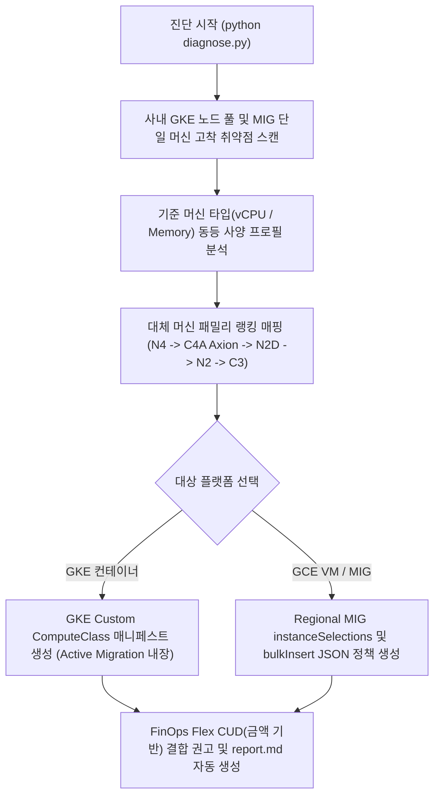

<!--
Copyright 2026 Google LLC. All Rights Reserved.
SPDX-License-Identifier: Apache-2.0

NOTICE: This code/repository is owned by Google LLC and provided under the Apache-2.0 License.
It is strictly provided as an EXAMPLE/REFERENCE ONLY and is NOT INTENDED FOR PRODUCTION USE.
All contents, designs, and code examples are subject to change, modification, or removal at any time without notice.

[고지 사항] 본 저장소 및 문서는 구글 (Google LLC) 소유이며 Apache 2.0 라이선스 하에 예시 (Sample) 용도로 제공된다.
프로덕션 환경용이 아니며, 사전 통지 없이 언제든지 수정, 변경 또는 삭제될 수 있다.
-->

> [!IMPORTANT]
> **구글 (Google LLC) 참조용 샘플 고지 사항**:
> 본 프로젝트의 모든 소스 코드와 문서는 Google LLC의 소유이며, Apache-2.0 라이선스에 따라 오직 **참조용 샘플 (Sample / Reference Only)** 목적으로만 제공된다. 프로덕션 환경에 그대로 사용할 수 없으며, 사전 통지 없이 언제든 내용이 수정, 변경 또는 삭제될 수 있다.

# Compute Engine & GKE 인스턴스 유연성(Instance Flexibility) 및 스톡아웃 방어 설계기

업계 전반의 AI 및 대규모 컴퓨트 수요 급증으로 인한 하드웨어 용량 부족(ZONE_RESOURCE_POOL_EXHAUSTED) 상황에서, 단일 머신 타입/단일 존 고착 위험을 진단하고 GKE Custom ComputeClass(CCC)의 능동적 마이그레이션(Active Migration) 및 Compute Engine Regional MIG의 instanceSelections 다중 머신 랭킹 정책을 자동 설계하여 무중단 복원력을 확보하는 올인원 아키텍처 진단 도구다. (As of 2026-09-29)

**Audience**: `#Architect`, `#Developer`, `#FinOps`  
**Concern**: `#Billing`, `#Performance`, `#Resilience`  
**Service**: `#ComputeEngine`, `#GoogleKubernetesEngine`  

---

## 1. 이 가이드가 필요한 상황 (증상 체크리스트)

- [ ] 주요 리전(서울, 도쿄, 아이오와 등)에서 특정 머신 또는 GPU 타입(예: `g2-standard-8`, `a2-highgpu-8g`, `n2-standard-8`) 프로비저닝 시 `ZONE_RESOURCE_POOL_EXHAUSTED` 에러로 배포나 스케일아웃이 실패한다.
- [ ] LLM 서빙 및 인퍼런스 환경에서 NVIDIA L4, T4 또는 A100 GPU 단일 패밀리에 고착되어 스톡아웃 시 파드가 Pending 상태에 갇힌다.
- [ ] GKE 오토스케일러가 노드를 증설하지 못해 대량의 파드가 `Pending` 상태로 적체되거나, 스팟 노드 대규모 회수 시 대체 노드를 구하지 못한다.
- [ ] Compute Engine MIG(Managed Instance Groups)가 단일 인스턴스 템플릿에 고착되어 특정 존의 하드웨어 고갈 시 자동 확장에 실패한다.
- [ ] 대규모 배치/분석 작업에서 단일 머신 요청이 실패하여 전체 파이프라인이 중단되거나 지연된다.
- [ ] 자원 기반 CUD(Resource-based CUD) 약정에 묶여 최신 고성능 머신(N4, C4, C4A Axion)이나 GPU 인스턴스로 인프라를 유연하게 이전하지 못하고 있다.

---

## 2. 진단 및 해결 흐름



---

## 3. 사전 준비 사항 및 필요 권한

### (1) 필수 API 활성화
본 도구가 사내 클러스터와 인스턴스 그룹 설정을 조회하려면 아래 API가 활성화되어 있어야 한다:
```bash
gcloud services enable compute.googleapis.com container.googleapis.com
```

### (2) 진단 실행 계정 최소 IAM 권한
본 도구는 순수 읽기 전용 진단 스크립트이므로 최소한의 조회 권한만 요구한다:

| 역할 (Role) | 설명 |
| :--- | :--- |
| `roles/compute.viewer` | Compute Engine 인스턴스 템플릿 및 MIG 설정 조회 권한 |
| `roles/container.viewer` | GKE 클러스터 및 노드 풀 구성 상태 조회 권한 |

---

## 4. 1분 퀵스타트

### 가상 모의 실행 (Dry-run) - 예습
실제 GCP 호출 없이 8 vCPU / 32 GB RAM 기준 표준 워크로드의 동등 사양 랭킹과 GKE CCC 매니페스트 및 MIG 정책 생성을 1초 만에 검증한다:
```bash
python diagnose.py --dry-run
```

### 사내 실측 진단 실행 - 실습 및 복습
현재 활성화된 프로젝트의 실데이터를 기반으로 단일 고착 취약점을 진단하고 맞춤형 유연성 정책을 산출한다:
```bash
# 기본 활성 프로젝트 및 기본 머신(n2-standard-8) 유연성 설계
python diagnose.py

# 특정 프로젝트, 특정 리전 및 기준 머신(16코어 표준) 지정
python diagnose.py --project-id=my-compute-project --region=asia-northeast3 --base-machine=n2-standard-16

# GPU 인퍼런스/서빙 워크로드 (NVIDIA L4 기준 대체 랭킹 및 GKE CCC/MIG 정책 산출)
python diagnose.py --base-machine=g2-standard-8

# GPU 대규모 파인튜닝/연산 워크로드 (NVIDIA A100/H100 기준 대체 랭킹 산출)
python diagnose.py --base-machine=a2-highgpu-8g
```

---

## 5. 결과 확인 후 즉각 조치 가이드

### 1단계: GKE 워크로드 Custom ComputeClass(CCC) 배포
산출된 `resilient-compute-class` 매니페스트를 GKE 클러스터에 적용한다. 용량 부족 시 하위 머신으로 자동 폴백되고, 최상위 머신(N4 등) 자원이 확보되면 워크로드가 무중단으로 자동 복귀(Active Migration)한다:
```bash
# GKE 클러스터 자격 증명 획득
gcloud container clusters get-credentials [CLUSTER_NAME] --region=[REGION]

# ComputeClass 매니페스트 적용 (report.md의 YAML 내용 활용)
kubectl apply -f compute-class.yaml
```
- GKE 공식 문서 ( https://cloud.google.com/kubernetes-engine/docs )

### 2단계: Compute Engine Regional MIG instanceSelections 적용
기존의 단일 인스턴스 템플릿 MIG 대신 다중 머신 랭킹이 포함된 Regional MIG를 구성하여 특정 존 스톡아웃을 스마트하게 우회한다:
```bash
# Regional MIG 생성 및 인스턴스 선택 정책 지정
gcloud compute instance-groups managed create [MIG_NAME] \
    --region=[REGION] \
    --target-distribution-shape=BALANCED \
    --instance-template=[TEMPLATE_NAME] \
    --size=10 \
    --instance-flexibility-policy=instance-selections.json
```
- Compute Engine Managed Instance Groups 공식 문서 ( https://cloud.google.com/compute/docs/instance-groups )

### 3단계: 대규모 단기 배치/분석 작업에 bulkInsert API 도입
수백 대의 단기 연산 워커를 띄울 때는 단일 VM 생성을 반복하지 않고 `bulkInsert` API를 활용하여 리전 내 최적 존과 대체 머신 타입을 원자적으로 획득한다:
- Compute Engine 인스턴스 공식 문서 ( https://cloud.google.com/compute/docs/instances )

### 4단계: 상업적 유연성(Flex CUD) 포트폴리오 전환
- 특정 머신 패밀리(N2 등)에 고착된 자원 기반 CUD(Resource-based CUD)는 신규 머신(N4, C4, C4A) 전환 시 할인이 단절된다.
- 전 리전, 전 머신 패밀리에 교차 적용되는 금액 기반 Flex CUD(Flexible Committed Use Discounts)를 결합하여 인프라 유연성과 FinOps 할인을 동시 보장한다.
- 지속 사용 할인(CUD) 공식 문서 ( https://cloud.google.com/docs/cuds )

---

## 6. 자원 정리 가이드 (Teardown)
본 도구는 순수 읽기 전용 진단 도구이므로 별도의 클라우드 인프라 자원을 생성하지 않으며, 추가 삭제 절차가 필요하지 않다.
