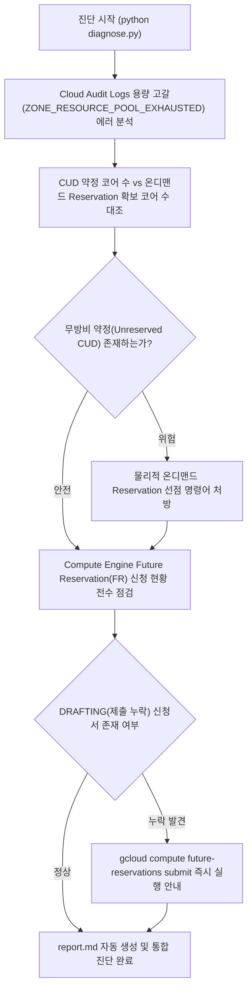

<!--
Copyright 2026 Google LLC. All Rights Reserved.
SPDX-License-Identifier: Apache-2.0

NOTICE: This code/repository is owned by Google LLC and provided under the Apache-2.0 License.
It is strictly provided as an EXAMPLE/REFERENCE ONLY and is NOT INTENDED FOR PRODUCTION USE.
All contents, designs, and code examples are subject to change, modification, or removal at any time without notice.

[고지 사항] 본 저장소 및 문서는 구글 (Google LLC) 소유이며 Apache 2.0 라이선스 하에 예시 (Sample) 용도로 제공된다.
프로덕션 환경용이 아니며, 사전 통지 없이 언제든지 수정, 변경 또는 삭제될 수 있다.
-->

> [!IMPORTANT]
> **구글 (Google LLC) 참조용 샘플 고지 사항**:
> 본 프로젝트의 모든 소스 코드와 문서는 Google LLC의 소유이며, Apache-2.0 라이선스에 따라 오직 **참조용 샘플 (Sample / Reference Only)** 목적으로만 제공된다. 프로덕션 환경에 그대로 사용할 수 없으며, 사전 통지 없이 언제든 내용이 수정, 변경 또는 삭제될 수 있다.

# Compute Engine 하드웨어 예약(Reservation) 및 CUD 용량 보장 통합 진단기

Compute Engine 특정 리전 및 존에서 발생하는 용량 고갈(ZONE_RESOURCE_POOL_EXHAUSTED) 사태를 감사 로그로 역추적하고, 요금 할인만 적용되고 물리적 용량 확보가 없는 무방비 약정(Unreserved CUD) 위험과 GPU/특수 머신의 Future Reservation(FR) 미제출 및 승인 지연 문제를 한 번에 진단하여 하드웨어 가용성을 보장하는 통합 인프라 진단 도구다. (As of 2026-09-30)

**Audience**: `#Architect`, `#Developer`, `#FinOps`  
**Concern**: `#Billing`, `#Performance`, `#Resilience`  
**Service**: `#ComputeEngine`, `#GoogleKubernetesEngine`  

---

## 1. 이 가이드가 필요한 상황 (증상 체크리스트)

- [ ] 주요 리전(서울, 도쿄, 아이오와 등)에서 N4, N2 또는 GPU 머신 프로비저닝 시 `ZONE_RESOURCE_POOL_EXHAUSTED` 에러로 인스턴스 생성이 중단될 때
- [ ] 1년 또는 3년 CUD(지속 사용 약정)를 체결했음에도 물리적 하드웨어 용량을 보장받지 못해 요금은 계속 나가면서 인스턴스를 띄우지 못하는 FinOps 손실이 발생할 때
- [ ] GPU(H100, A100, L4) 대규모 프로젝트를 위해 Future Reservation을 생성했으나, 콘솔에서 제출(Submit)을 누락하여 `DRAFTING` 상태로 방치되어 있을 때
- [ ] Future Reservation의 최소 리드 타임(120시간 / 5일)을 지키지 못해 구글 용량 팀 심사에서 거절되거나 서비스 론칭이 지연될 위험이 있을 때

---

## 2. 진단 및 해결 흐름



---

## 3. 사전 준비 사항 및 필요 권한

### (1) 필수 API 활성화
```bash
gcloud services enable compute.googleapis.com logging.googleapis.com
```

### (2) 진단 실행 계정 최소 IAM 권한

| 역할 (Role) | 설명 |
| :--- | :--- |
| `roles/compute.viewer` | CUD 약정 및 온디맨드/Future Reservation 목록 조회 권한 |
| `roles/logging.viewer` | Cloud Logging 스톡아웃 감사 로그 조회 권한 |

---

## 4. 1분 퀵스타트

### 가상 모의 실행 (Dry-run) - 예습
실제 GCP 호출 없이 시뮬레이션 데이터를 바탕으로 무방비 CUD 탐지 및 Future Reservation 미제출 검사를 1초 만에 검증한다:
```bash
python diagnose.py --dry-run
```

### 사내 실측 진단 실행 - 실습 및 복습
현재 활성화된 프로젝트의 실데이터를 기반으로 CUD 용량 보장율과 Future Reservation 현황을 통합 진단한다:
```bash
# 기본 활성 프로젝트 점검
python diagnose.py

# 특정 프로젝트 및 특정 리전 지정
python diagnose.py -p my-gce-project -r asia-northeast3 -d 14
```

---

## 5. 결과 확인 후 즉각 조치 가이드

### 1단계: 무방비 CUD에 대한 온디맨드 Reservation 선점
물리적 용량이 없는 CUD에 대해 동일 존의 온디맨드 예약을 생성하여 하드웨어를 물리적으로 찜(선점)한다:
```bash
gcloud compute reservations create res-guaranteed-capacity \
    --zone=[ZONE] \
    --vm-count=[COUNT] \
    --machine-type=[MACHINE_TYPE]
```
- Compute Engine Reservations 공식 문서 ( https://cloud.google.com/compute/docs/instances/reservations-overview )

### 2단계: DRAFTING 상태 Future Reservation 즉시 제출
콘솔에서 생성만 해두고 승인 요청을 보내지 않은 Future Reservation에 대해 submit 명령을 실행한다:
```bash
gcloud compute future-reservations submit [FR_NAME] --zone=[ZONE]
```
- Future Reservations 공식 문서 ( https://cloud.google.com/compute/docs/instances/future-reservations-overview )

---

## 6. 자원 정리 가이드 (Teardown)
본 도구는 순수 읽기 전용 진단 도구이므로 별도의 클라우드 인프라 자원을 생성하지 않으며, 추가 삭제 절차가 필요하지 않다.
