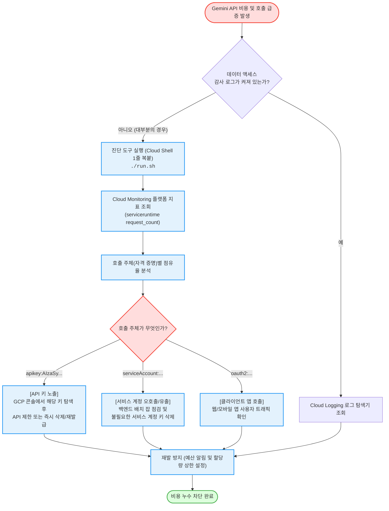

<!--
Copyright 2026 Google LLC. All Rights Reserved.
SPDX-License-Identifier: Apache-2.0

NOTICE: This code/repository is owned by Google LLC and provided under the Apache-2.0 License.
It is strictly provided as an EXAMPLE/REFERENCE ONLY and is NOT INTENDED FOR PRODUCTION USE.
All contents, designs, and code examples are subject to change, modification, or removal at any time without notice.

[고지 사항] 본 저장소 및 문서는 구글 (Google LLC) 소유이며 Apache 2.0 라이선스 하에 예시 (Sample) 용도로 제공된다.
프로덕션 환경용이 아니며, 사전 통지 없이 언제든지 수정, 변경 또는 삭제될 수 있다.
-->

> [!IMPORTANT]
> **구글 (Google LLC) 참조용 샘플 고지 사항**:
> 본 프로젝트의 모든 소스 코드와 문서는 Google LLC의 소유이며, Apache-2.0 라이선스에 따라 오직 **참조용 샘플 (Sample / Reference Only)** 목적으로만 제공된다. 프로덕션 환경에 그대로 사용할 수 없으며, 사전 통지 없이 언제든 내용이 수정, 변경 또는 삭제될 수 있다.

# 제미나이(Gemini) API 비용 급증 원인 진단 (`gemini-billing-spike`)

데이터 액세스 감사 로그(Audit Logs)가 꺼져 있어도, 구글 클라우드 기본 모니터링 지표를 통해 **어떤 인증 수단(API 키, 서비스 계정, OAuth 등)에서 Gemini 호출 비용이 급증했는지 1분 만에 규명**하는 진단 가이드다. (As of 2026-07-01)

**Audience**: `#Developer`, `#FinOps`, `#SecOps`  
**Concern**: `#Billing`, `#CostSpike`, `#Security`  
**Service**: `#CloudMonitoring`, `#GeminiAPI`

---

## 이 가이드가 필요한 상황 (증상 체크리스트)

- **비용 급증**: 이번 달 청구서나 예산 알림에서 Gemini (Vertex AI 또는 AI Studio) 비용이 예상보다 갑자기 수 배 이상 급증했을 때
- **감사 로그 부재**: "누가 호출했는지" 확인하려 했으나, BigQuery 감사 로그 내보내기나 데이터 액세스 감사 로그가 비활성화되어 있어 원인을 파악하기 어려울 때
- **보안 유출 의심**: 개발자가 GitHub나 클라이언트 앱에 API 키 또는 서비스 계정 키를 실수로 노출했는지 신속히 점검하고자 할 때

---

## 진단 및 해결 흐름 (Activity Diagram)



---

## 사전 준비 사항 (필요 권한 - IAM)

이 도구는 **오직 읽기(조회) 작업만 수행**하며, 인프라를 변경하거나 삭제하지 않는다.  
스크립트를 실행하는 사용자 또는 서비스 계정에 아래 역할(Role) 중 하나가 필요하다:

| 역할 (Role) | 권한 ID | 용도 |
| :--- | :--- | :--- |
| **모니터링 뷰어 (권장)** | `roles/monitoring.viewer` | Cloud Monitoring 지표 데이터 조회 |
| **뷰어 (기본)** | `roles/viewer` | 프로젝트 리소스 및 지표 전반 조회 |

> [!NOTE]
> 사내 보안팀에 권한을 요청할 때는 **"Cloud Monitoring 지표 조회를 위한 `roles/monitoring.viewer` 권한 1개"**만 요청하면 된다.

---

## 1분 퀵스타트 (실행 방법)

### 방법 1: 구글 클라우드 쉘 (Google Cloud Shell) - *가장 권장*

별도의 파이썬 환경이나 패키지를 설치할 필요 없이 웹 브라우저에서 바로 실행한다.

```bash
# 1. 저장소 클론 및 폴더 이동
git clone https://github.com/jiangjun-forge/google-cloud-0-to-1.git
cd google-cloud-0-to-1/samples/gemini-billing-spike

# 2. 진단 실행 (현재 gcloud 기본 활성 프로젝트 자동 감지)
./run.sh

# 사전 가상 체험 또는 데모 모드 (GCP 호출 및 권한 없이 즉시 테스트):
./run.sh --dry-run

# 특정 프로젝트와 기간(예: 최근 30일)을 지정하려면:
./run.sh -p your-project-id -d 30
```

### 방법 2: 로컬 환경 (Local Python)

```bash
# 가상 환경 생성 및 의존성 설치
python3 -m venv .venv
source .venv/bin/activate
pip install -r requirements.txt

# GCP 인증 및 진단 실행
gcloud auth application-default login
python diagnose.py --project your-project-id --days 90
```

---

## 결과 출력 예시

스크립트가 완료되면 아래와 같이 **어떤 자격 증명이 전체 호출의 몇 %를 차지했는지** 명확한 표로 출력된다:

```text
========================================================================
[진단 결과] 제미나이(Gemini) 사용량 및 비용 급증 원인 분석 리포트
   - 대상 프로젝트: my-production-ai-project
   - 조회 대상 기간: 최근 90일
========================================================================

총 집계된 API 호출 수: 148,250 건 (시계열 레코드: 4개)

┌──────────────────────────────────────────────────────────────────────┐
│ 1. 호출 주체(자격 증명)별 점유율 및 호출 횟수                        │
├──────────────────────────────────────────────────────────────────────┤
│  - apikey:AIzaSyB1234567890abcdefghijklmnopqr   :  135,200회 ( 91.2%) │
│  - serviceAccount:gemini-batch-sa@my-proj...    :   13,050회 (  8.8%) │
└──────────────────────────────────────────────────────────────────────┘

[2. 호출된 서비스 및 API 메서드]
  - aiplatform.googleapis.com (Vertex AI Gemini): 148,250회

[상위 호출 메서드]
  - GenerateContent: 142,100회
  - StreamGenerateContent: 6,150회
```

---

## 결과 확인 후 즉각 조치 가이드

출력된 자격 증명 유형에 따라 다음 단계로 이동하여 즉시 조치한다:

### 1. `apikey:AIzaSy...`가 상위 점유율을 차지한 경우
- **원인**: 누군가 소스 코드, 프론트엔드 모바일 앱, 또는 퍼블릭 깃허브에 API 키를 노출했거나 외부 테스트용 키가 무제한 호출되고 있다.
- **조치 방법**:
  1. GCP 콘솔 > API 및 서비스 > 사용자 인증 정보 ( https://console.cloud.google.com/apis/credentials )로 이동한다.
  2. 화면에 찍힌 키 앞부분(`AIzaSy...`)과 일치하는 API 키를 찾는다.
  3. **키 수정(연필 아이콘)**을 눌러 조치한다:
     - **애플리케이션 제한**: 특정 웹사이트(HTTP 리퍼러)나 특정 IP에서만 호출되도록 제한한다.
     - **API 제한**: 반드시 필요한 API(예: Vertex AI API)만 체크하고 나머지는 잠근다.
  4. 알 수 없는 키이거나 유출이 확실한 경우 즉시 **삭제(휴지통 아이콘)**한다.

### 2. `serviceAccount:...`가 상위 점유율을 차지한 경우
- **원인**: 내부 배치 애플리케이션, Cloud Run 서비스, 또는 CI/CD 파이프라인에서 무한 재시도나 대량 호출 루프가 돌고 있다.
- **조치 방법**:
  1. GCP 콘솔 > IAM 및 관리자 > 서비스 계정 ( https://console.cloud.google.com/iam-admin/serviceaccounts )으로 이동한다.
  2. 해당 서비스 계정이 연결된 VM, Cloud Run, GKE 워크로드를 확인한다.
  3. JSON 키 파일이 발급되어 있다면 해당 키의 최근 생성일을 확인하고 불필요한 키는 사용 중지(Disable) 또는 삭제한다.

---

## 향후 비용 누수 방지 베스트 프랙티스

1. **예산 알림(Budget Alert) 설정**:
   - 청구 계정에서 예상 사용 금액의 50%, 90%, 100% 도달 시 담당자에게 즉시 이메일이 발송되도록 Cloud Billing 예산 및 알림 콘솔 ( https://console.cloud.google.com/billing/budgets ) 에서 구성한다.
2. **일일 할당량(Quota Caps) 강제 적용**:
   - 테스트/개발 프로젝트라면 Vertex AI API의 `분당 요청 수(RPM)` 또는 `일일 요청 한도`를 낮게 고정하여 실수로 인한 요금 폭탄을 구조적으로 차단하도록 IAM 및 관리자 할당량 콘솔 ( https://console.cloud.google.com/iam-admin/quotas ) 에서 설정한다.

---

## 자원 정리 (Teardown Guide)

본 도구는 순수 Cloud Monitoring 플랫폼 지표 조회 도구이며 클라우드 상에 영구 자원을 생성하지 않으므로 별도의 자원 정리 작업이 필요하지 않다.
