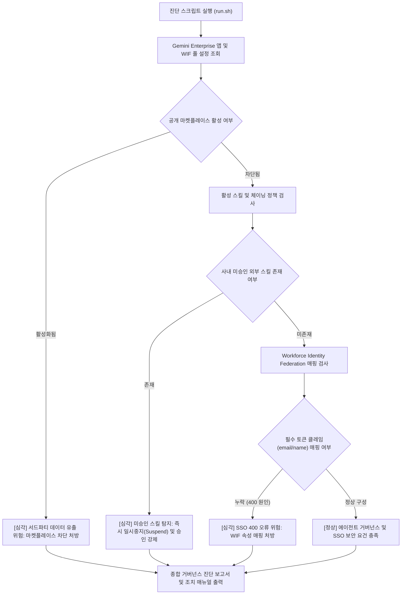

# Gemini Enterprise 에이전트 마켓플레이스 차단 및 사내 거버넌스 진단기 (`gemini-enterprise-agent-governance-guard`)

Gemini Enterprise 환경에서 외부 공개 에이전트 마켓플레이스 접근 차단, 사내 승인 커스텀 에이전트 강제 정책, 미승인 스킬 체이닝 위험 및 Microsoft Entra ID(Workforce Identity Federation) SSO 400 인증 오류를 1분 만에 자동 진단하고 복구 처방을 제공하는 도구다. (As of 2026-09-09)

**Audience**: `#Architect`, `#Compliance`, `#SecOps`  
**Concern**: `#Compliance`, `#IAM`, `#Security`  
**Service**: `#AgentPlatform`, `#GeminiEnterprise`

---

## 1. 문제 증상 체크리스트
- 전사 임직원에게 Gemini Enterprise 라이선스를 배포한 후, 사용자가 외부 공개 마켓플레이스 에이전트에 무분별하게 접근하여 사내 기밀 데이터를 전송할 위험이 발생한다.
- 관리자가 마켓플레이스 구매/조달 담당자 메일을 지정하지 않은 상태에서 사용자가 에이전트 승인 요청을 보내 혼선이 빚어지거나 승인 없이 임의 활성화된다.
- 일반 사용자가 에이전트 플로우에서 검증되지 않은 외부 서드파티 스킬을 임의로 연결하여 워크플로우를 생성하지 못하도록 차단해야 한다.
- Microsoft Entra ID(구 Azure AD)와 Google Cloud Workforce Identity Federation(WIF)을 연동하여 SSO 로그인 시 클레임 속성 매핑 누락으로 인해 HTTP 400 Bad Request 에러가 발생한다.

---

## 2. 처리 흐름도



---

## 3. 필요 IAM 권한
- `roles/discoveryengine.viewer` (Gemini Enterprise 앱 설정 조회)
- `roles/iam.workforcePoolViewer` (Workforce Identity Federation 풀 조회)

---

## 4. 원클릭 실행법

### 가상 검증 실행 (--dry-run)
실제 API 호출 없이 가상 시뮬레이션 데이터를 바탕으로 거버넌스 정책 위반 및 SSO 결함을 즉시 확인한다.
```bash
./run.sh --dry-run
```

### 실제 환경 진단
기본 활성 프로젝트의 지정 Gemini Enterprise 앱 설정을 점검한다.
```bash
./run.sh --project="your-project-id" --app-id="default-enterprise-agent-app"
```

결과를 JSON 포맷으로 수집할 경우:
```bash
./run.sh --dry-run --json
```

---

## 5. 결과 확인 후 즉각 조치 가이드
- Gemini Enterprise 스킬 및 에이전트 관리 가이드 ( https://cloud.google.com/gemini/docs/enterprise/manage-skills )
- Google Cloud Workforce Identity Federation 구성 가이드 ( https://cloud.google.com/iam/docs/workforce-identity-federation )
- Google Cloud 콘솔 Workforce Identity 풀 ( https://console.cloud.google.com/iam-admin/workforce-pools )

### 1. 마켓플레이스 조달 요청 비활성화 및 승인 절차 유지
Gemini Enterprise 콘솔 -> [에이전트] -> [조달 및 통합 요청] 화면에서 구매팀 담당자 이메일을 비워두거나, 사내 승인된 Agent Registry만 노출되도록 앱 정책을 고정한다.

### 2. 미승인 외부 스킬 일시중지(Suspend)
```bash
# Gemini Enterprise 관리 콘솔 [스킬(Skills)] 목록에서 미승인 외부 스킬을 선택하고 'Suspend' 처리
```

### 3. Entra ID WIF 풀 속성 매핑 보완 (400 오류 해결)
```bash
gcloud iam workforce-pools providers update-oidc [PROVIDER_ID] \
    --workforce-pool=[POOL_ID] \
    --location=global \
    --attribute-mapping="google.subject=assertion.sub,attribute.user_email=assertion.email,attribute.display_name=assertion.name"
```

---

## 6. 자원 정리 (Teardown) 안내
본 도구는 읽기 전용 진단 스크립트이므로 자체적으로 리소스를 생성하지 않는다. 테스트 목적으로 생성한 Workforce Identity 풀이나 공급업체 설정은 다음 명령어로 삭제한다:
```bash
gcloud iam workforce-pools delete [WORKFORCE_POOL_ID] --location=global --quiet
```
