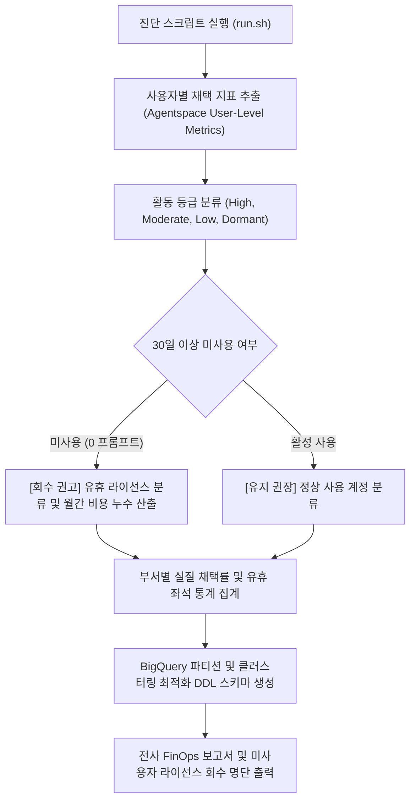

# Gemini Enterprise 사용자 채택률 분석 및 유휴 라이선스 회수 진단기 (`gemini-enterprise-analytics-exporter`)

> **태그**: `#FinOps`, `#SecOps` | `#Billing`, `#Compliance` | `#BigQuery`, `#CloudIdentity`, `#GeminiEnterprise`  
> **요약**: 전사 배포된 Gemini Enterprise 라이선스의 부서 및 사용자별 실제 활성도 지표를 추출하여 BigQuery 적재 스키마로 가공하고 미사용 유휴 라이선스 회수 대상을 1분 만에 분석하는 도구다.

---

## 1. 문제 증상 체크리스트
- 전사 또는 계열사 단위로 수천 개의 Gemini Enterprise 라이선스를 일괄 구매했으나, 실제 부서별 임직원 활용도(Active Rate)를 측정할 수 있는 통합 대시보드가 없다.
- 라이선스 할당 후 30일 이상 단 한 번도 프롬프트를 입력하지 않은 유휴 계정이 방치되어 불필요한 구독 비용이 매월 누수된다.
- 보안 및 규정 준수(Compliance) 목적으로 계정별 사용 빈도와 활동 등급(High, Moderate, Low, Dormant)을 체계적으로 분류하여 감사 리포트를 제출해야 한다.
- Cloud Identity 및 Google Workspace 관리자 콘솔에서 사용자별 지표를 일일이 수동 집계하는 데 과도한 공수가 발생하며 BigQuery 자동 파이프라인이 부재하다.

---

## 2. 처리 흐름도



---

## 3. 필요 IAM 및 관리자 권한
- **Google Cloud IAM 권한**:
  - `roles/bigquery.dataEditor` (테이블 생성 및 데이터 적재)
  - `roles/bigquery.jobUser` (쿼리 및 로드 작업 실행)
- **Google Workspace / Cloud Identity 권한**:
  - Reports API 읽기 권한 또는 라이선스 관리자 권한 (`https://www.googleapis.com/auth/admin.reports.usage.readonly`)

---

## 4. 원클릭 실행법

### 가상 검증 실행 (--dry-run)
실제 API 권한 없이 모의 기업 사용자 데이터(부서별 10개 계정)를 바탕으로 유휴 라이선스 탐지, 부서별 채택률, 월간 누수 비용 산출을 즉시 검증한다.
```bash
./run.sh --dry-run
```

### 실제 환경 진단 및 회수 명단 추출
30일 이상 미사용 계정을 기본 기준으로 진단한다.
```bash
./run.sh --project="your-project-id"
```

미사용 유휴 판정 기준을 60일로 조정할 경우:
```bash
./run.sh --threshold-days=60
```

타 시스템 연동용 JSON 출력:
```bash
./run.sh --dry-run --json
```

---

## 5. BigQuery DDL 스키마 및 회수 조치 가이드

### 1) BigQuery 적재 최적화 테이블 DDL
```sql
CREATE TABLE IF NOT EXISTS `gemini_analytics.user_adoption_metrics` (
  user_email STRING NOT NULL,
  department STRING,
  license_type STRING NOT NULL,
  days_active_last_30d INT64,
  total_prompts INT64,
  total_tokens INT64,
  last_active_date DATE,
  inactive_days INT64,
  activity_tier STRING,
  reclaim_candidate BOOL,
  snapshot_timestamp TIMESTAMP NOT NULL
)
PARTITION BY DATE(snapshot_timestamp)
CLUSTER BY department, activity_tier;
```

### 2) 관리 콘솔 조치 링크 및 라이선스 회수
- **Google Workspace 관리 콘솔 라이선스 관리**: ( https://admin.google.com/ac/billing/subscriptions )
- **회수 권고 대상 계정**:
  - 진단 결과 도출된 `[회수 권고]` 계정의 Gemini Enterprise 라이선스를 해제하고 대기 중인 신규 부서 임직원에게 재할당한다.

---

## 6. 자원 정리(Teardown) 안내
본 도구는 기본적으로 읽기 전용 분석을 수행한다. 테스트 목적으로 생성한 BigQuery 데이터세트 및 테이블을 삭제하려면 다음 명령어를 실행한다:
```bash
bq rm -r -f -d [PROJECT_ID]:gemini_analytics
```
