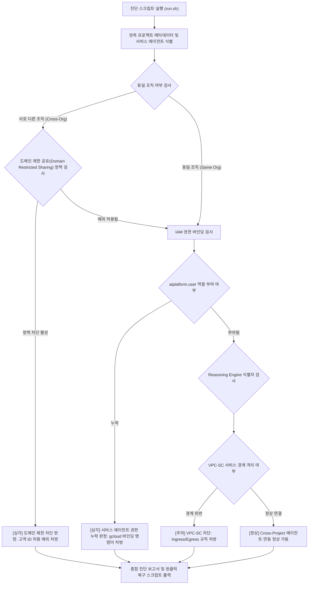

# Gemini Enterprise Cross-Org 커스텀 에이전트 연동 및 조직 정책 진단기 (`gemini-enterprise-cross-org-agent-resolver`)

Gemini Enterprise 웹 앱 프로젝트와 타 프로젝트 또는 타 조직의 커스텀 에이전트(Agent Engine) 연동 시 발생하는 도메인 제한 공유 조직 정책(Domain Restricted Sharing) 차단, 서비스 에이전트 IAM 권한 부재, VPC-SC 경계 위반을 1분 만에 자동 진단하고 복구 명령어를 처방하는 도구다.

**Audience**: `#Architect`, `#Developer`, `#SecOps`  
**Concern**: `#IAM`, `#Resilience`, `#Security`  
**Date**: `2026-09-09`  
**Service**: `#AgentPlatform`, `#GeminiEnterprise`

---

## 1. 문제 증상 체크리스트
- 사내 엔터프라이즈 환경에서 Gemini Enterprise 웹 앱(프로젝트 A, 조직 A)과 계열사/사업부별 커스텀 에이전트(Agent Engine, 프로젝트 B, 조직 B)가 서로 다른 프로젝트에 분리되어 있어 연동 시 403 Forbidden 오류가 발생한다.
- 상대 조직의 서비스 에이전트에 권한을 부여하려 할 때, 상위 조직 정책 `constraints/iam.allowedPolicyMemberDomains`에 의해 외부 도메인 계정 바인딩이 차단된다.
- Gemini Enterprise Agent Registry에 커스텀 에이전트 등록 시 필수 서비스 에이전트(`service-[NUM]@gcp-sa-discoveryengine.iam.gserviceaccount.com`)에 `roles/aiplatform.user` 역할이 부여되지 않아 에이전트 호출이 실패한다.
- VPC Service Controls(VPC-SC) 서비스 경계가 설정된 환경에서 두 프로젝트 간 API 호출이 차단되어 에이전트 목록 검색 및 추론이 불가능하다.

---

## 2. 처리 흐름도



---

## 3. 필요 IAM 권한
- `roles/iam.securityReviewer` (IAM 정책 조회)
- `roles/orgpolicy.policyViewer` (조직 정책 제약 조건 조회)
- `roles/aiplatform.viewer` (Vertex AI Agent Engine 조회)

---

## 4. 원클릭 실행법

### 가상 검증 실행 (--dry-run)
실제 GCP API 호출 없이 Cross-Org 시뮬레이션 데이터를 바탕으로 정책 충돌을 즉시 확인한다.
```bash
./run.sh --dry-run
```

### 실제 환경 진단
두 프로젝트 간 연동 상태를 점검한다.
```bash
./run.sh --ge-project="ge-app-prod" --agent-project="custom-agent-ml-prod" --engine-id="8492049182740192841"
```

결과를 JSON 포맷으로 수집할 경우:
```bash
./run.sh --dry-run --json
```

---

## 5. 결과 확인 후 즉각 조치 가이드
- Vertex AI Agent Engine 개요 ( https://cloud.google.com/vertex-ai/generative-ai/docs/agent-engine/overview )
- 도메인별 ID 제한 조직 정책 안내 ( https://cloud.google.com/resource-manager/docs/organization-policy/restricting-domains )
- Gemini Enterprise 제품 개요 ( https://cloud.google.com/gemini/docs/enterprise/overview )

### 1. Agent Engine 프로젝트에 GE 서비스 에이전트 권한 부여
```bash
gcloud projects add-iam-policy-binding [AGENT_PROJECT_ID] \
    --member="serviceAccount:service-[GE_PROJECT_NUM]@gcp-sa-discoveryengine.iam.gserviceaccount.com" \
    --role="roles/aiplatform.user"
```

### 2. 도메인 제한 공유 조직 정책 예외 적용 (Cross-Org 시)
```bash
gcloud resource-manager org-policies allow constraints/iam.allowedPolicyMemberDomains [CUSTOMER_ID] \
    --project=[AGENT_PROJECT_ID]
```

---

## 6. 자원 정리 (Teardown) 안내
본 도구는 읽기 전용 진단 스크립트이므로 자체적으로 리소스를 생성하지 않는다. 테스트 목적으로 부여한 크로스 프로젝트 IAM 권한은 다음 명령어로 회수할 수 있다:
```bash
gcloud projects remove-iam-policy-binding [AGENT_PROJECT_ID] \
    --member="serviceAccount:service-[GE_PROJECT_NUM]@gcp-sa-discoveryengine.iam.gserviceaccount.com" \
    --role="roles/aiplatform.user"
```
