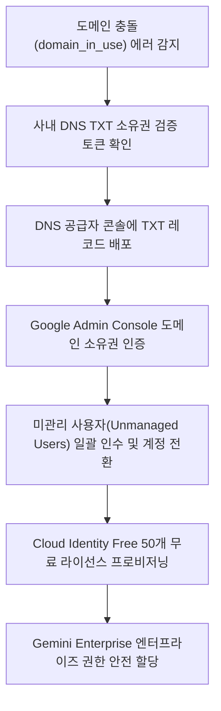

# Gemini Enterprise 도입을 위한 도메인 충돌(domain_in_use) 진단기

`#Audience` `#Architect` `#SecOps`  
`#Concern` `#Compliance` `#IAM`  
`#Service` `#CloudIdentity` `#GeminiEnterprise`  

요약: Gemini Enterprise 도입 시 사내 도메인이 기존 비관리 계정에 의해 선점되어 발생하는 도메인 충돌(domain_in_use)을 진단하고, Google Workspace 라이선스 구매 없이 Cloud Identity Free를 활용하여 독립적인 엔터프라이즈 AI 환경을 배포하도록 지원하는 진단 도구다.

---

## 1. 이 가이드가 필요한 상황

- 그룹사 산하 계열사에 Gemini Enterprise를 전사 공급하려 할 때, 사내 도메인이 이미 사용 중이라는 에러(`domain_in_use`)로 인해 신규 테넌트 개설이 차단된 경우
- Gemini Enterprise는 Google Workspace(Gmail, Google Drive, Google Docs)와는 완전히 별개의 독립 제품이므로, 고가의 Workspace 라이선스 없이 무료 `Cloud Identity Free` 계정만으로 전사 배포하고자 하는 경우
- 과거 임직원이 회사 이메일 주소로 구글 무료 서비스(Google Workspace Essentials Starter 등)에 개별 가입하여 도메인이 비관리(Unmanaged) 상태로 선점되어 이를 중앙 거버넌스로 편입해야 하는 경우

---

## 2. 진단 및 해결 흐름



---

## 3. 사전 준비 사항

본 조치를 완료하려면 아래의 권한 및 관리 접근 권한이 필요하다:

| 서비스 / 영역 | 필요 역할 또는 권한 | 목적 |
| :--- | :--- | :--- |
| `사내 DNS 관리자` | DNS 레코드(TXT) 추가 및 갱신 권한 | Google 도메인 소유권 확인 토큰 등록 |
| `Google Admin Console` | `슈퍼 관리자(Super Admin)` | 도메인 관리, 소유권 인수, 미관리 사용자 초대 및 라이선스 할당 |

---

## 4. 1분 퀵스타트

### 가상 실행 (Dry-run)

실제 DNS 조회나 API 권한 없이도 모의 도메인 충돌 및 라이선스 최적화 시나리오를 즉시 시뮬레이션할 수 있다:

```bash
./run.sh --dry-run
```

### 실제 환경 실행

```bash
# 기본 환경 변수 도메인 기준 진단
./run.sh

# 특정 기업 도메인 지정 실행
./run.sh --domain=example-corp.com
```

---

## 5. 결과 출력 예시

```text
=====================================================================================
Gemini Enterprise 도입을 위한 도메인 충돌(domain_in_use) 및 Cloud Identity 진단 리포트
진단 모드: 가상 실행 (Dry-run)
점검 대상 도메인: example.com
=====================================================================================

[1단계] 도메인 충돌 상태 및 원인 분석
-------------------------------------------------------------------------------------
* 충돌 증상 코드: domain_in_use
* 원인 분석: 임직원 개별 가입 구글 서비스(Essentials Starter 등)로 인한 비관리(Unmanaged) 테넌트 선점
* 식별된 미관리 사용자 계정 수: 8명
* 대표 미관리 계정 목록: user1@example.com, marketing-lead@example.com, dev-ops@example.com, finance-mgr@example.com
-------------------------------------------------------------------------------------

[2단계] DNS TXT 레코드 기반 도메인 소유권 검증 상태
-------------------------------------------------------------------------------------
* DNS 검증 상태: 미검증 (NOT VERIFIED - 조치 필요)
* 등록 필요 TXT 레코드 값: google-site-verification=AbCdEf1234567890XyZ_mock_token
-------------------------------------------------------------------------------------

[3단계] 라이선스 최적화 및 Gemini Enterprise 배포 전략
-------------------------------------------------------------------------------------
* Cloud Identity Free 지원 여부: 지원 가능 (50개 무료 라이선스 즉시 제공)
* 비용 최적화 제안: 전사 Google Workspace 유료 라이선스 구매 없이도 Cloud Identity Free 계정에
  Gemini Enterprise 전용 애드온 라이선스만 할당하여 그룹사 분할 배포 가능
-------------------------------------------------------------------------------------

[4단계] 단계별 소유권 인수(Takeover) 및 계정 통합 처방
1. DNS 공급자 콘솔 접속 후 도메인 TXT 레코드 추가:
   호스트: @ | 유형: TXT | 값: google-site-verification=AbCdEf1234567890XyZ_mock_token
2. Google Admin Console에서 도메인 소유권 확인 완료:
   ( https://admin.google.com/ac/domains/manage )
3. 도메인 소유권 확인 후 미관리 사용자 통합 및 계정 충돌 해소:
   - 관리 콘솔 > 디렉터리 > 사용자 > 미관리 사용자 초청 및 소유권 인수
   - 또는 임시 계정(gtempaccount.com)으로의 자동 분리 승인
4. Cloud Identity Free 라이선스를 통한 중앙 ID 거버넌스 수립:
   ( https://admin.google.com/ac/billing/subscriptions )
=====================================================================================
```

---

## 6. 결과 확인 후 즉각 조치 가이드

1. **도메인 소유권 확인 및 인수(Takeover)**:
   - 콘솔 경로: Google Admin Console > 계정 > 도메인 > 도메인 관리 ( https://admin.google.com/ac/domains/manage )
   - 공식 가이드: 도메인 소유권 확인 ( https://support.google.com/a/answer/7126229 )
   - 공식 가이드: 도메인 충돌(domain_in_use) 해결 가이드 ( https://support.google.com/a/answer/11112794 )
2. **미관리 사용자 계정 통합 및 관리**:
   - 콘솔 경로: 디렉터리 > 사용자 ( https://admin.google.com/ac/users )
3. **Cloud Identity Free 라이선스 발급**:
   - 콘솔 경로: 결제 > 구독 ( https://admin.google.com/ac/billing/subscriptions )
   - 공식 가이드: Cloud Identity 개요 ( https://cloud.google.com/identity/docs/overview )
   - 공식 가이드: Cloud Identity 에디션 비교 ( https://cloud.google.com/identity/docs/editions )

---

## 7. 자원 정리 (Teardown) 가이드

본 진단 도구는 도메인 충돌 여부 및 DNS 상태를 조회하는 진단기이므로 별도의 클라우드 인프라 자원을 생성하지 않는다. 테스트 완료 후 불필요한 DNS TXT 레코드는 DNS 공급자 관리 화면에서 삭제한다.
