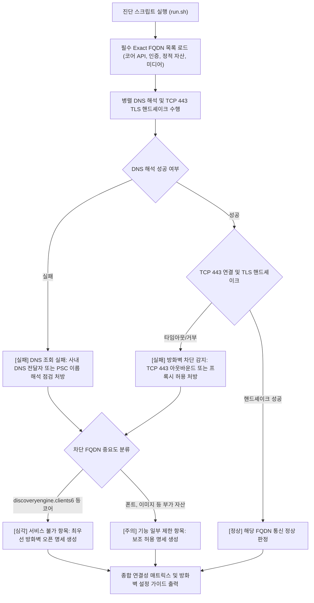

# Gemini Enterprise 사내망 방화벽 FQDN 연결 진단기 (`gemini-enterprise-firewall-fqdn-checker`)

사내망 보안 정책상 와일드카드 도메인 등록이 불가한 환경에서 Gemini Enterprise App 정상 구동에 필요한 필수 코어 API, 인증, 정적 에셋 FQDN의 아웃바운드 443 및 DNS 연결성을 1분 만에 일괄 진단하고 방화벽 허용 명세를 자동 생성하는 도구다.

**Audience**: `#Architect`, `#SecOps`  
**Concern**: `#Compliance`, `#Security`  
**Service**: `#CloudNextGenerationFirewall`, `#GeminiEnterprise`

---

## 1. 문제 증상 체크리스트
- 사내 보안 방화벽 규정상 와일드카드 도메인(`*.googleapis.com`, `*.gstatic.com`) 일괄 허용이 전면 금지되어 있다.
- 사내 PC 또는 VDI 환경에서 Gemini Enterprise App 접속 시 흰 화면(Blank Page)만 표시되거나 폰트와 스타일이 깨진다.
- 텍스트 질의는 일부 동작하나 Deep Research 실행, 멀티모달 이미지 생성 및 UI 렌더링 시 통신 에러가 발생한다. (원인: `discoveryengine.clients6.google.com` 차단)
- Google Cloud 계정 인증(`accounts.google.com`, `auth.cloud.google.com`) 단계에서 세션이 만료되거나 무한 리다이렉트가 발생한다.
- Private Service Connect(PSC) 내부망을 구성했으나 일부 필수 공개 FQDN에 대한 외부 DNS 해독 및 TCP 443 아웃바운드가 누락되어 있다.

---

## 2. 처리 흐름도



---

## 3. 필요 네트워크 및 IAM 요구 사항
- **실행 환경**: 사내망, 온프레미스 사내 PC, VDI, Compute Engine VM 또는 Cloud Shell
- **아웃바운드 포트**: TCP Port 443 (HTTPS)
- **IAM 권한**: 로컬 네트워크 및 도메인 소켓 테스트이므로 GCP IAM 권한이 없어도 진단 가능하다. (GCP 방화벽 정책 생성 시 `roles/compute.securityAdmin` 필요)

---

## 4. 원클릭 실행법

### 가상 검증 실행 (--dry-run)
기업 방화벽 차단 시나리오(`discoveryengine.clients6.google.com` 차단 및 DNS 실패)를 시뮬레이션하여 진단 보고서와 처방 출력을 즉시 확인한다.
```bash
./run.sh --dry-run
```

### 실제 사내망 환경 전수 진단
현재 실행 중인 네트워크 환경에서 모든 필수 FQDN에 대한 실시간 DNS 및 TCP 443 연결성을 진단한다.
```bash
./run.sh
```

특정 카테고리(예: Core API)만 선별 진단할 경우:
```bash
./run.sh --category="Core API"
```

타 보안 관제 시스템 및 자동화 도구와 연동하기 위해 JSON으로 출력할 경우:
```bash
./run.sh --json
```

---

## 5. 방화벽 설정 및 조치 가이드

### 1) 최우선 조치 대상 코어 FQDN
- `discoveryengine.googleapis.com` (기본 API 엔드포인트)
- `discoveryengine.clients6.google.com` (**핵심**: UI 렌더링, Deep Research 및 동적 에셋 통신 필수 엔드포인트)
- `global-discoveryengine.googleapis.com`
- `content-discoveryengine.googleapis.com`
- `vertexaisearch.cloud.google.com`

### 2) 사용자 인증 및 세션 FQDN
- `accounts.google.com`
- `apis.google.com`
- `auth.cloud.google.com`
- `reauth.cloud.google.com`

### 3) UI 정적 자산 및 이미지 FQDN
- `www.gstatic.com`
- `ssl.gstatic.com`
- `fonts.gstatic.com`
- `lh3.googleusercontent.com` ~ `lh6.googleusercontent.com`

### 4) Cloud Next Generation Firewall 아웃바운드 허용 예시 (FQDN 규칙)
```bash
gcloud compute firewall-rules create allow-gemini-enterprise-egress \
    --direction=EGRESS \
    --priority=1000 \
    --network=default \
    --action=ALLOW \
    --rules=tcp:443 \
    --destination-ranges=0.0.0.0/0
```

---

## 6. 자원 정리(Teardown) 안내
본 도구는 클라우드 자원을 생성하지 않는 네트워크 소켓 진단 유틸리티다. 진단 과정에서 발생하는 추가 과금이나 자원 잔류가 없다.
