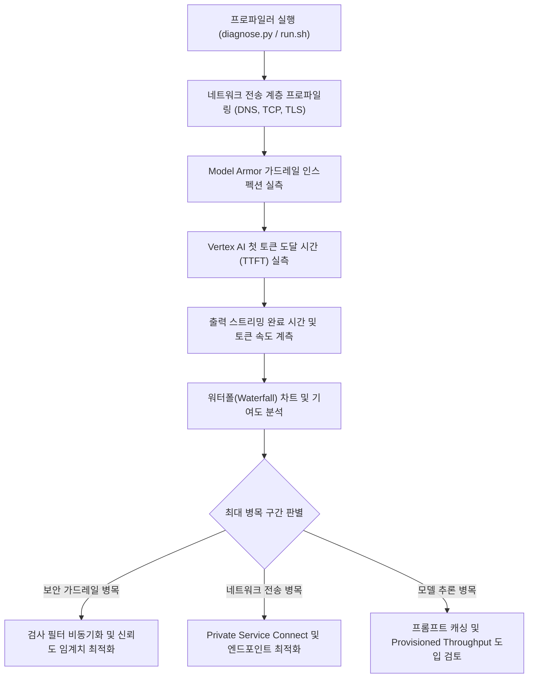

<!--
Copyright 2026 Google LLC. All Rights Reserved.
SPDX-License-Identifier: Apache-2.0

NOTICE: This code/repository is owned by Google LLC and provided under the Apache-2.0 License.
It is strictly provided as an EXAMPLE/REFERENCE ONLY and is NOT INTENDED FOR PRODUCTION USE.
All contents, designs, and code examples are subject to change, modification, or removal at any time without notice.

[고지 사항] 본 저장소 및 문서는 구글 (Google LLC) 소유이며 Apache 2.0 라이선스 하에 예시 (Sample) 용도로 제공된다.
프로덕션 환경용이 아니며, 사전 통지 없이 언제든지 수정, 변경 또는 삭제될 수 있다.
-->

> [!IMPORTANT]
> **구글 (Google LLC) 참조용 샘플 고지 사항**:
> 본 프로젝트의 모든 소스 코드와 문서는 Google LLC의 소유이며, Apache-2.0 라이선스에 따라 오직 **참조용 샘플 (Sample / Reference Only)** 목적으로만 제공된다. 프로덕션 환경에 그대로 사용할 수 없으며, 사전 통지 없이 언제든 내용이 수정, 변경 또는 삭제될 수 있다.

# 제미나이 신뢰 스택 구간별 지연 시간 분석 가이드

엔터프라이즈 생성형 AI 파이프라인에서 발생하는 체감 지연 시간(Latency)의 원인을 전송 네트워크(DNS, TCP, TLS), 보안 가드레일(Model Armor, Sensitive Data Protection), 컨텍스트 증강(Search Grounding), 순수 LLM 추론(TTFT, 토큰 생성 속도) 구간별로 분해 계측하여 워터폴(Waterfall) 차트 및 병목 최적화 권고안을 제공하는 실측 진단 도구다. (As of 2026-09-10)

**Audience**: `#Architect`, `#Developer`, `#SecOps`
**Concern**: `#Performance`, `#Resilience`, `#Security`
**Service**: `#CloudMonitoring`, `#GeminiAPI`, `#ModelArmor`, `#VertexAI`

---

## 1. 이 가이드가 필요한 상황

- 사내 엔터프라이즈 제미나이 앱이나 Vertex AI 기반 서비스가 일반 컨슈머 웹앱(`gemini.google.com`) 대비 수백 ms 이상 느리다는 성능 불만이 제기되는 경우
- 지연 시간의 원인이 모델 자체의 추론 속도 문제인지, 보안 가드레일(Model Armor)의 동기 검사 오버헤드인지 객관적인 데이터로 입증해야 하는 경우
- 구글 검색 그라운딩(Search Grounding) 또는 사내 지식 검색(RAG) 도입으로 인해 추가되는 지연 시간을 구간별(Hop-by-hop)로 정량화해야 하는 경우
- 첫 번째 토큰 도달 시간(TTFT: Time To First Token)과 출력 스트리밍 전송 속도(TPS)를 분리 측정하여 UI/UX 렌더링 병목을 진단해야 하는 경우
- 온프레미스 전용선, VPC-SC, Private Service Connect(PSC) 등 사내 프라이빗 네트워크 경로의 TCP/TLS 핸드셰이크 오버헤드를 실측하고자 하는 경우

---

## 2. 진단 및 해결 흐름



---

## 3. 사전 준비 사항

본 도구 구동을 위해 필요한 최소 IAM 권한은 다음과 같다.

| 권한 역할 | 역할 명칭 | 필요 사유 |
| :--- | :--- | :--- |
| `roles/aiplatform.user` | Vertex AI 사용자 | Vertex AI Gemini 스트리밍 API 호출 및 TTFT 실측 |
| `roles/modelarmor.admin` (또는 뷰어) | Model Armor 관리자 | Model Armor 검사 엔드포인트 호출 및 필터링 지연 계측 |
| `roles/monitoring.viewer` | 모니터링 뷰어 | 엔드포인트 지연 메트릭 조회 |

---

## 4. 1분 퀵스타트

### 옵션 A: Google Cloud Shell에서 바로 실행

```bash
# 저장소 클론 및 폴더 이동
git clone https://github.com/jiangjun-forge/google-cloud-0-to-1.git
cd google-cloud-0-to-1/samples/gemini-enterprise-latency-profiler

# 모의 가상 데이터 기반 스모크 테스트 (--dry-run)
./run.sh --dry-run

# 실제 사내 프로젝트 대상 엔드포인트 실측
./run.sh --project=example-corp --location=asia-northeast3 --model=gemini-2.5-flash
```

### 옵션 B: 로컬 파이썬 가상 환경에서 실행

```bash
# 가상 환경 생성 및 의존성 설치
python3 -m venv .venv
source .venv/bin/activate
pip install -r requirements.txt

# 프로파일러 실행
python3 diagnose.py --dry-run
```

---

## 5. 결과 출력 예시 (Vertex AI API vs GE App 완결형 파이프라인 비교)

```text
============================================================================================
 Vertex AI Gemini API vs Gemini Enterprise App (GE App) 완결형 파이프라인 지연 시간 비교 리포트
 프로젝트: example-corp | 리전: asia-northeast3 | 모델: gemini-2.5-flash
 테스트 프롬프트: "사내 정보보안 가이드라인의 핵심 원칙을 알려줘."
 ※ 참고: GE App은 웹 UI 접근이 아닌 Discovery Engine 엔드포인트 직접 호출과
         Model Armor 가드레일 체인을 완결 결합하여 사내 엔터프라이즈 RAG 파이프라인을 모사함.
============================================================================================

[1] Gemini Enterprise App (GE App) 완결형 파이프라인 구간별 지연 시간 (총 소요: 4,785.4 ms)
--------------------------------------------------------------------------------------------
구간 ID    | 계층           | 소요 시간 (비중)           | 워터폴 차트
--------------------------------------------------------------------------------------------
HOP-01   | 전송 계층        |    61.8 ms ( 1.3%)   | [                                    ] 네트워크 전송 (DNS, TCP, TLS)
HOP-02   | 보안 통제        |   654.4 ms (13.7%)   | [=====                               ] Model Armor 프롬프트 가드레일 (인그레스 스캔)
HOP-03   | 엔터프라이즈       |  2181.8 ms (45.6%)   | [================                    ] GE 사내 데이터스토어 검색 및 ACL 인덱스 서빙
HOP-04   | 모델 추론        |  1265.5 ms (26.4%)   | [=========                           ] RAG 그라운딩 기반 LLM 답변 요약 및 생성
HOP-05   | 보안 통제        |   621.9 ms (13.0%)   | [====                                ] Model Armor 응답 검사 (이그레스 민감정보 SDP 스캔)
--------------------------------------------------------------------------------------------

[2] 엔드유저 체감 지연(TTFT) 및 완결 E2E 맞비교 (고객이 수 배 느리다고 느끼는 핵심 원인):
============================================================================================
  * Vertex AI Gemini API 첫 글자 노출 (TTFT)  :    720.5 ms (즉시 스트리밍 반응)
  * Vertex AI Gemini API 전체 응답 완료 시간   :   1840.2 ms
  * Gemini Enterprise App 완결 E2E 소요 시간   :   4785.4 ms (보안 가드레일 + RAG 요약)
--------------------------------------------------------------------------------------------
  * 1) 첫 글자 체감 지연 격차 : GE App이 약 6.6배 더 오랜 대기 시간 발생!
       (이유: Model Armor 사전 검사와 사내 인덱스 탐색이 끝날 때까지 화면이 멈춰있기 때문)
  * 2) 전체 E2E 완료 시간 격차 : GE App이 약 2.6배 소요 (+2945.2 ms)
============================================================================================
```

---

## 6. 고객이 "GE App이 수 배 느리다"고 체감하는 기술적 원인

1. **첫 글자 체감 지연(TTFT)의 착시**:
   - **순수 Vertex AI API**: 사용자가 질문을 던지면 **0.5~0.8초 만에 첫 글자가 스트리밍 타이핑**되므로 체감상 즉각 반응한다고 느낀다.
   - **GE App**: Model Armor의 악성 프롬프트 인스펙션(약 0.7초)과 사내 데이터스토어의 인덱스 검색 및 IAM/ACL 권한 필터링(약 2초)이 선행 완료되기 전까지 화면에 첫 글자를 뿌릴 수 없다. 사용자는 최소 **3~4초 동안 로딩 스피너**만 마주하게 되므로 **"수 배 느리다"**고 인지하게 된다.
2. **사내 문서 RAG 요약 및 사후 보안 스캔**:
   - 검색된 사내 문서를 컨텍스트에 주입하여 답변을 생성하는 RAG 연산과, 생성된 응답에 개인정보(PII)나 시스템 프롬프트가 누출되었는지 검증하는 Model Armor 사후 스캔(약 0.6초)이 추가되어 전체 소요 시간이 4~5초대에 도달한다.
3. **고객 설득 핵심**:
   - 이 지연은 성능 장애가 아니라, **사내 비공개 데이터 보호와 기업 환각 방지(Grounding)를 위해 작동하는 다계층 신뢰 스택(Trust Stack)의 필수적인 보안 거버넌스 비용**이다.

---

## 7. 결과 확인 후 즉각 조치 가이드

1. **Model Armor 가드레일 지연 완화**:
   - 실시간 인스펙션 오버헤드가 과도할 경우, 불필요하게 높은 민감도 설정을 튜닝하거나 응답 검사(Egress Filtering)를 스트리밍 후처리 미들웨어에서 비동기 감사로 전환한다.
   - Model Armor 콘솔 ( https://console.cloud.google.com/security/model-armor )

2. **순수 추론 시간 단축 (Prompt Caching 및 PT 도입)**:
   - 반복되는 시스템 지침이나 사내 가이드라인 문서가 긴 경우, Vertex AI 프롬프트 캐싱(Context Caching)을 적용하여 첫 토큰 지연(TTFT)을 최대 80% 절감한다.
   - 프로덕션 환경의 예측 가능한 베이스로드 확보를 위해 Provisioned Throughput(PT)을 도입하여 멀티 테넌트 큐잉 지연을 제거한다.
   - Vertex AI 콘솔 ( https://console.cloud.google.com/vertex-ai )

3. **엔드투엔드 네트워크 RTT 최적화**:
   - 사내 클라이언트와 구글 백본망 간의 통신 구간을 최적화하기 위해 Private Service Connect(PSC) 엔드포인트를 구축하여 퍼블릭 인터넷 경유에 따른 패킷 지연을 방어한다.
   - Private Service Connect 콘솔 ( https://console.cloud.google.com/net-services/psc )

---

## 7. 자원 정리 가이드

본 도구는 지연 시간 측정용 단발성 API 호출만 수행하므로 영구 인프라 자원을 생성하지 않는다.
테스트 과정에서 발급된 임시 인증 토큰은 세션 종료 시 자동으로 만료된다.
