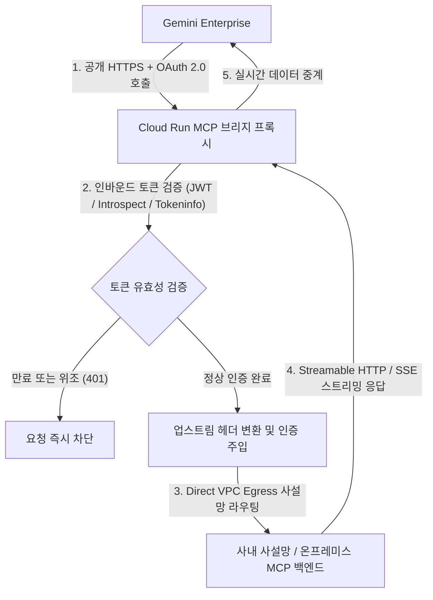

<!--
Copyright 2026 Google LLC. All Rights Reserved.
SPDX-License-Identifier: Apache-2.0

NOTICE: This code/repository is owned by Google LLC and provided under the Apache-2.0 License.
It is strictly provided as an EXAMPLE/REFERENCE ONLY and is NOT INTENDED FOR PRODUCTION USE.
All contents, designs, and code examples are subject to change, modification, or removal at any time without notice.

[고지 사항] 본 저장소 및 문서는 구글 (Google LLC) 소유이며 Apache 2.0 라이선스 하에 예시 (Sample) 용도로 제공된다.
프로덕션 환경용이 아니며, 사전 통지 없이 언제든지 수정, 변경 또는 삭제될 수 있다.
-->

> [!IMPORTANT]
> **구글 (Google LLC) 참조용 샘플 고지 사항**:
> 본 프로젝트의 모든 소스 코드와 문서는 Google LLC의 소유이며, Apache-2.0 라이선스에 따라 오직 **참조용 샘플 (Sample / Reference Only)** 목적으로만 제공된다. 프로덕션 환경에 그대로 사용할 수 없으며, 사전 통지 없이 언제든 내용이 수정, 변경 또는 삭제될 수 있다.

# Gemini Enterprise 사설 MCP 브리지 프록시

Gemini Enterprise의 공개 HTTPS 및 OAuth 2.0 전용 제약을 극복하고, 사내 VPC 사설망 또는 온프레미스 환경에 위치한 모델 컨텍스트 프로토콜(MCP) 서버를 Direct VPC Egress 기반 Cloud Run 리버스 프록시를 통해 안전하게 연동하며, 새로 고침 토큰 누락으로 인한 1시간 후 401 대량 만료 장애를 선제 예방하는 엔터프라이즈 통합 브리지다. (As of 2026-09-11)

**Audience**: `#Architect`, `#Developer`, `#SecOps`  
**Concern**: `#Compliance`, `#Resilience`, `#Security`  
**Service**: `#CloudRun`, `#GeminiEnterprise`

---

## 1. 이 가이드가 필요한 상황

- Gemini Enterprise의 커스텀 MCP 서버(Custom MCP Server, Preview) 등록 시 **공개 HTTPS 엔드포인트**와 **OAuth 2.0**만 요구되어, 사내 사설망(Private VPC)이나 온프레미스 데이터 센터에 위치한 사내 MCP 서버를 직접 등록할 수 없는 경우
- 사내 DB, 내부 지라, 사내 위키 등 민감 데이터가 포함된 백엔드 MCP 서버를 공용 인터넷에 노출하지 않고 사설 IP로만 안전하게 유지해야 하는 경우
- 기업의 사내 표준 계정 공급자(IdP: Okta, Microsoft Entra ID, Auth0, Google Workspace, Keycloak 등)의 인바운드 OAuth 토큰과 사내 백엔드가 요구하는 인증(무인증, 정적 API 토큰, Google ADC) 간의 유연한 변환이 필요한 경우
- Gemini Enterprise에 MCP 서버 등록 후 정확히 1시간 뒤 새로 고침 토큰(Refresh Token) 부재로 인해 대량의 `401 Unauthorized` 오류가 발생하며 서비스가 마비되는 현상을 사전에 방지하려는 경우
- Gemini Enterprise 조직 정책(`constraints/gemini.disableCustomMcpServerConnector`)으로 인해 커스텀 커넥터 생성이 차단된 환경을 진단하고 인가하려는 경우

---

## 2. 아키텍처 및 처리 흐름



---

## 3. 사전 준비 사항

### 3.1 라이선스 및 에디션 요건
- Gemini Enterprise 에디션: **Standard**, **Plus**, **Frontline** 에디션에서만 커스텀 MCP 서버 메뉴가 활성화된다. (Business 에디션은 미지원)
- 관리 콘솔 경로: Google Cloud Console ( https://console.cloud.google.com/ai/gemini-enterprise )

### 3.2 필수 API 활성화 및 조직 정책 해제
프로젝트 관리자 권한으로 아래 명령어를 실행한다:
```bash
# 1. 필수 API 활성화
gcloud services enable run.googleapis.com discoveryengine.googleapis.com --project "[PROJECT_ID]"

# 2. 커스텀 MCP 커넥터 차단 조직 정책 비활성화 (Org Policy Administrator 필요)
gcloud resource-manager org-policies disable-enforce \
  constraints/gemini.disableCustomMcpServerConnector \
  --project "[PROJECT_ID]"
```

### 3.3 필요 IAM 권한

| 서비스 | 필요 역할 (Role) | 최소 IAM 권한 |
| :--- | :--- | :--- |
| `Discovery Engine` | `roles/discoveryengine.editor` | `discoveryengine.dataStores.create`, `discoveryengine.dataStores.get` |
| `Cloud Run` | `roles/run.admin` | `run.services.create`, `run.services.get` |
| `Compute Engine` | `roles/compute.networkViewer` | `compute.networks.get`, `compute.subnetworks.get` |

---

## 4. IdP별 OAuth 등록 및 1시간 401 장애 방지 매핑

### 4.1 IdP 측 공통 등록 정보
사내 IdP(Okta, Entra ID, Google, Auth0 등)에서 웹 애플리케이션(Web Application) 유형의 OAuth 클라이언트를 생성할 때 아래의 리다이렉트 URI를 필수로 지정해야 한다:
- **승인된 리다이렉트 URI (Authorized redirect URI)**:
  `https://vertexaisearch.cloud.google.com/oauth-redirect`

### 4.2 IdP별 필수 Authorization URL Parameters (1시간 만료 방지)
Gemini Enterprise 콘솔에서 커스텀 MCP 서버를 등록할 때, `Authorization URL Parameters`를 지정하지 않으면 IdP가 새로 고침 토큰(Refresh Token)을 발급하지 않는다. 이 경우 초기 발급된 액세스 토큰의 수명인 **정확히 1시간(3,600초) 뒤 대량의 401 오류**가 발생한다.

| 계정 공급자 (IdP) | 필수 Authorization URL Parameters | 비고 및 장애 예방 사유 |
| :--- | :--- | :--- |
| `Google Identity` | `access_type=offline&prompt=consent` | `access_type=offline` 미지정 시 새로 고침 토큰이 생략되어 1시간 후 단절됨 |
| `Auth0` | `audience=https://your-mcp-api` | Audience 미지정 시 불투명(Opaque) 토큰이 발급되어 JWT 서명 검증 불가 |
| `Microsoft Entra ID` | 지정 불필요 (또는 `prompt=consent`) | 스코프에 `offline_access` 포함 시 기본 발급 |
| `Okta` | 지정 불필요 | Authorization Server 설정에 따라 기본 발급 |
| `Keycloak` | 지정 불필요 | 스코프에 `offline_access` 추가 권장 |

---

## 5. 빠른 시작 및 실행 방법

### 단계 1: 환경 변수 설정
`.env.example` 파일을 복사하여 `.env` 파일을 생성하고 사내 환경에 맞게 값을 기재한다:
```bash
cp .env.example .env
```

주요 설정 항목 예시:
```env
UPSTREAM_MCP_URL=http://10.10.0.5:8000/mcp
AUTH_MODE=jwt
UPSTREAM_AUTH=none
OAUTH_JWKS_URL=https://idp.example.com/.well-known/jwks.json
OAUTH_AUDIENCE=gemini-enterprise-mcp
VPC_NETWORK=projects/example-project/global/networks/default
VPC_SUBNET=projects/example-project/regions/asia-northeast3/subnetworks/default
```

### 단계 2: 모의 데이터 로컬 가상 실행 (Dry-Run)
외부 IdP나 업스트림 백엔드 없이 내장된 가상 토큰과 모의 검증기로 스모크 테스트를 수행한다:
```bash
./run.sh --dry-run
```

### 단계 3: Cloud Run Direct VPC Egress 자동 배포
```bash
./run.sh --deploy
```

배포 완료 후 터미널에 출력된 Cloud Run 서비스 URL(예: `https://mcp-proxy-xxxx.a.run.app`)을 확인한다.

---

## 6. Gemini Enterprise 콘솔 데이터 저장소 등록 절차

Cloud Run 배포가 완료되면 Gemini Enterprise 관리 콘솔에서 사설 MCP 서버를 등록한다:

1. **콘솔 접속**:
   Google Cloud Console ( https://console.cloud.google.com/ai/gemini-enterprise )의 **Data stores** 메뉴로 이동한다.
2. **커넥터 생성**:
   **Create** 버튼 클릭 후 데이터 원본 목록에서 **Custom MCP server**를 선택한다.
3. **상세 필드 입력**:
   - **MCP Server URL**: `https://[CLOUD_RUN_SERVICE_URL]/mcp` (반드시 끝에 `/mcp` 포함)
   - **Authorization URL**: 사내 IdP의 `/authorize` 엔드포인트
   - **Token URL**: 사내 IdP의 `/token` 엔드포인트
   - **Client ID / Secret**: 4.1단계에서 발급받은 OAuth 클라이언트 자격 증명
   - **Scopes**: `openid email profile` (사내 필요 스코프 추가)
   - **Authorization URL Parameters**: 4.2단계 표를 참조하여 IdP별 필수 파라미터 입력
4. **저장 및 연동 검증**:
   저장 완료 후 Gemini Enterprise 에이전트 대화창에서 사내 MCP 도구가 정상적으로 도구 호출(Tool Calling)되는지 확인한다.

---

## 7. 리소스 정리 (Teardown) 안내

테스트 완료 후 클라우드 리소스 비용을 방지하기 위해 배포된 Cloud Run 서비스를 삭제한다:
```bash
gcloud run services delete gemini-enterprise-mcp-proxy \
  --project="[PROJECT_ID]" \
  --region="asia-northeast3" \
  --quiet
```

로컬 임시 설정 파일 삭제:
```bash
rm -f .env
```
