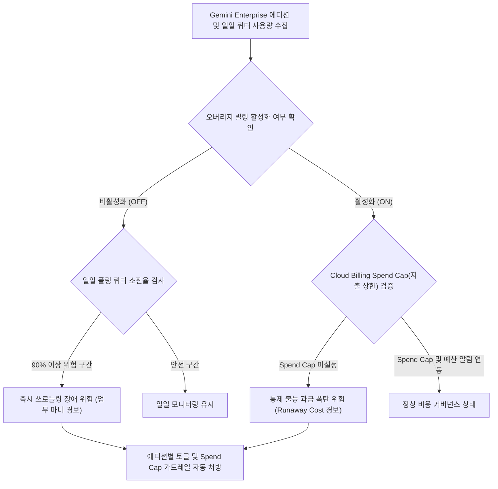

# Gemini Enterprise Overage 빌링 방어 및 일일 쿼터 쓰로틀링 가드

Gemini Enterprise App 도입 환경에서 신규 오버리지 빌링(Overage Billing) 체계에 따른 일일 풀링 쿼터 초과 쓰로틀링(업무 중단) 위험과 무제한 오버리지 과금 누수(비용 급증) 위험을 진단하고, 에디션별 차등 제어와 Cloud Billing Spend Cap(월 지출 한도) 가드레일을 처방한다. (As of 2026-09-09)

**Audience**: `#Architect`, `#FinOps`  
**Concern**: `#Billing`, `#Resilience`  
**Service**: `#AgentPlatform`, `#CloudBilling`  

---

## 1. 배경 및 문제 증상

Gemini Enterprise App은 사용자당 월 구독(PUPM) 모델을 기본으로 제공하며, 일일 기본 풀링 쿼터(pooled quota)를 초과하는 사용량에 대해 토큰 단위로 추가 과금되는 오버리지 빌링(Overage Billing) 제도를 지원한다.

- **업무 중단 쓰로틀링(Throttling)**: 오버리지 빌링이 기본값인 비활성화(OFF) 상태로 유지될 경우, 월말이나 특정 피크 시간대에 일일 풀링 쿼터가 소진되면 당일 자정까지 전사적으로 AI 질의 및 에이전트 서비스가 전면 차단되는 장애 발생.
- **예측 불가능한 비용 급증(Runaway Cost)**: 쿼터 차단을 막기 위해 관리자가 오버리지 토글을 활성화(ON)했으나, 현재 콘솔에서 개별 사용자나 특정 부서별 한도 부여가 불가능하여 일부 사용자의 무분별한 사용으로 인해 막대한 오버리지 요금 폭탄이 발생하는 위험.
- **스토리지 및 인덱싱 혼선**: 데이터스토어 인덱싱 및 스토리지 초과 사용량은 오버리지 토글과 무관하게 계약 조건에 따라 별도 과금되므로 종합적인 비용 거버넌스 필요.

---

## 2. 진단 워크플로우



---

## 3. 사전 요구 사항 및 IAM 권한

본 도구를 실행하고 결제 지표 및 Gemini Enterprise 설정을 진단하기 위해 다음 권한이 필요하다:

- `roles/billing.viewer`: Cloud Billing 계정 지출 한도 및 예산 설정 조회
- `roles/serviceusage.serviceUsageViewer`: 프로젝트 서비스 활성화 및 할당량 현황 조회
- `roles/monitoring.viewer`: 일일 풀링 쿼터 사용률 시계열 지표 조회

---

## 4. 원클릭 실행 및 검증

### (1) 가상 모의 진단 (`--dry-run`)
실제 API 호출 없이 에디션별 오버리지 위험 판정 및 Spend Cap 처방을 사전 검증한다:
```bash
./run.sh --dry-run
```

### (2) 운영 환경 진단
환경 변수 또는 CLI 인자를 지정하여 실행한다:
```bash
./run.sh --project-id demo-project --billing-account-id 012345-6789AB-CDEF01 --spend-cap-usd 1000 --alert-threshold 80
```

---

## 5. 단계별 조치 가이드

### 1단계: 티어별 오버리지 차등 활성화
1. 구글 클라우드 콘솔의 **Gemini Enterprise 관리 페이지**로 이동한다.
2. 에디션별로 오버리지 토글을 전략적으로 분리 설정한다:
   - **Plus 티어**: 핵심 비즈니스 중단 방지를 위해 오버리지 빌링을 수동 활성화(ON)한다.
   - **Standard 티어**: 일반 업무용은 기본 비활성화(OFF)를 유지하거나 필요 시 선별적으로 활성화한다.

### 2단계: Cloud Billing Spend Cap 및 실시간 예산 알림 연동
1. 콘솔의 **결제(Billing) > 예산 및 알림(Budgets & alerts)** 메뉴로 이동한다.
2. 월간 허용 가능한 최대 오버리지 지출 한도(Spend Cap)를 사내 예산에 맞추어 생성한다. (구체적인 에디션별 토큰 단가는 공식 요금 가이드 참조)
3. 80%, 90%, 100% 도달 시 FinOps 및 인프라 담당자에게 Pub/Sub 실시간 알림이 발송되도록 구성한다.

### 공식 가이드 및 콘솔 링크
- [Gemini Enterprise 오버리지 빌링 공식 가이드] ( https://docs.cloud.google.com/gemini/enterprise/docs/overages )
- [Cloud Billing 예산 및 지출 한도 알림 생성] ( https://docs.cloud.google.com/billing/docs/how-to/budgets )

---

## 6. 리소스 정리 (Teardown)

본 도구는 순수 진단 및 모니터링 도구이므로 별도의 클라우드 인프라 자원을 생성하지 않는다.
테스트 목적으로 생성한 Cloud Billing 임시 예산(Budgets)을 삭제하려면 결제 콘솔의 예산 목록에서 해당 항목을 삭제한다.
