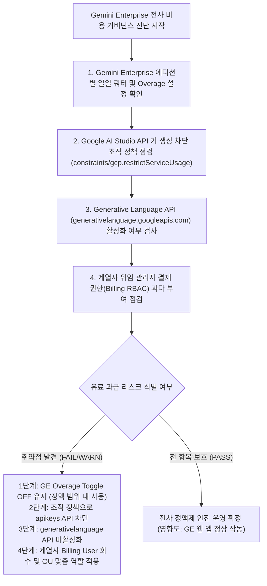

<!--
Copyright 2026 Google LLC. All Rights Reserved.
SPDX-License-Identifier: Apache-2.0

NOTICE: This code/repository is owned by Google LLC and provided under the Apache-2.0 License.
It is strictly provided as an EXAMPLE/REFERENCE ONLY and is NOT INTENDED FOR PRODUCTION USE.
All contents, designs, and code examples are subject to change, modification, or removal at any time without notice.

[고지 사항] 본 저장소 및 문서는 구글 (Google LLC) 소유이며 Apache 2.0 라이선스 하에 예시 (Sample) 용도로 제공된다.
프로덕션 환경용이 아니며, 사전 통지 없이 언제든지 수정, 변경 또는 삭제될 수 있다.
-->

> [!IMPORTANT]
> **구글 (Google LLC) 참조용 샘플 고지 사항**:
> 본 프로젝트의 모든 소스 코드와 문서는 Google LLC의 소유이며, Apache-2.0 라이선스에 따라 오직 **참조용 샘플 (Sample / Reference Only)** 목적으로만 제공된다. 프로덕션 환경에 그대로 사용할 수 없으며, 사전 통지 없이 언제든 내용이 수정, 변경 또는 삭제될 수 있다.

# Gemini Enterprise 추가 과금 방어 및 비인가 API 호출 차단 가드

Gemini Enterprise 전사 도입 환경에서 라이선스 일일 풀링 쿼터 초과 쓰로틀링(업무 중단) 위험뿐만 아니라, 임직원이 공식 계정으로 Google AI Studio 등에 접근하여 회사 결제 계정(Cloud Billing)으로 API 키를 발급하거나 유료 API를 호출하는 섀도우 과금 누수를 원천 차단하고, 계열사 중간 관리자 권한 거버넌스(RBAC)를 진단·처방하는 종합 비용 가드레일 도구다. (As of 2026-09-22)

**Audience**: `#Architect`, `#FinOps`, `#SecOps`  
**Concern**: `#Billing`, `#Compliance`, `#Resilience`  
**Service**: `#AgentPlatform`, `#CloudBilling`  

---

## 1. 배경 및 문제 증상 (비용 리스크 3대 유형)

엔터프라이즈 환경에서 전사 임직원에게 공식 계정을 배포할 때 다음과 같은 3대 비용 누수 및 업무 중단 리스크가 발생한다:

1. **Gemini Enterprise 자체 일일 풀링 쿼터 소진 및 쓰로틀링**:
   - 오버리지 빌링이 비활성화(OFF)된 경우, 피크 시간대 일일 쿼터가 소진되면 당일 자정까지 전사 AI 질의가 일시 차단되는 업무 장애 발생.
   - 반대로 오버리지 토글을 켰을 때(ON) 월 지출 상한선(Spend Cap)이 없으면 통제 불능의 초과 비용(Runaway Cost) 청구 위험.
2. **Google AI Studio를 통한 비의도적 유료 API 호출 (가장 큰 위험 경로)**:
   - 일반 임직원이 Google AI Studio에 회사 공식 계정으로 로그인한 뒤, 회사 Cloud Billing이 연결된 GCP 프로젝트를 선택하여 API 키(`AIzaSy...`)를 발급하고 `generativelanguage.googleapis.com`을 호출하면 종량제(Pay-as-you-go)로 전사 결제 계정에 비용이 청구됨.
3. **계열사 IT 관리자의 결제 권한 남용 및 거버넌스 부재**:
   - 계열사 중간 관리자에게 `roles/billing.admin` 또는 `roles/billing.user` 권한이 부여될 경우, 승인되지 않은 유료 프로젝트를 임의로 생성하거나 결제 계정에 연결하여 통제되지 않는 인프라 비용을 발생시킴.

---

## 2. 진단 워크플로우



---

## 3. 사전 요구 사항 및 IAM 권한

본 도구를 실행하고 결제 지표 및 보안 정책을 진단하기 위해 다음 권한이 필요하다:

- `roles/billing.viewer`: Cloud Billing 계정 지출 한도 및 예산 설정 조회
- `roles/orgpolicy.policyViewer`: 조직 정책(`constraints/gcp.restrictServiceUsage`) 설정 조회
- `roles/serviceusage.serviceUsageViewer`: 프로젝트 API 활성화 상태 조회
- `roles/monitoring.viewer`: 일일 풀링 쿼터 사용률 지표 조회

---

## 4. 원클릭 실행 및 검증

### (1) 가상 모의 진단 (`--dry-run`) - 예습
실제 클라우드 호출 없이 4대 가드레일 상태 및 에디션별 오버리지 위험 판정을 시뮬레이션한다. 실행 시 `report.md` 파일이 자동 생성된다:
```bash
python diagnose.py --dry-run
```

### (2) 운영 환경 실측 진단 - 실습 및 복습
환경 변수 또는 CLI 인자를 지정하여 사내 환경의 결제 거버넌스를 점검한다. 진단 결과는 `report.md`에 자동으로 덮어써진다:
```bash
python diagnose.py --project-id=example-corp-ai --billing-account-id=012345-6789AB-CDEF01 --spend-cap-usd=1000 --alert-threshold=80
```

---

## 5. 결과 확인 후 단계별 조치 가이드

### 1단계: Gemini Enterprise 관리 콘솔 내 Overage 차단 (필수)
- Gemini Enterprise Admin Console > 구독 및 라이선스(Subscriptions/Licenses) > Overage Settings에서 **Toggle OFF** 상태를 유지한다.
- **결과**: 일일 쿼터를 모두 소진하더라도 당일 추가 질의만 일시 제한되며 추가 요금이 청구되지 않는다.

### 2단계: 조직 정책 기반 Google AI Studio API 키 발급 차단 (필수)
일반 사용자가 Google AI Studio에서 회사 결제 계정 프로젝트를 선택해 API 키를 발급하지 못하도록 차단한다:
```bash
gcloud resource-manager org-policies enable-enforce constraints/gcp.restrictServiceUsage --project=[PROJECT_ID]
```

### 3단계: Generative Language API 비활성화 및 제한 (권장)
Google AI Studio 백엔드 API 호출 경로 자체를 비활성화한다:
```bash
gcloud services disable generativelanguage.googleapis.com --project=[PROJECT_ID] --force
```

### 4단계: 계열사 IT 관리자 결제 권한(Billing RBAC) 회수 및 거버넌스 확립
- 계열사 관리자에게 최고 관리자(Super Admin) 권한 부여를 엄격히 금지한다.
- Cloud Identity 관리자 콘솔에서 계열사 조직 단위(OU)에 한정된 맞춤 역할(사용자/그룹 관리)만 부여한다.
- Google Cloud 콘솔에서 `roles/billing.admin` 및 `roles/billing.user` 권한을 회수하고, 사전 프로비저닝된 프로젝트 내 `roles/viewer`만 선별 부여한다.

### 차단 정책 적용 후 기존 업무 영향도 평가
- **Gemini Enterprise 웹 앱 (Chat / Search)**: 영향 없음 (자체 관리형 테넌트 및 Vertex AI 엔드포인트를 사용하므로 정상 동작)
- **NotebookLM Enterprise**: 영향 없음 (Enterprise 테넌트 격리 영역 내 구동)
- **Antigravity (Google OAuth 로그인)**: 영향 없음 (사용자 라이선스 기반 인증)
- **Antigravity (GCP Project 종량제 모드)**: 차단됨 (의도된 통제 목적에 정확히 부합)

### 공식 가이드 및 콘솔 링크
- Gemini Enterprise 오버리지 빌링 공식 가이드 ( https://docs.cloud.google.com/gemini/enterprise/docs/overages )
- Cloud Billing 예산 및 지출 한도 알림 생성 ( https://docs.cloud.google.com/billing/docs/how-to/budgets )
- 리소스 사용 제한 조직 정책 가이드 ( https://docs.cloud.google.com/organization-policy/restrict-locations )

---

## 6. 리소스 정리 (Teardown)

본 도구는 순수 진단 및 모니터링 도구이므로 별도의 클라우드 인프라 자원을 생성하지 않는다.
테스트 목적으로 생성한 Cloud Billing 임시 예산(Budgets)을 삭제하려면 결제 콘솔의 예산 목록에서 해당 항목을 삭제한다.
