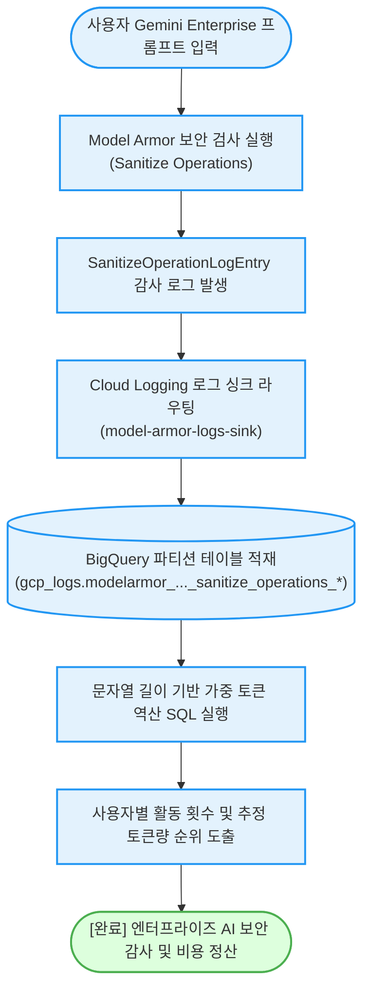

# 제미나이 엔터프라이즈 Model Armor 감사 및 토큰 소모량 추정 (`gemini-enterprise-usage-by-account`)

> **태그**: `#Architect`, `#FinOps`, `#SecOps` | `#Billing`, `#Compliance`, `#Security` | `#BigQuery`, `#CloudLogging`, `#GeminiAPI`, `#ModelArmor`  
> **요약**: Model Armor의 살균(Sanitize) 검사 로그를 BigQuery 로그 싱크로 실시간 적재하여, **엔터프라이즈 Gemini 환경에서 사용자별 프롬프트 검사 이력과 추정 토큰 소모량을 1분 만에 분석**하는 가이드다.

---

## 이 가이드가 필요한 상황 (증상 체크리스트)

- **Gemini Enterprise 토큰 추적**: 엔터프라이즈 포털이나 사내 챗봇에서 사용자별로 소모된 토큰량을 상세히 추적 및 정산하고자 할 때
- **Model Armor 살균 이력 감사**: 보안 위협(탈옥, 프롬프트 인젝션, 민감 정보)으로 인해 Model Armor에서 살균되거나 차단된 프롬프트 본문을 영구 보관 및 감사할 때
- **비정형 프롬프트 기반 토큰 추정**: API 응답 메타데이터가 제한적인 환경에서 프롬프트/응답 문자 길이를 기반으로 정밀한 토큰 소비량을 가중 역산하고자 할 때

---

## 감사 및 적재 흐름 (Activity Diagram)



---

## 사전 준비 사항 (필요 권한 - IAM)

로그 싱크 생성 및 BigQuery 데이터세트 권한 위임을 위한 IAM 역할이다:

| 역할 (Role) | 권한 ID | 용도 |
| :--- | :--- | :--- |
| **로그 구성 작성자** | `roles/logging.configWriter` | Cloud Logging 로그 싱크 생성 및 라우팅 규칙 관리 |
| **BigQuery 관리자** | `roles/bigquery.admin` | BigQuery 데이터세트 생성 및 싱크 서비스 계정 권한 위임 |

> [!NOTE]
> `--dry-run` 모드로 실행할 경우 GCP IAM 권한 없이도 파이프라인 구성과 토큰 추정 SQL 쿼리를 즉시 확인할 수 있다.

---

## 1분 퀵스타트 (실행 방법)

### 방법 1: 구글 클라우드 쉘 (Google Cloud Shell) - *가장 권장*

```bash
# 1. 저장소 클론 및 폴더 이동
git clone https://github.com/jiangjun-forge/google-cloud-0-to-1.git
cd google-cloud-0-to-1/samples/gemini-enterprise-usage-by-account

# 2. 사전 가상 체험 또는 데모 모드 (권한 없이 즉시 시뮬레이션)
./run.sh --dry-run

# 3. 실제 프로젝트 대상 로그 싱크 구성 및 분석
./run.sh -p your-project-id -d 14
```

### 방법 2: 로컬 환경 (Local Python)

```bash
# 의존성 설치
pip install -r requirements.txt

# 가상 실행
python3 diagnose.py --dry-run

# 실제 실행
python3 diagnose.py --project your-project-id --dataset gcp_logs --days 7
```

---

## 결과 출력 및 쿼리 예시

스크립트가 완료되면 아래와 같이 **사용자별 검사 횟수 및 추정 토큰 소모량**이 출력된다:

```text
========================================================================
[진단 결과] 제미나이 엔터프라이즈 Model Armor 감사 및 토큰 통계
  - 대상 프로젝트: my-corp-ai
  - BigQuery 데이터세트: gcp_logs
  - 조회 기간: 최근 7일
========================================================================

[Model Armor 보안 검사 기반 사용자별 활동 및 추정 토큰량 순위]
┌───────────────────────────────────────────┬────────────┬──────────────────┬─────────────────┬──────────────────┐
│ 사용자/클라이언트 식별자 (Principal)     │ 검사 횟수  │ 추정 입력 토큰   │ 추정 출력 토큰  │ 총 추정 토큰     │
├───────────────────────────────────────────┼────────────┼──────────────────┼─────────────────┼──────────────────┤
│ enterprise-agent-bot@company.com          │ 5,420회    │ 16,260,000       │ 2,710,000       │ 18,970,000       │
│ finance-advisor@company.com               │ 1,120회    │  3,360,000       │   560,000       │  3,920,000       │
│ hr-assistant@company.com                  │   780회    │  1,560,000       │   390,000       │  1,950,000       │
│ external-partner-eval@partner.com         │   110회    │    220,000       │    55,000       │    275,000       │
└───────────────────────────────────────────┴────────────┴──────────────────┴─────────────────┴──────────────────┘
```

---

## 자원 정리 (Teardown Guide)

테스트 완료 후 과금 방지 및 자원 잔존을 막기 위해 생성된 로그 싱크와 데이터세트를 삭제한다:

```bash
# 1. Cloud Logging 로그 싱크 삭제
gcloud logging sinks delete model-armor-logs-sink --project=YOUR_PROJECT_ID

# 2. BigQuery 데이터세트 삭제
bq rm -r -f -d YOUR_PROJECT_ID:gcp_logs
```
