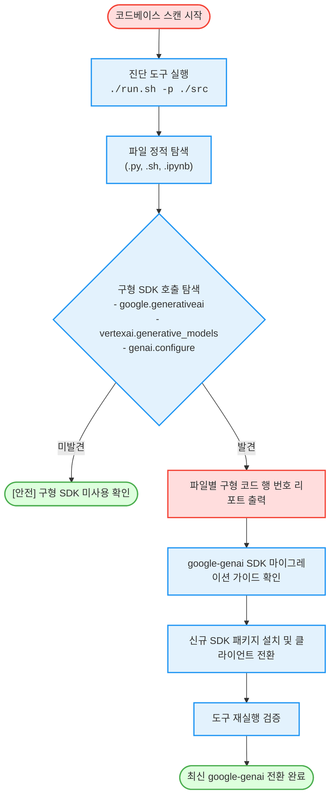

# 구형 제미나이(Gemini) SDK 탐색 및 신규 SDK 마이그레이션 (`gemini-legacy-sdk-scanner`)

소스 코드 내 구형 제미나이 SDK(`google.generativeai` 또는 `vertexai.generative_models`) 호출 부위를 정적 탐색하고 최신 구글 공식 통일 SDK인 **`google-genai`로의 마이그레이션 가이드를 1분 만에 제공**하는 도구다. (As of 2026-06-16)

**Audience**: `#Architect`, `#Developer`  
**Concern**: `#Compliance`, `#Performance`  
**Service**: `#GeminiAPI`

---

## 이 가이드가 필요한 상황 (증상 체크리스트)

- **구형 라이브러리 지원 중단 대비**: 구형 SDK(`google-generativeai`) 지원 종료 예정에 따라 신규 라이브러리로 사전 전환이 필요한 경우
- **통일 클라이언트 전환**: AI Studio 환경과 Vertex AI 환경에서 각각 파편화되어 사용되던 코드를 최신 `google-genai` 단일 클라이언트로 일원화하고자 할 때
- **레거시 코드 자가 감사**: 프로젝트 내 파이썬 스크립트, 배시 스크립트, 주피터 노트북(`.ipynb`) 전반에 걸쳐 잔존하는 구형 SDK 호출 위치를 전수 조사하고자 할 때

---

## 진단 및 마이그레이션 흐름 (Activity Diagram)



---

## 사전 준비 사항 (필요 권한 - IAM)

이 도구는 소스 코드 및 노트북 파일을 정적으로 분석하는 도구로, 별도의 클라우드 인프라 자원을 생성하거나 변경하지 않는다.

| 권한 항목 | 요구 조건 | 비고 |
| :--- | :--- | :--- |
| **GCP IAM 권한** | 필요 없음 | 순수 로컬 또는 Cloud Shell 환경 정적 진단 도구 |
| **로컬 환경 권한** | 소스 코드 읽기 권한 | 스캔 대상 프로젝트 디렉터리 접근 권한 |

---

## 1분 퀵스타트 (실행 방법)

### 방법 1: 구글 클라우드 쉘 (Google Cloud Shell) - *가장 권장*

```bash
# 1. 저장소 클론 및 폴더 이동
git clone https://github.com/jiangjun-forge/google-cloud-0-to-1.git
cd google-cloud-0-to-1/samples/gemini-legacy-sdk-scanner

# 2. 사전 가상 체험 또는 데모 모드 (모의 데이터로 결과 리포트 확인)
./run.sh --dry-run

# 3. 실제 애플리케이션 소스 코드 경로 진단 (예: ../my-app)
./run.sh -p /path/to/your/project
```

### 방법 2: 로컬 환경 (Local Python)

```bash
# 실행 권한 부여 및 진단 실행
python3 diagnose.py --path /path/to/your/project

# 가상 데모 실행
python3 diagnose.py --dry-run
```

---

## 결과 출력 예시

스크립트가 완료되면 아래와 같이 **구형 SDK 호출 부위와 행 번호**가 정밀하게 출력된다:

```text
========================================================================
[진단 결과] 구형 제미나이(Gemini) SDK 코드 정적 진단 리포트
========================================================================

검출된 구형 SDK 사용 파일: 2건 (총 5개 라인)

[파일: app/services/chat_bot.py]
  - [1행] 구형 AI Studio SDK 임포트 (google.generativeai)
    코드: import google.generativeai as genai
  - [5행] 구형 AI Studio 설정 함수 (genai.configure)
    코드: genai.configure(api_key=os.environ['GEMINI_API_KEY'])
  - [12행] 구형 모델 객체 생성자 (genai.GenerativeModel)
    코드: model = genai.GenerativeModel('gemini-1.5-flash')
------------------------------------------------------------------------
[파일: pipelines/evaluate.py]
  - [3행] 구형 Vertex AI SDK 임포트 (vertexai.generative_models)
    코드: from vertexai.generative_models import GenerativeModel
  - [8행] 구형 모델 객체 생성자 (GenerativeModel)
    코드: model = GenerativeModel('gemini-1.5-pro')
------------------------------------------------------------------------

========================================================================
[최신 google-genai SDK 마이그레이션 가이드]
========================================================================
...
```

---

## 최신 SDK 마이그레이션 가이드

진단 결과 구형 코드가 발견된 경우 아래와 같이 코드를 현대화한다:

### 1. 패키지 설치 변경

```bash
# 기존 레거시 패키지 제거
pip uninstall -y google-generativeai

# 최신 통일 SDK 설치
pip install google-genai
```

### 2. 소스 코드 전환 비교

| 작업 구분 | 기존 구형 코드 (Legacy) | 신규 통일 코드 (`google-genai`) |
| :--- | :--- | :--- |
| **임포트** | `import google.generativeai as genai` | `from google import genai` |
| **클라이언트 생성** | `genai.configure(api_key="...")` | `client = genai.Client(api_key="...")` |
| **콘텐츠 생성** | `model = genai.GenerativeModel("...")`<br>`model.generate_content(...)` | `client.models.generate_content(`<br>`    model="gemini-2.5-flash", contents="..."`<br>`)` |

---

## 자원 정리 (Teardown) 안내

이 도구는 소스 코드 정적 분석기이므로 클라우드 상에 생성된 리소스가 없으며, 별도의 자원 정리 작업이 필요하지 않다.
