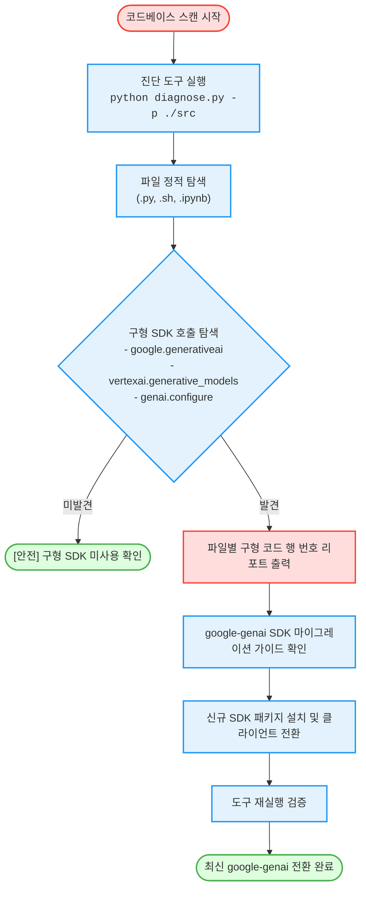

<!--
Copyright 2026 Google LLC. All Rights Reserved.
SPDX-License-Identifier: Apache-2.0

NOTICE: This code/repository is owned by Google LLC and provided under the Apache-2.0 License.
It is strictly provided as an EXAMPLE/REFERENCE ONLY and is NOT INTENDED FOR PRODUCTION USE.
All contents, designs, and code examples are subject to change, modification, or removal at any time without notice.

[고지 사항] 본 저장소 및 문서는 구글 (Google LLC) 소유이며 Apache 2.0 라이선스 하에 예시 (Sample) 용도로 제공된다.
프로덕션 환경용이 아니며, 사전 통지 없이 언제든지 수정, 변경 또는 삭제될 수 있다.
-->

> [!IMPORTANT]
> **구글 (Google LLC) 참조용 샘플 고지 사항**:
> 본 프로젝트의 모든 소스 코드와 문서는 Google LLC의 소유이며, Apache-2.0 라이선스에 따라 오직 **참조용 샘플 (Sample / Reference Only)** 목적으로만 제공된다. 프로덕션 환경에 그대로 사용할 수 없으며, 사전 통지 없이 언제든 내용이 수정, 변경 또는 삭제될 수 있다.

# 구형 제미나이(Gemini) SDK 탐색 및 신규 SDK 마이그레이션 진단기 (`gemini-legacy-sdk-scanner`)

소스 코드 내 구형 제미나이 SDK(`google.generativeai` 또는 `vertexai.generative_models`) 호출 부위를 정적 탐색하고 최신 구글 공식 통일 SDK인 **`google-genai`로의 마이그레이션 가이드를 1분 만에 제공**하는 도구다. (As of 2026-10-17)

**Audience**: `#Architect`, `#Developer`  
**Concern**: `#Compliance`, `#Performance`  
**Service**: `#GeminiAPI`

---

## 1. 문제 증상 체크리스트

- **구형 라이브러리 지원 중단 대비**: 구형 SDK(`google-generativeai`) 지원 종료 예정에 따라 신규 라이브러리로 사전 전환이 필요한 경우
- **통일 클라이언트 전환**: AI Studio 환경과 버텍스 AI(Vertex AI) 환경에서 각각 파편화되어 사용되던 코드를 최신 `google-genai` 단일 클라이언트로 일원화하고자 할 때
- **레거시 코드 자가 감사**: 프로젝트 내 파이썬 스크립트, 배시 스크립트, 주피터 노트북(`.ipynb`) 전반에 걸쳐 잔존하는 구형 SDK 호출 위치를 전수 조사하고자 할 때

---

## 2. 처리 흐름도


```mermaid
flowchart TD
    Start(["코드베이스 스캔 시작"]) --> RunTool["진단 도구 실행<br/><code>python diagnose.py -p ./src</code>"]
    
    RunTool --> ScanFiles["파일 정적 탐색<br/>(.py, .sh, .ipynb)"]
    ScanFiles --> MatchPatterns{"구형 SDK 호출 탐색<br/>- google.generativeai<br/>- vertexai.generative_models<br/>- genai.configure"}
    
    MatchPatterns -- "미발견" --> Safe(["[안전] 구형 SDK 미사용 확인"])
    MatchPatterns -- "발견" --> Report["파일별 구형 코드 행 번호 리포트 출력"]
    
    Report --> Guide["google-genai SDK 마이그레이션 가이드 확인"]
    Guide --> Refactor["신규 SDK 패키지 설치 및 클라이언트 전환"]
    Refactor --> Retest["도구 재실행 검증"]
    Retest --> Done(["최신 google-genai 전환 완료"])

    classDef alert fill:#ffdddd,stroke:#f44336,stroke-width:2px;
    classDef success fill:#ddffdd,stroke:#4caf50,stroke-width:2px;
    classDef action fill:#e3f2fd,stroke:#2196f3,stroke-width:2px;
    class Start,Report alert;
    class Safe,Done success;
    class RunTool,ScanFiles,MatchPatterns,Guide,Refactor,Retest action;
```

---

## 3. 필요 IAM 권한

이 도구는 소스 코드 및 노트북 파일을 정적으로 분석하는 도구로, 별도의 클라우드 인프라 자원을 생성하거나 변경하지 않는다.

| 권한 항목 | 요구 조건 | 비고 |
| :--- | :--- | :--- |
| **구글 클라우드 IAM 권한** | 필요 없음 | 순수 로컬 또는 Cloud Shell 환경 정적 진단 도구 |
| **로컬 환경 권한** | 소스 코드 읽기 권한 | 스캔 대상 프로젝트 디렉터리 접근 권한 |

---

## 4. 원클릭 실행법

### 가상 검증 실행 (--dry-run)
실제 디렉터리 스캔 없이 가상 모의 취약 코드를 기반으로 마이그레이션 리포트를 시뮬레이션한다. 실행 시 `report.md` 파일이 자동 생성된다:
```bash
python diagnose.py --dry-run
```

### 실제 환경 진단
사내 애플리케이션 소스 코드 디렉터리를 대상으로 구형 SDK 호출부를 정적 스캔한다. 진단 결과는 `report.md`에 자동으로 덮어써진다:
```bash
python diagnose.py --path="/path/to/your/project"
```

---

## 5. 결과 확인 후 즉각 조치 가이드

스크립트가 완료되면 아래와 같이 **구형 SDK 호출 부위와 행 번호**가 정밀하게 출력된다:

```text
========================================================================
[진단 결과] 구형 제미나이(Gemini) SDK 코드 정적 진단 리포트
========================================================================

검출된 구형 SDK 사용 파일: 2건 (총 5개 라인)

[파일: app/services/chat_bot.py]
  - [1행] 구형 AI Studio SDK 임포트 (google.generativeai)
    코드: import google.generativeai as genai
  - [5행] 구형 AI Studio 설정 함수 (genai.configure)
    코드: genai.configure(api_key=os.environ['GEMINI_API_KEY'])
  - [12행] 구형 모델 객체 생성자 (genai.GenerativeModel)
    코드: model = genai.GenerativeModel('gemini-1.5-flash')
------------------------------------------------------------------------
[파일: pipelines/evaluate.py]
  - [3행] 구형 Vertex AI SDK 임포트 (vertexai.generative_models)
    코드: from vertexai.generative_models import GenerativeModel
  - [8행] 구형 모델 객체 생성자 (GenerativeModel)
    코드: model = GenerativeModel('gemini-1.5-pro')
------------------------------------------------------------------------

========================================================================
[최신 google-genai SDK 마이그레이션 가이드]
========================================================================
...
```

진단 결과 구형 코드가 발견된 경우 아래와 같이 코드를 현대화한다:

### 1. 패키지 설치 변경

```bash
# 기존 레거시 패키지 제거
pip uninstall -y google-generativeai

# 최신 통일 SDK 설치
pip install google-genai
```

### 2. 소스 코드 전환 비교

| 작업 구분 | 기존 구형 코드 (Legacy) | 신규 통일 코드 (`google-genai`) |
| :--- | :--- | :--- |
| **임포트** | `import google.generativeai as genai` | `from google import genai` |
| **클라이언트 생성** | `genai.configure(api_key="...")` | `client = genai.Client(api_key="...")` |
| **콘텐츠 생성** | `model = genai.GenerativeModel("...")`<br>`model.generate_content(...)` | `client.models.generate_content(`<br>`    model="gemini-3.8-flash", contents="..."`<br>`)` |

---

## 6. 사내 거버넌스 4대 필수 표준 라벨링

신규 SDK 기반 클라우드 리소스 및 마이그레이션 파이프라인 생성 시 4대 표준 라벨을 반드시 적용한다:
- `managed-by`: `google-cloud-0-to-1`
- `scenario`: `gemini-legacy-sdk-scanner`
- `env`: `sample` (또는 `poc`)
- `created-by`: `customer-engineer`

---

## 7. 콘솔 링크 조치 가이드

- **Google Gen AI SDK 공식 마이그레이션 가이드**: ( https://docs.cloud.google.com/gemini-enterprise-agent-platform/machine-learning/python-sdk/sdk-migration )
- **Google AI Studio Gemini API 마이그레이션 가이드**: ( https://ai.google.dev/gemini-api/docs/migrate )
- **Vertex AI 콘솔**: ( https://console.cloud.google.com/vertex-ai )
- **Google AI Studio 콘솔**: ( https://aistudio.google.com )

---

## 8. 자원 정리 안내 (Teardown)

이 도구는 소스 코드 정적 분석기이므로 클라우드 상에 생성된 리소스가 없으며, 별도의 자원 정리 작업이 필요하지 않다.
