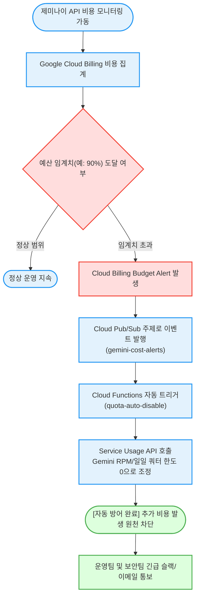

# 제미나이(Gemini) API 비용 및 쿼터 임계치 실시간 경보 자동화 (`gemini-quota-cost-alert`)

제미나이(Gemini) API 비용 급증 및 예산 임계치 도달 시, Cloud Pub/Sub과 Cloud Functions를 연동하여 **실시간 경보를 전송하고 API 쿼터 한도를 자동으로 0으로 차단하는 안전 아키텍처**를 검증 및 시뮬레이션하는 도구다. (As of 2026-06-16)

**Audience**: `#FinOps`, `#SecOps`  
**Concern**: `#Billing`, `#Resilience`  
**Service**: `#CloudFunctions`, `#CloudPubSub`, `#GeminiAPI`, `#GoogleCloudBilling`

---

## 이 가이드가 필요한 상황 (증상 체크리스트)

- **비용 폭탄 원천 차단**: 비인가 호출이나 잘못 작성된 루프 코드로 인해 예산 상한을 초과했을 때 자동으로 서비스를 일시 차단하고자 할 때
- **실시간 예산 알림 연동**: 단순 이메일 알림을 넘어 Pub/Sub 메시징 큐로 실시간 예산 초과 이벤트를 수신하여 사내 슬랙이나 모니터링 시스템과 연동하고자 할 때
- **사전 파이프라인 모의 검증**: 실제 과금이나 서비스 중단 없이 예산 초과 이벤트 페이로드와 차단 로직이 정상 작동하는지 가상 시뮬레이션으로 테스트하고자 할 때

---

## 진단 및 복구 흐름 (Activity Diagram)



---

## 사전 준비 사항 (필요 권한 - IAM)

실제 리소스를 배포하거나 설정을 점검할 때 필요한 역할(Role) 목록이다:

| 역할 (Role) | 권한 ID | 용도 |
| :--- | :--- | :--- |
| **결제 관리자 (또는 뷰어)** | `roles/billing.costsManager` 또는 `roles/billing.viewer` | 결제 예산 규칙 확인 및 생성 |
| **Pub/Sub 관리자** | `roles/pubsub.admin` | 알림 전달용 Pub/Sub 주제 생성 및 메시지 테스트 |
| **Cloud Functions 개발자** | `roles/cloudfunctions.developer` | 자동 차단 함수 배포 |

> [!NOTE]
> `--dry-run` 모드로 실행할 경우 실제 클라우드 리소스 생성이나 IAM 권한 없이도 파이프라인 구조와 페이로드 스키마를 즉시 확인할 수 있다.

---

## 1분 퀵스타트 (실행 방법)

### 방법 1: 구글 클라우드 쉘 (Google Cloud Shell) - *가장 권장*

```bash
# 1. 저장소 클론 및 폴더 이동
git clone https://github.com/jiangjun-forge/google-cloud-0-to-1.git
cd google-cloud-0-to-1/samples/gemini-quota-cost-alert

# 2. 사전 가상 체험 또는 데모 모드 (GCP 호출 및 권한 없이 가상 시뮬레이션)
./run.sh --dry-run

# 3. 실제 프로젝트 점검 및 모의 이벤트 발행 테스트
./run.sh -p your-project-id
```

### 방법 2: 로컬 환경 (Local Python)

```bash
# 가상 실행
python3 diagnose.py --dry-run

# 실제 실행
python3 diagnose.py --project your-project-id --topic gemini-cost-alerts
```

---

## 결과 출력 예시

스크립트가 완료되면 아래와 같이 **파이프라인 설계 가이드 및 모의 이벤트 페이로드**가 출력된다:

```text
========================================================================
[진단 시작] 제미나이(Gemini) API 실시간 비용 및 할당량 경보 아키텍처 점검
  - 프로젝트 ID: my-prod-project
  - Pub/Sub 주제: gemini-cost-alerts
  - 예산 규칙명: gemini-budget-alert
========================================================================

[표준 처방] 비용 초과 시 자동 할당량(Quota) 차단 Cloud Functions 가이드
...

========================================================================
[시뮬레이션] 가상 예산 초과 이벤트 페이로드 생성
========================================================================
{
  "billingAccountId": "012345-6789AB-CDEF01",
  "budgetDisplayName": "gemini-budget-alert",
  "costAmount": 120.0,
  "costIntervalStart": "2026-06-01T00:00:00Z",
  "budgetAmount": 100.0,
  "alertThresholdExceeded": 1.2,
  "currencyCode": "USD"
}
------------------------------------------------------------------------

[자원 정리 안내 (Teardown Guide)]
테스트 완료 후 요금 발생 및 불필요한 자원 잔존을 방지하기 위해 아래 명령어로 삭제한다:
  1. Pub/Sub 주제 삭제: gcloud pubsub topics delete gemini-cost-alerts --project=my-prod-project
  2. Cloud Functions 삭제: gcloud functions delete quota-auto-disable --region=asia-northeast3
  3. 예산 규칙 삭제: GCP 결제 콘솔(https://console.cloud.google.com/billing) '예산 및 알림' 메뉴에서 'gemini-budget-alert' 삭제
========================================================================
```

---

## 자원 정리 (Teardown Guide)

실습 및 테스트가 끝난 후 불필요한 과금과 리소스 누수를 방지하기 위해 생성한 자원을 아래 순서로 반드시 정리한다:

```bash
# 1. Pub/Sub 알림 주제 삭제
gcloud pubsub topics delete gemini-cost-alerts --project=YOUR_PROJECT_ID

# 2. Cloud Functions 자동 차단 함수 삭제
gcloud functions delete quota-auto-disable --region=asia-northeast3 --project=YOUR_PROJECT_ID

# 3. 결제 예산 규칙 정리
# GCP 결제 콘솔 (https://console.cloud.google.com/billing)에 접속하여 '예산 및 알림' 메뉴에서 생성한 예산 규칙을 삭제한다.
```
