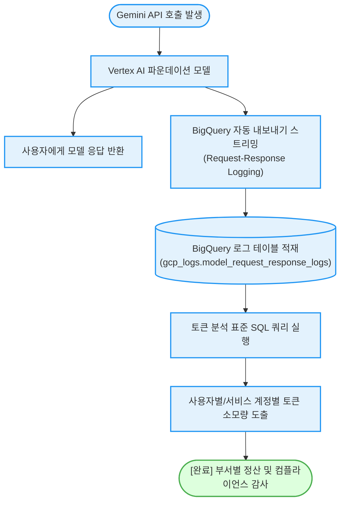

# 제미나이(Gemini) API 요청 및 응답 BigQuery 자동 로깅 (`gemini-request-response-logging`)

별도의 복잡한 엔드포인트 프록시 서버 구축 없이, 제미나이(Gemini) 파운데이션 모델 자체의 설정을 통해 **모든 프롬프트 요청 및 응답 데이터를 BigQuery로 자동 내보내고 사용자별 토큰 소비량을 1분 만에 분석**하는 가이드다. (As of 2026-06-22)

**Audience**: `#Architect`, `#Developer`, `#FinOps`  
**Concern**: `#Billing`, `#Compliance`, `#Security`  
**Service**: `#BigQuery`, `#GeminiAPI`

---

## 이 가이드가 필요한 상황 (증상 체크리스트)

- **AI 프롬프트 감사 및 규제 준수**: 엔터프라이즈 환경에서 어떤 사내 사용자가 어떤 질문과 답변을 모델과 주고받았는지 규제 컴플라이언스 차원에서 영구 보관해야 할 때
- **부서별/사용자별 토큰 과금 분필**: 전체 프로젝트 비용 청구서로는 확인하기 어려운 사용자 계정 및 API 키 단위의 상세 입력/출력 토큰 소모량을 BigQuery SQL로 정확히 정산하고자 할 때
- **프록시 없는 무중단 로깅**: 애플리케이션 코드를 크게 변경하거나 별도의 로깅 미들웨어 서버를 운영하지 않고 GCP 관리형 파이프라인으로 처리하고자 할 때

---

## 로깅 및 분석 흐름 (Activity Diagram)



---

## 사전 준비 사항 (필요 권한 - IAM)

BigQuery 데이터세트 생성 및 제미나이 모델 호출을 위한 IAM 권한 목록이다:

| 역할 (Role) | 권한 ID | 용도 |
| :--- | :--- | :--- |
| **BigQuery 데이터 편집자 (권장)** | `roles/bigquery.dataEditor` | 로그 저장용 데이터세트 및 테이블 생성 |
| **Vertex AI 사용자** | `roles/aiplatform.user` | 제미나이 모델 호출 및 로깅 파라미터 설정 |

---

## 1분 퀵스타트 (실행 방법)

### 방법 1: 구글 클라우드 쉘 (Google Cloud Shell) - *가장 권장*

```bash
# 1. 저장소 클론 및 폴더 이동
git clone https://github.com/jiangjun-forge/google-cloud-0-to-1.git
cd google-cloud-0-to-1/samples/gemini-request-response-logging

# 2. 사전 가상 체험 또는 데모 모드 (BigQuery 호출 없이 시뮬레이션 및 표준 SQL 확인)
./run.sh --dry-run

# 3. 실제 프로젝트 대상 로깅 설정 및 테스트 호출 실행
./run.sh -p your-project-id -d gcp_logs
```

### 방법 2: 로컬 환경 (Local Python)

```bash
# 의존성 설치
pip install -r requirements.txt

# 가상 실행
python3 diagnose.py --dry-run

# 실제 실행
python3 diagnose.py --project your-project-id --dataset gcp_logs
```

---

## 결과 출력 및 쿼리 예시

스크립트가 완료되면 아래와 같이 **사용자별 토큰 집계 결과와 실행 가능한 표준 SQL 쿼리**가 출력된다:

```text
========================================================================
[시뮬레이션] BigQuery 자동 로깅 및 토큰 사용량 집계 리포트
  - 대상 프로젝트: my-enterprise-project
  - BigQuery 대상 데이터세트: gcp_logs
========================================================================

[가상 쿼리 실행 결과: 사용자/서비스 계정별 토큰 소모량]
┌───────────────────────────────────────────┬────────────┬──────────────────┬─────────────────┬────────────────┐
│ 사용자 계정 (Principal Email)            │ 호출 횟수  │ 입력 토큰 (Prompt)│ 출력 토큰 (Cand)│ 총 토큰 (Total)│
├───────────────────────────────────────────┼────────────┼──────────────────┼─────────────────┼────────────────┤
│ data-analyst@example.com                  │ 1,240회    │ 12,450,000       │ 1,820,000       │ 14,270,000     │
│ sa-prod-worker@project.iam.gserviceaccount│ 3,890회    │  5,210,000       │ 4,110,000       │  9,320,000     │
│ dev-engineer@example.com                  │   450회    │    920,000       │   180,000       │  1,100,000     │
└───────────────────────────────────────────┴────────────┴──────────────────┴─────────────────┴────────────────┘

------------------------------------------------------------------------
[BigQuery 토큰 분석 표준 SQL 쿼리문]
SELECT 
    JSON_VALUE(full_request, '$.labels.user_email') AS user_email,
    COUNT(1) AS call_count,
    SUM(SAFE_CAST(JSON_VALUE(full_response, '$.usageMetadata.promptTokenCount') AS INT64)) AS total_prompt_tokens,
    SUM(SAFE_CAST(JSON_VALUE(full_response, '$.usageMetadata.candidatesTokenCount') AS INT64)) AS total_candidate_tokens,
    SUM(SAFE_CAST(JSON_VALUE(full_response, '$.usageMetadata.totalTokenCount') AS INT64)) AS total_tokens
FROM `my-enterprise-project.gcp_logs.model_request_response_logs`
WHERE logging_time >= TIMESTAMP_SUB(CURRENT_TIMESTAMP(), INTERVAL 7 DAY)
GROUP BY user_email
ORDER BY total_tokens DESC;
```

---

## 자원 정리 (Teardown Guide)

테스트 및 실습 완료 후 불필요한 BigQuery 스토리지 과금을 방지하기 위해 데이터세트를 삭제한다:

```bash
bq rm -r -f -d YOUR_PROJECT_ID:gcp_logs
```
