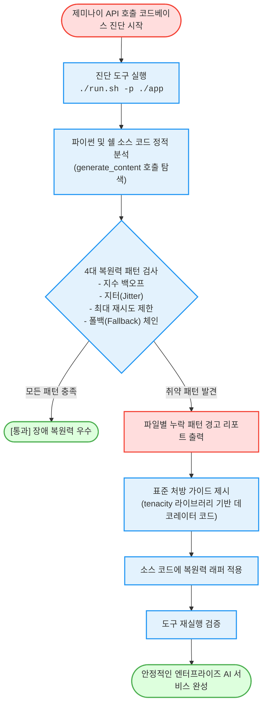

# 제미나이(Gemini) API 복원력 패턴 자가 진단 (`gemini-resilience-checker`)

제미나이(Gemini) API 호출 소스 코드에서 429 과부하 에러와 일시적 네트워크 장애를 방어하기 위한 **지수 백오프, 지터(무작위 대기), 최대 재시도 제약, 폴백 모델 체인 구비 여부를 1분 만에 정적 진단**하고 표준 처방 코드를 제시하는 도구다.

**Audience**: `#Architect`, `#Developer`  
**Concern**: `#Performance`, `#Resilience`  
**Date**: `2026-09-09`  
**Service**: `#GeminiAPI`

---

## 이 가이드가 필요한 상황 (증상 체크리스트)

- **간헐적 429 (Resource Exhausted) 장애**: 트래픽이 몰릴 때 재시도 로직이 없거나 단순 재시도로 인해 서비스 중단이 발생하는 경우
- **폭풍 재시도(Thundering Herd) 현상**: 대기 시간 무작위화(Jitter) 없이 고정 간격으로 재시도하여 백엔드 모델 서버에 추가 부하를 주는 경우
- **무한 루프로 인한 지연 및 비용 누수**: 재시도 횟수 제한(Max Retries)이 없어 일시 장애가 영구 행(Hang) 또는 과다 호출로 이어지는 경우
- **주 모델 장애 시 서비스 중단**: Gemini 2.5 Pro 등 주력 모델 지연 또는 쿼터 소진 시 Gemini 2.5 Flash 등으로 자동 우회하는 폴백 로직이 누락된 경우

---

## 진단 및 해결 흐름 (Activity Diagram)



---

## 사전 준비 사항 (필요 권한 - IAM)

이 도구는 소스 코드 파일을 정적으로 분석하는 도구로, 별도의 클라우드 인프라 자원을 생성하거나 변경하지 않는다.

| 권한 항목 | 요구 조건 | 비고 |
| :--- | :--- | :--- |
| **GCP IAM 권한** | 필요 없음 | 순수 로컬 또는 Cloud Shell 환경 정적 진단 도구 |
| **로컬 환경 권한** | 소스 코드 읽기 권한 | 스캔 대상 프로젝트 디렉터리 접근 권한 |

---

## 1분 퀵스타트 (실행 방법)

### 방법 1: 구글 클라우드 쉘 (Google Cloud Shell) - *가장 권장*

```bash
# 1. 저장소 클론 및 폴더 이동
git clone https://github.com/jiangjun-forge/google-cloud-0-to-1.git
cd google-cloud-0-to-1/samples/gemini-resilience-checker

# 2. 사전 가상 체험 또는 데모 모드 (모의 데이터로 결과 리포트 확인)
./run.sh --dry-run

# 3. 실제 애플리케이션 소스 코드 경로 진단 (예: ../my-app)
./run.sh -p /path/to/your/project
```

### 방법 2: 로컬 환경 (Local Python)

```bash
# 실행 권한 부여 및 진단 실행
python3 diagnose.py --path /path/to/your/project

# 가상 데모 실행
python3 diagnose.py --dry-run
```

---

## 결과 출력 예시

스크립트가 완료되면 아래와 같이 **각 파일별로 어떤 복원력 패턴이 누락되었는지** 명확히 출력된다:

```text
========================================================================
[진단 결과] 제미나이(Gemini) API 호출 복원력(Resilience) 진단 리포트
========================================================================

진단된 API 호출 소스 파일: 2건

[파일: app/services/llm_client.py]
  - 지수 백오프 및 재시도: [경고] 누락
  - 지터 무작위 대기 제어: [경고] 누락
  - 최대 재시도 횟수 제한: [경고] 누락
  - 폴백 모델 예외 체인  : [권장] 미적용
------------------------------------------------------------------------
[파일: batch_worker.py]
  - 지수 백오프 및 재시도: 통과
  - 지터 무작위 대기 제어: [경고] 누락
  - 최대 재시도 횟수 제한: 통과
  - 폴백 모델 예외 체인  : [권장] 미적용
------------------------------------------------------------------------

========================================================================
[추천 표준 처방 가이드 - 파이썬 tenacity 라이브러리 연동]
========================================================================
...
```

---

## 표준 복원력 처방 가이드

진단 결과 취약점이 발견된 경우, 아래 표준 코드를 적용하여 서비스를 즉시 보강한다:

```python
from google import genai
from google.genai import types
from tenacity import retry, stop_after_attempt, wait_random_exponential

# 1. 지수 백오프, 지터, 최대 5회 재시도 제약 표준 결합
@retry(
    wait=wait_random_exponential(min=1, max=60), # 지수 백오프 및 무작위성(지터) 추가
    stop=stop_after_attempt(5)                    # 최대 5회까지만 재시도 제한
)
def generate_with_retry(client, model_id, prompt):
  return client.models.generate_content(
      model=model_id,
      contents=prompt
  )

# 2. 주 모델(Gemini 2.5 Pro) 실패 시 경량 모델(Gemini 2.5 Flash)로 자동 우회
def generate_with_fallback(client, prompt):
  try:
    return generate_with_retry(client, "gemini-2.5-pro", prompt)
  except Exception as e:
    print(f"[안내] 주 모델 호출 실패로 폴백 모델로 즉시 우회한다: {e}")
    return generate_with_retry(client, "gemini-2.5-flash", prompt)
```

---

## 자원 정리 (Teardown) 안내

이 도구는 소스 코드 정적 분석기이므로 클라우드 상에 생성된 리소스가 없으며, 별도의 자원 정리 작업이 필요하지 않다.
