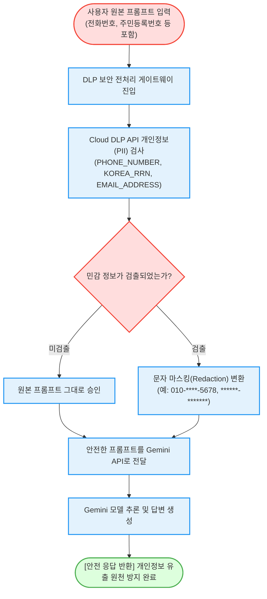

# 제미나이(Gemini) API 프롬프트 민감 정보 실시간 마스킹 (`gemini-sensitive-data-masking`)

> **태그**: `#Architect`, `#Developer`, `#SecOps` | `#Compliance`, `#Security` | `#CloudDLP`, `#GeminiAPI`  
> **요약**: 제미나이(Gemini) API로 프롬프트를 전송하기 전, Cloud DLP(Sensitive Data Protection)를 연동하여 **전화번호, 주민등록번호, 이메일 등 개인 식별 정보(PII)를 실시간으로 탐지 및 마스킹(Redaction)하는 엔터프라이즈 보안 게이트웨이** 가이드다.

---

## 이 가이드가 필요한 상황 (증상 체크리스트)

- **개인정보보호법 및 컴플라이언스 준수**: 고객이나 임직원이 LLM 프롬프트에 주민등록번호, 계좌번호, 전화번호 등을 직접 입력하여 발생할 수 있는 데이터 유출 사고를 사전에 차단하고자 할 때
- **엔터프라이즈 보안 게이트웨이 구현**: 사내 챗봇 또는 고객 지원 AI 파이프라인 전면에 위치하여 모든 입출력 텍스트의 민감 정보를 자동 필터링하고자 할 때
- **사전 마스킹 테스트**: 실제 Cloud DLP API 호출 및 로컬 정규식 모의 엔진을 통해 마스킹 정책이 정상 동작하는지 1분 만에 검증하고자 할 때

---

## 마스킹 및 전송 흐름 (Activity Diagram)



---

## 사전 준비 사항 (필요 권한 - IAM)

실제 Cloud DLP API를 호출하여 프롬프트를 마스킹할 때 필요한 역할(Role) 목록이다:

| 역할 (Role) | 권한 ID | 용도 |
| :--- | :--- | :--- |
| **DLP 사용자 (권장)** | `roles/dlp.user` | Cloud DLP를 통한 텍스트 검사 및 마스킹 실행 |
| **DLP 관리자 (선택)** | `roles/dlp.admin` | DLP 템플릿 및 규칙 관리 |
| **Vertex AI 사용자** | `roles/aiplatform.user` | 안전한 프롬프트로 제미나이 모델 호출 |

> [!NOTE]
> `--dry-run` 모드로 실행할 경우 GCP IAM 권한이나 API 활성화 없이도 로컬 가상 마스킹 결과를 즉시 확인할 수 있다.

---

## 1분 퀵스타트 (실행 방법)

### 방법 1: 구글 클라우드 쉘 (Google Cloud Shell) - *가장 권장*

```bash
# 1. 저장소 클론 및 폴더 이동
git clone https://github.com/jiangjun-forge/google-cloud-0-to-1.git
cd google-cloud-0-to-1/samples/gemini-sensitive-data-masking

# 2. 사전 가상 체험 또는 데모 모드 (DLP 호출 없이 즉시 확인)
./run.sh --dry-run

# 3. 실제 Cloud DLP API를 통한 마스킹 실행
./run.sh -p your-project-id
```

### 방법 2: 로컬 환경 (Local Python)

```bash
# 의존성 설치
pip install -r requirements.txt

# 가상 실행
python3 diagnose.py --dry-run

# 실제 텍스트 지정 실행
python3 diagnose.py --project your-project-id --text "제 번호는 010-9999-8888 입니다"
```

---

## 결과 출력 예시

스크립트가 완료되면 아래와 같이 **원본 프롬프트와 마스킹된 프롬프트의 전/후 비교**가 출력된다:

```text
========================================================================
[진단 결과] 제미나이(Gemini) 프롬프트 민감 정보 마스킹 리포트
========================================================================
감지 타겟 개인정보 유형 (InfoTypes): PHONE_NUMBER, EMAIL_ADDRESS, KOREA_RRN
------------------------------------------------------------------------
[1. 원본 전송 프롬프트 (민감 정보 포함 위험)]
  안녕하세요. 제 연락처는 010-1234-5678이고 주민등록번호는 900101-1234567입니다. gcp-user@example.com 으로 제미나이 2.5 기술 자료를 보내주세요.
------------------------------------------------------------------------
[2. 마스킹 처리된 안전 프롬프트 (DLP Redacted)]
  안녕하세요. 제 연락처는 *************이고 주민등록번호는 **************입니다. ******************** 으로 제미나이 2.5 기술 자료를 보내주세요.
========================================================================

[안내] 마스킹 완료된 안전 프롬프트가 Gemini API로 안전하게 전송될 준비를 마쳤다.
```

---

## 자원 정리 (Teardown Guide)

본 도구는 상태 비저장(Stateless) API 호출 도구이며 별도의 영구 리소스를 생성하지 않으므로 추가적인 자원 삭제 절차가 필요하지 않다.
