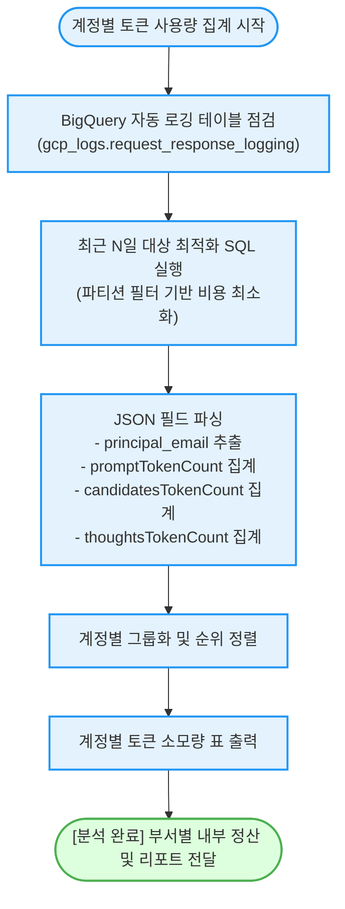

<!--
Copyright 2026 Google LLC. All Rights Reserved.
SPDX-License-Identifier: Apache-2.0

NOTICE: This code/repository is owned by Google LLC and provided under the Apache-2.0 License.
It is strictly provided as an EXAMPLE/REFERENCE ONLY and is NOT INTENDED FOR PRODUCTION USE.
All contents, designs, and code examples are subject to change, modification, or removal at any time without notice.

[고지 사항] 본 저장소 및 문서는 구글 (Google LLC) 소유이며 Apache 2.0 라이선스 하에 예시 (Sample) 용도로 제공된다.
프로덕션 환경용이 아니며, 사전 통지 없이 언제든지 수정, 변경 또는 삭제될 수 있다.
-->

> [!IMPORTANT]
> **구글 (Google LLC) 참조용 샘플 고지 사항**:
> 본 프로젝트의 모든 소스 코드와 문서는 Google LLC의 소유이며, Apache-2.0 라이선스에 따라 오직 **참조용 샘플 (Sample / Reference Only)** 목적으로만 제공된다. 프로덕션 환경에 그대로 사용할 수 없으며, 사전 통지 없이 언제든 내용이 수정, 변경 또는 삭제될 수 있다.

# 제미나이(Gemini) API 계정별 토큰 사용량 동적 분석 (`gemini-usage-by-account`)

BigQuery에 적재된 제미나이(Gemini) API 자동 로깅 데이터를 바탕으로, **사용자(계정) 및 서비스 계정별 호출 횟수, 입력 토큰, 출력 토큰, 생각(Thinking) 토큰 소비량을 1분 만에 동적 집계**하는 분석 도구다. (As of 2026-06-22)

**Audience**: `#Architect`, `#FinOps`, `#SecOps`  
**Concern**: `#Billing`, `#Compliance`  
**Service**: `#BigQuery`, `#GeminiAPI`

---

## 이 가이드가 필요한 상황 (증상 체크리스트)

- **계정별/부서별 상세 토큰 비용 분필**: 프로젝트 전체 과금서 외에 어떤 개발자나 서비스 계정이 토큰을 과다 소모하고 있는지 정확히 파악해야 할 때
- **생각 토큰(Thinking Tokens) 소모량 추적**: Gemini 2.5 Pro 등 추론형 모델에서 추론 단계(Thinking)에 소모된 토큰량을 분리하여 분석하고자 할 때
- **사내 AI 사용 패턴 감사**: 사용자별 API 호출 빈도와 평균 입출력 토큰 규모를 정기적으로 모니터링하여 남용을 예방하고자 할 때

---

## 데이터 흐름 및 집계 구조 (Activity Diagram)



---

## 사전 준비 사항 (필요 권한 - IAM)

BigQuery 로그 테이블을 읽고 쿼리 작업을 실행하기 위한 IAM 권한 목록이다:

| 역할 (Role) | 권한 ID | 용도 |
| :--- | :--- | :--- |
| **BigQuery 데이터 뷰어 (권장)** | `roles/bigquery.dataViewer` | 로그 테이블 데이터 읽기 권한 |
| **BigQuery 작업 사용자 (권장)** | `roles/bigquery.jobUser` | 집계 쿼리 작업(Job) 실행 권한 |

> [!NOTE]
> `--dry-run` 모드로 실행할 경우 BigQuery 권한이나 테이블 없이도 집계 표의 구조와 쿼리 문법을 즉시 확인할 수 있다.

---

## 1분 퀵스타트 (실행 방법)

### 방법 1: 구글 클라우드 쉘 (Google Cloud Shell) - *가장 권장*

```bash
# 1. 저장소 클론 및 폴더 이동
git clone https://github.com/jiangjun-forge/google-cloud-0-to-1.git
cd google-cloud-0-to-1/samples/gemini-usage-by-account

# 2. 사전 가상 체험 또는 데모 모드 (BigQuery 권한 없이 즉시 테스트)
./run.sh --dry-run

# 3. 실제 프로젝트 대상 최근 14일 집계 실행
./run.sh -p your-project-id -d 14
```

### 방법 2: 로컬 환경 (Local Python)

```bash
# 의존성 설치
pip install -r requirements.txt

# 가상 실행
python3 diagnose.py --dry-run

# 실제 실행
python3 diagnose.py --project your-project-id --days 30
```

---

## 결과 출력 예시

스크립트가 완료되면 아래와 같이 **계정별 호출 수와 토큰 소모량 순위 표**가 출력된다:

```text
========================================================================
[진단 결과] 제미나이(Gemini) API 계정별 사용량 및 토큰 통계 리포트
  - 대상 프로젝트: my-enterprise-project
  - BigQuery 테이블: gcp_logs.request_response_logging
  - 집계 기간: 최근 7일
========================================================================

[계정별 API 호출 횟수 및 상세 토큰 소모량 순위]
┌───────────────────────────────────────────┬────────────┬──────────────────┬─────────────────┬──────────────────┐
│ 사용자 계정 (Principal Email)            │ 호출 횟수  │ 입력 토큰 (Prompt)│ 출력 토큰 (Cand)│ 생각 토큰 (Think)│
├───────────────────────────────────────────┼────────────┼──────────────────┼─────────────────┼──────────────────┤
│ dev-backend@company.iam.gserviceaccount   │ 8,420회    │ 25,260,000       │ 4,210,000       │ 1,530,000        │
│ kim.developer@company.com                 │ 1,350회    │  4,050,000       │   675,000       │   220,000        │
│ lee.analyst@company.com                   │   820회    │  1,640,000       │   410,000       │   110,000        │
│ park.intern@company.com                   │    95회    │    190,000       │    47,500       │    12,000        │
└───────────────────────────────────────────┴────────────┴──────────────────┴─────────────────┴──────────────────┘
```

---

## 자원 정리 (Teardown Guide)

본 도구는 순수 조회(SELECT) 도구이며 새로운 영구 자원을 생성하지 않으므로 별도의 자원 정리 작업이 필요하지 않다.
