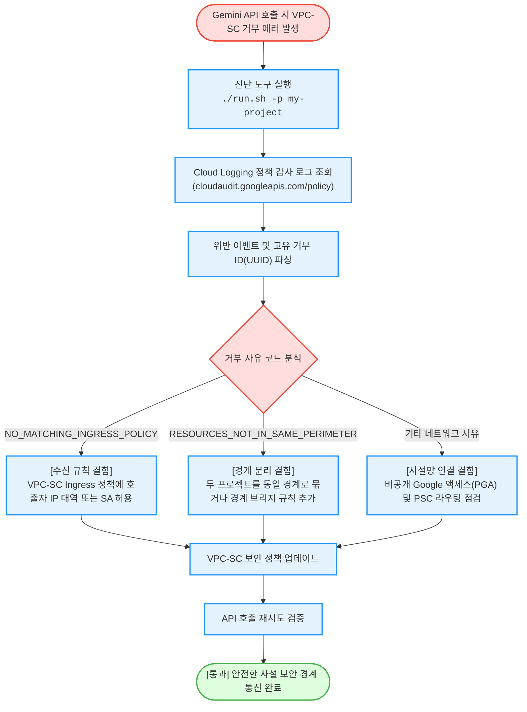

# 제미나이(Gemini) VPC Service Controls 차단 감사 추적 및 처방 (`gemini-vpc-sc-denial-resolver`)

제미나이(Gemini / Vertex AI) API 호출 시 발생하는 VPC Service Controls(VPC-SC) 보안 경계 차단(Perimeter Denial) 에러를 감사 로그에서 역추적하고 **거부 사유 코드별 근본 원인 분석 및 네트워크 수신 허용 규칙을 1분 만에 처방**하는 도구다.

`#Audience` `#Architect` `#SecOps`  
`#Concern` `#Compliance` `#Security`  
`#Service` `#CloudLogging` `#GeminiAPI` `#VPCServiceControls`

---

## 이 가이드가 필요한 상황 (증상 체크리스트)

- **VPC-SC 경계 차단 장애**: 온프레미스 사설망, 하이브리드 클라우드 또는 특정 서브넷에서 Gemini 호출 시 알 수 없는 보안 정책 거부(Denial)가 발생할 때
- **거부 원인 규명 곤란**: 일반적인 클라이언트 에러 메시지만으로는 수신 규칙(Ingress Rule) 누락인지, 상이한 경계 분리인지 판단하기 어려울 때
- **VPC-SC 감사 추적 및 즉각 해결**: Cloud Logging의 보안 정책 감사 로그(`cloudaudit.googleapis.com/policy`)를 역추적하여 고유 거부 ID(UUID)와 원인별 해결책을 즉시 확보하고자 할 때

---

## 진단 및 복구 흐름 (Activity Diagram)



---

## 사전 준비 사항 (필요 권한 - IAM)

Cloud Logging 감사 로그를 조회하기 위해 필요한 IAM 역할이다:

| 역할 (Role) | 권한 ID | 용도 |
| :--- | :--- | :--- |
| **로그 뷰어 (권장)** | `roles/logging.viewer` | Cloud Logging 정책 감사 로그 읽기 |
| **보안 뷰어 (선택)** | `roles/iam.securityViewer` | 보안 정책 및 거부 감사 로그 통합 조회 |

> [!NOTE]
> `--dry-run` 모드로 실행할 경우 GCP IAM 권한 없이도 가상 거부 사례와 사유별 표준 처방을 즉시 확인할 수 있다.

---

## 1분 퀵스타트 (실행 방법)

### 방법 1: 구글 클라우드 쉘 (Google Cloud Shell) - *가장 권장*

```bash
# 1. 저장소 클론 및 폴더 이동
git clone https://github.com/jiangjun-forge/google-cloud-0-to-1.git
cd google-cloud-0-to-1/samples/gemini-vpc-sc-denial-resolver

# 2. 사전 가상 체험 또는 데모 모드 (권한 없이 가상 시뮬레이션)
./run.sh --dry-run

# 3. 실제 프로젝트 대상 최근 14일 감사 로그 추적 실행
./run.sh -p your-project-id -d 14
```

### 방법 2: 로컬 환경 (Local Python)

```bash
# 가상 실행
python3 diagnose.py --dry-run

# 실제 실행
python3 diagnose.py --project your-project-id --days 7 --limit 10
```

---

## 결과 출력 예시

스크립트가 완료되면 아래와 같이 **거부된 계정, 서비스, 메서드, 고유 거부 ID 및 처방**이 출력된다:

```text
========================================================================
[진단 결과] 제미나이(Gemini) VPC Service Controls 경계 차단 진단 리포트
  - 대상 프로젝트: my-secured-project
  - 조회 기간: 최근 7일
========================================================================

발견된 VPC-SC 경계 거부 사례: 2건

[거부 사례 #1]
  - 호출 주체 계정: developer-workstation@company.com
  - 대상 서비스   : aiplatform.googleapis.com
  - 호출 메서드   : google.cloud.aiplatform.v1beta1.PredictionService.GenerateContent
  - 거부 사유 코드: NO_MATCHING_INGRESS_POLICY
  - 고유 거부 ID  : vpc-sc-denial-8f2a1b9c-4d3e-41a2-98bc-abcdef012345
  [권장 처방 및 복구 가이드]
    - 원인 분석 및 해결책: API 호출자가 신뢰할 수 없는 공용 IP 대역 또는 미지정 사설 서브넷에서 접근했다. VPC-SC 수신(Ingress) 규칙에 호출자의 IP 서브넷 대역 또는 서비스 계정을 명시적으로 허용해야 한다.
    - VPC-SC 문제 해결사 콘솔: https://console.cloud.google.com/security/vpc-service-controls/troubleshooter
    - 서비스 경계 관리 콘솔  : https://console.cloud.google.com/security/vpc-service-controls
------------------------------------------------------------------------
```

---

## 자원 정리 (Teardown Guide)

본 도구는 순수 감사 로그 조회 도구이며 클라우드 상에 영구 자원을 생성하지 않으므로 별도의 자원 정리 작업이 필요하지 않다.
