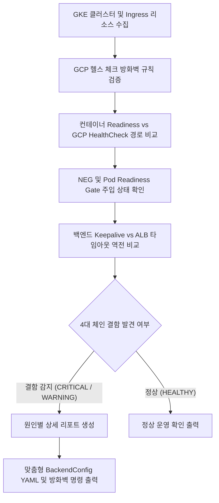

<!--
Copyright 2026 Google LLC. All Rights Reserved.
SPDX-License-Identifier: Apache-2.0

NOTICE: This code/repository is owned by Google LLC and provided under the Apache-2.0 License.
It is strictly provided as an EXAMPLE/REFERENCE ONLY and is NOT INTENDED FOR PRODUCTION USE.
All contents, designs, and code examples are subject to change, modification, or removal at any time without notice.

[고지 사항] 본 저장소 및 문서는 구글 (Google LLC) 소유이며 Apache 2.0 라이선스 하에 예시 (Sample) 용도로 제공된다.
프로덕션 환경용이 아니며, 사전 통지 없이 언제든지 수정, 변경 또는 삭제될 수 있다.
-->

> [!IMPORTANT]
> **구글 (Google LLC) 참조용 샘플 고지 사항**:
> 본 프로젝트의 모든 소스 코드와 문서는 Google LLC의 소유이며, Apache-2.0 라이선스에 따라 오직 **참조용 샘플 (Sample / Reference Only)** 목적으로만 제공된다. 프로덕션 환경에 그대로 사용할 수 없으며, 사전 통지 없이 언제든 내용이 수정, 변경 또는 삭제될 수 있다.

# GKE Ingress 및 Gateway 502 Bad Gateway 원인 체인 역추적기

GKE 클러스터의 파드가 정상 기동 중임에도 외부 또는 내부 HTTP(S) 로드 밸런서에서 간헐적 또는 전면적으로 반환되는 502 Bad Gateway 오류의 4대 원인(헬스 체크 방화벽 차단, 프로브 경로 불일치, NEG Pod Readiness Gate 미충족, Keepalive 타임아웃 역전)을 1분 만에 교차 진단하고 복구 YAML 및 방화벽 명령을 도출하는 도구다. (As of 2026-09-10)

**Audience**: `#Architect`, `#Developer`, `#SecOps`  
**Concern**: `#Performance`, `#Resilience`, `#Security`  
**Service**: `#ComputeEngine`, `#GKE`

---

## 1. 이 가이드가 필요한 상황

- 쿠버네티스 파드가 `Running` 및 `Ready` 상태임에도 사용자가 브라우저나 API 클라이언트 접속 시 `502 Bad Gateway` 또는 `failed_to_pick_backend` 오류를 마주하는 경우
- 애플리케이션 로그에는 아무런 오류가 없는데 구글 클라우드 로드 밸런서(External/Internal Application Load Balancer)에서 간헐적인 502 응답이 기록되는 경우
- 신규 파드 롤아웃(Deployment 배포) 직후 수 초에서 수 분 동안 트래픽이 유실되고 502 에러가 치솟는 현상을 방지하려는 경우
- GCP 헬스 체크 프로브 대역(`35.191.0.0/16`, `130.211.0.0/22`)의 인그레스 방화벽 차단 여부를 점검하려는 경우
- 백엔드 웹 서버(Node.js, Express, Tomcat, Gunicorn, Nginx)의 유휴 커넥션 Keepalive 타임아웃과 GCP 로드 밸런서의 백엔드 타임아웃 간 역전 현상을 교차 검증하려는 경우

---

## 2. 진단 및 해결 흐름



---

## 3. 사전 준비 사항

본 도구를 실행하려면 최소 아래의 IAM 권한이 필요하다:

| 서비스 | 필요 역할 (Role) | 최소 IAM 권한 |
| :--- | :--- | :--- |
| `Google Kubernetes Engine` | `roles/container.viewer` | `container.clusters.get`, `container.clusters.list` |
| `Compute Engine` | `roles/compute.networkViewer` | `compute.firewalls.list`, `compute.backendServices.get` |

---

## 4. 빠른 시작 및 실행 방법

### 단계 1: 환경 변수 설정
`.env.example` 파일을 복사하여 `.env` 파일을 생성한다:
```bash
cp .env.example .env
```
특정 리소스 고정이 필요하지 않다면 `.env` 값을 비워두어도 된다. gcloud 활성 설정 및 사내 GKE 클러스터를 자동으로 감지한다.

### 단계 2: 모의 데이터 가상 실행 (Dry-Run)
실제 클러스터나 GCP API 호출 없이 내장된 가상 인프라 데이터로 4단계 원인 역추적 체인을 확인한다:
```bash
./run.sh --dry-run
```

### 단계 3: 실제 사내 GKE 클러스터 실시간 진단
```bash
./run.sh
```

특정 클러스터와 네임스페이스를 명시적으로 점검할 수도 있다:
```bash
./run.sh --cluster gke-prod-asia-northeast3 --location asia-northeast3 --namespace production
```

---

## 5. 502 Bad Gateway를 유발하는 4대 아키텍처 원인

구글 클라우드 로드 밸런서와 GKE 파드 간 통신에서 발생하는 502 오류는 대부분 다음 4가지 설정 불일치에서 기인한다:

1. **GCP 헬스 체크 프로브 대역 방화벽 차단 (FIREWALL_PROBE_BLOCKED)**:
   - GCP 로드 밸런서의 상태 확인 프록시는 `35.191.0.0/16` 및 `130.211.0.0/22` IP 대역에서 각 노드나 파드로 상태 확인 패킷을 보낸다.
   - 이 대역에서 들어오는 인그레스 트래픽이 VPC 방화벽에서 허용되지 않으면 모든 백엔드가 Unhealthy로 처리되어 트래픽 유입 즉시 502가 반환된다.

2. **헬스 체크 요청 경로 불일치 (HEALTH_CHECK_PATH_MISMATCH)**:
   - 파드 명세의 `readinessProbe` 경로는 `/healthz`로 구현되어 정상 동작하지만, GKE Ingress 기본 로드 밸런서 헬스 체크 경로는 별도 지정이 없으면 `/`로 설정된다.
   - 만약 애플리케이션의 루트(`/`) 경로가 404 Not Found나 인증 리다이렉트(302)를 반환하면, 쿠버네티스 파드는 정상(Running)이지만 GCP 로드 밸런서는 백엔드를 비정상으로 판정한다.

3. **NEG Pod Readiness Gate 미충족 (NEG_READINESS_GATE_MISSING)**:
   - 컨테이너-네이티브 로드 밸런싱(NEG) 환경에서 파드가 생성될 때, 컨테이너 Readiness Probe만 통과하고 GCP 로드 밸런서 엔드포인트 등록이 완료되기 전에 트래픽이 유입되면 502가 발생한다.
   - `cloud.google.com/neg-ready` Readiness Gate가 선언되어 있어야 GCP 로드 밸런서의 상태 확인이 완료될 때까지 엔드포인트 트래픽 투입이 안전하게 지연된다.

4. **백엔드 Keepalive 타임아웃 역전 (KEEPALIVE_TIMEOUT_INVERSION)**:
   - GCP 로드 밸런서 백엔드 서비스의 기본 유휴 타임아웃은 30초(최대 600초)다.
   - 백엔드 웹 서버(Node.js 기본 5초, Tomcat 기본 20초 등)의 Keepalive 타임아웃이 로드 밸런서보다 짧으면, 유휴 상태의 TCP 연결을 백엔드가 먼저 TCP FIN/RST로 일방 종료한다.
   - 이때 클라이언트의 신규 요청이 해당 유휴 커넥션으로 들어오면 로드 밸런서가 백엔드로부터 즉시 RST를 수신하여 브라우저에 502 오류를 반환한다.

---

## 6. 조치 가이드 및 맞춤형 설정

### 1. 헬스 체크 허용 방화벽 규칙 배포
```bash
gcloud compute firewall-rules create allow-gcp-health-checks \
  --network=default \
  --action=ALLOW \
  --direction=INGRESS \
  --source-ranges=35.191.0.0/16,130.211.0.0/22 \
  --rules=tcp:80,tcp:443,tcp:8080
```

### 2. BackendConfig 커스텀 매니페스트 적용 (`backend-config.yaml`)
파드의 실제 헬스 체크 경로와 타임아웃을 로드 밸런서에 동기화한다:
```yaml
apiVersion: cloud.google.com/v1
kind: BackendConfig
metadata:
  name: web-backend-config
  namespace: default
spec:
  timeoutSec: 30
  healthCheck:
    type: HTTP
    requestPath: /healthz
    port: 8080
```

서비스에 애노테이션 바인딩:
```bash
kubectl annotate service [SERVICE_NAME] \
  cloud.google.com/backend-config='{"default": "web-backend-config"}' --overwrite
```

### 3. 백엔드 애플리케이션 Keepalive 타임아웃 상향
로드 밸런서 타임아웃(30초)보다 최소 5초 이상 길게 유지한다 (35초 이상 권장):
- **Node.js**:
  ```javascript
  const server = app.listen(port);
  server.keepAliveTimeout = 35000;
  server.headersTimeout = 40000;
  ```
- **Nginx (`nginx.conf`)**:
  ```nginx
  keepalive_timeout 35s;
  ```

### 4. 관련 공식 기술 문서
- GKE Ingress 문제 해결 및 502 오류 원인 ( https://cloud.google.com/kubernetes-engine/docs/troubleshooting#502_bad_gateway )
- 컨테이너 네이티브 로드 밸런싱(NEG) 가이드 ( https://cloud.google.com/kubernetes-engine/docs/how-to/container-native-load-balancing )
- GKE BackendConfig 구성 참조 ( https://cloud.google.com/kubernetes-engine/docs/concepts/backendconfig )

---

## 7. 리소스 정리 (Teardown) 안내

본 진단 도구는 읽기 전용(Read-Only) 명령어로 작동하므로 별도의 클라우드 인프라 자원을 생성하지 않는다. 로컬 임시 설정 파일만 정리하면 된다:
```bash
rm -f .env
```
