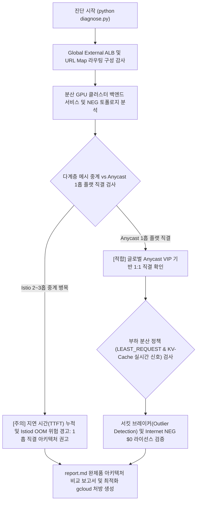

<!--
Copyright 2026 Google LLC. All Rights Reserved.
SPDX-License-Identifier: Apache-2.0

NOTICE: This code/repository is owned by Google LLC and provided under the Apache-2.0 License.
It is strictly provided as an EXAMPLE/REFERENCE ONLY and is NOT INTENDED FOR PRODUCTION USE.
All contents, designs, and code examples are subject to change, modification, or removal at any time without notice.

[고지 사항] 본 저장소 및 문서는 구글 (Google LLC) 소유이며 Apache 2.0 라이선스 하에 예시 (Sample) 용도로 제공된다.
프로덕션 환경용이 아니며, 사전 통지 없이 언제든지 수정, 변경 또는 삭제될 수 있다.
-->

> [!IMPORTANT]
> **구글 (Google LLC) 참조용 샘플 고지 사항**:
> 본 프로젝트의 모든 소스 코드와 문서는 Google LLC의 소유이며, Apache-2.0 라이선스에 따라 오직 **참조용 샘플 (Sample / Reference Only)** 목적으로만 제공된다. 프로덕션 환경에 그대로 사용할 수 없으며, 사전 통지 없이 언제든 내용이 수정, 변경 또는 삭제될 수 있다.

# Multi-Cluster GKE Inference Gateway 라우팅 및 L7 제어 평면 진단기

대규모 AI/LLM 서빙 환경에서 GPU/TPU 공급 부족으로 여러 리전과 멀티 클라우드에 분산된 수십 개 쿠버네티스 클러스터 운영 시, 기존 계층형 Istio 풀 메시(Full-mesh) 중계로 인한 지연 시간(TTFT) 증가와 GKE Fleet 라이선스 비용 누수를 진단하고, Global External ALB 및 Hybrid/Internet NEG 기반의 1홉 플랫 직결 L7 제어 평면 상태를 1분 만에 점검 및 처방하는 아키텍처 진단 도구다. (As of 2026-10-01)

**Audience**: `#Architect`, `#Developer`, `#FinOps`  
**Concern**: `#Billing`, `#Performance`, `#Resilience`  
**Service**: `#CloudLoadBalancing`, `#ComputeEngine`, `#GoogleKubernetesEngine`  

---

## 1. 이 가이드가 필요한 상황 (증상 체크리스트)

- [ ] 단일 리전/단일 클러스터 내 GPU 재고 부족으로 인해 여러 리전의 GKE 클러스터 및 타 클라우드(EKS, AKS 등)에 걸쳐 다수의 분산 클러스터를 운영하고 있을 때
- [ ] 단순 라운드로빈 로드 밸런서로 인해 특정 클러스터의 VRAM / KV-cache 메모리 고갈(40%+ 포화) 시 동적 오버플로 분배가 이루어지지 않고 인퍼런스 지연이 급증할 때
- [ ] 다계층 Istio 서비스 메시 중계 구조(허브 클러스터 $\rightarrow$ 중간 프록시 $\rightarrow$ 백엔드 파드)로 인해 헤어피닝 지연 시간(TTFT)이 증가하고 불필요한 크로스 리전 Egress 비용이 발생할 때
- [ ] 멀티 클러스터 제어를 위해 GKE Fleet(구 Anthos)에 타 클라우드 GPU 워커 노드를 등록할 경우 발생하는 vCPU당 월 $73의 막대한 라이선스 비용을 회피하고 싶을 때
- [ ] 특정 GPU 클러스터 장애 시 전체 시스템으로 장애가 전파되지 않도록 글로벌 Anycast VIP 기반 1:1 플랫 직결 및 서킷 브레이커(이상치 탐지)를 신속하게 검증하고 싶을 때

---

## 2. 진단 및 해결 흐름



---

## 3. 사전 준비 사항 및 필요 권한

### (1) 필수 API 활성화 (실측 감사 시)
```bash
gcloud services enable compute.googleapis.com container.googleapis.com
```

### (2) 진단 실행 계정 최소 IAM 권한
- `roles/compute.viewer` (로드 밸런서, URL Map, 백엔드 서비스 및 NEG 조회 권한)

---

## 4. 원클릭 실행 가이드

### 단계 1: 가상 실행 모드로 1초 만에 사전 검증 (Dry-run)
실제 GCP 호출 없이 다수 분산 GPU 클러스터 환경을 가정한 모의 실행 결과를 즉시 확인한다:
```bash
python3 diagnose.py --dry-run
```

### 단계 2: 사내 실제 GCP 프로젝트 실측 진단
```bash
python3 diagnose.py -p <PROJECT_ID>
```

---

## 5. 생성 산출물 (report.md)
진단 완료 시 As-Is(다계층 메시) 대비 To-Be(Anycast 1홉 직결) 아키텍처 비교표와 즉시 실행 가능한 `gcloud` 최적화 명령어가 포함된 완제품 [report.md](report.md)가 자동 생성(덮어쓰기)된다.

---

## 6. 공식 제약 사항 및 아키텍처 트레이드오프 (Limitations)

구글 클라우드 공식 문서 ( https://docs.cloud.google.com/kubernetes-engine/docs/concepts/about-multi-cluster-inference-gateway#limitations )에 명시된 3대 공식 제약 사항과 사내 대응 아키텍처는 다음과 같다:

1. **단일 VPC 제약 (Same VPC Network)**:
   - 관리형 GKE Inference Gateway는 모든 타깃 클러스터가 동일 VPC에 속해야 하며 Cross-VPC를 직접 지원하지 않는다.
   - 타사 클라우드(EKS/AKS) 및 독립 VPC 클러스터는 관리형 Gateway 컨트롤러 대신 **Global External ALB의 Internet NEG / Hybrid NEG**로 직접 연동하여 제약을 완벽히 우회한다.
2. **백엔드 서비스당 최대 50개 NEG 제한 (50 NEGs per Backend Service)**:
   - 멀티포트 InferencePool 사용 시 3개 존 클러스터 2개만으로도 48개 NEG가 생성되어 50개 한도에 도달한다.
   - 클러스터 확장 시 단일 백엔드 서비스 집계를 피하고, **모델 포트별/경로별 백엔드 서비스 분할(URL Map 분기)** 구조를 적용한다.
3. **Model Armor 연동 미지원**:
   - 현재 GKE Inference Gateway 계층에서는 Model Armor 자동 연동이 지원되지 않는다.
   - 글로벌 진입점에 **Google Cloud Armor L7 WAF 정책(DDoS 방어, Rate Limiting, IP 평판)**을 결합하여 보안을 보완한다.

---

## 7. 자원 정리 (Teardown) 안내
본 도구는 읽기 전용 진단 스크립트로 클라우드 리소스를 생성하거나 변경하지 않으므로 별도의 자원 정리가 필요하지 않다.
