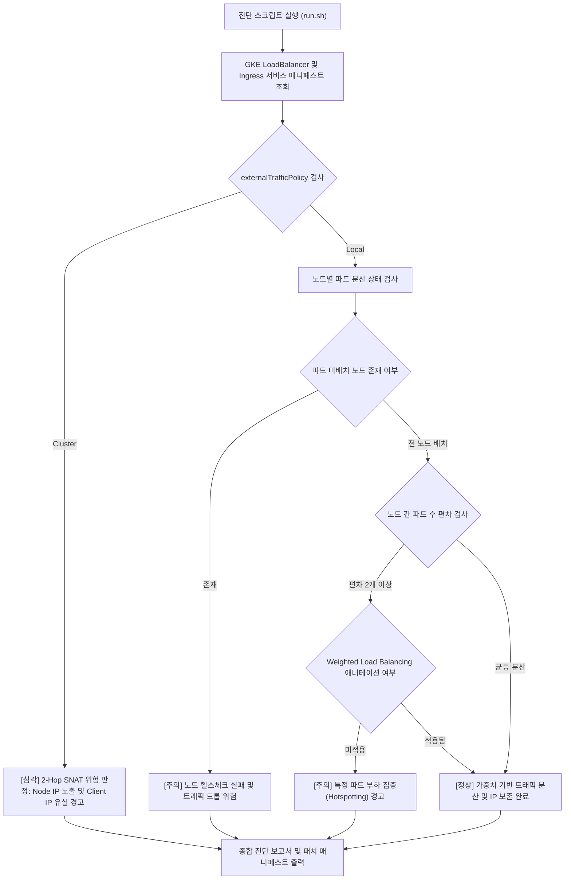

# GKE 소스 IP(Client IP) 보존 및 SNAT/부하 불균형 진단기 (`gke-source-ip-snat-guard`)

GKE 환경에서 Internal/External Passthrough NLB를 경유하여 인입되는 트래픽의 출발지 IP(Client IP) 유실(kube-proxy 2-Hop SNAT) 현상과 externalTrafficPolicy: Local 전환 시 발생하는 파드 부하 불균등(Pod Hotspotting) 위험을 1분 만에 자동 진단하고 최적 k8s 매니페스트를 처방하는 도구다. (As of 2026-09-09)

**Audience**: `#Architect`, `#Developer`, `#SecOps`  
**Concern**: `#Compliance`, `#Performance`, `#Resilience`  
**Service**: `#CloudLoadBalancing`, `#GoogleKubernetesEngine`

---

## 1. 문제 증상 체크리스트
- AWS EKS에서 GKE로 애플리케이션을 이전한 후, 동일한 인그레스(Kong, Nginx 등) 구성임에도 백엔드 Pod 로그에 클라이언트 실제 IP 대신 노드 내부 IP가 간헐적으로 기록된다.
- 개인 정보 보호법 및 금융 보안 컴플라이언스상 로그인 접속자 IP 추적이 필수적인 환경에서 원본 Client IP가 유실되어 보안 감사 결함이 발생한다.
- `externalTrafficPolicy: Cluster` 상태에서 파드가 없는 노드로 패킷이 유입된 후 2-Hop 전달 과정에서 kube-proxy SNAT(Source Network Address Translation)가 발생한다.
- Client IP 보존을 위해 `externalTrafficPolicy: Local`로 변경했으나, 노드별 파드 수가 불균등하여 특정 파드로 트래픽이 쏠리는 심각한 부하 불균형(Pod Hotspotting)이 발생한다.
- GKE Weighted Load Balancing 애너테이션 부재로 인해 파드가 없는 노드로 유입된 트래픽의 헬스체크 실패 및 드롭 현상이 일어난다.

---

## 2. 처리 흐름도



---

## 3. 필요 IAM 권한
- `roles/container.viewer` (GKE 클러스터 및 워크로드 읽기 권한)
- 세부 권한:
  - `container.services.get`
  - `container.services.list`
  - `container.pods.list`

---

## 4. 원클릭 실행법

### 가상 검증 실행 (--dry-run)
실제 클러스터 API 호출 없이 시뮬레이션 데이터를 바탕으로 SNAT 및 부하 불균형 위험을 즉시 진단한다.
```bash
./run.sh --dry-run
```

### 실제 환경 진단
기본 활성 프로젝트의 지정 클러스터 내 모든 LoadBalancer 서비스를 진단한다.
```bash
./run.sh --project="your-project-id" --cluster="prod-core-cluster" --location="asia-northeast3"
```

특정 네임스페이스만 필터링하여 진단할 경우:
```bash
./run.sh --namespace="ingress-gateway"
```

결과를 JSON 포맷으로 수집하여 CI/CD 파이프라인과 연동할 경우:
```bash
./run.sh --dry-run --json
```

---

## 5. 결과 확인 후 즉각 조치 가이드
- GKE 내부 부하 분산기 소스 IP 보존 가이드 ( https://cloud.google.com/kubernetes-engine/docs/how-to/internal-load-balance )
- GKE 가중치 로드 밸런싱 구성 안내 ( https://cloud.google.com/kubernetes-engine/docs/how-to/weighted-load-balancing )
- Kubernetes Service 소스 IP 보존 개념 ( https://kubernetes.io/docs/tutorials/services/source-ip/ )

### 1. externalTrafficPolicy: Local 전환 및 패치
```bash
kubectl patch svc [SERVICE_NAME] -n [NAMESPACE] -p '{"spec":{"externalTrafficPolicy":"Local"}}'
```

### 2. GKE Weighted Load Balancing(Subsetting) 활성화
```yaml
apiVersion: v1
kind: Service
metadata:
  name: [SERVICE_NAME]
  namespace: [NAMESPACE]
  annotations:
    networking.gke.io/load-balancer-type: "Internal"
    networking.gke.io/weighted-load-balancing: "true"
spec:
  type: LoadBalancer
  externalTrafficPolicy: Local
  internalTrafficPolicy: Local
```

### 3. Ingress Controller 파드 균등 배치를 위한 토폴로지 제약(TopologySpreadConstraints)
```yaml
spec:
  topologySpreadConstraints:
  - maxSkew: 1
    topologyKey: "kubernetes.io/hostname"
    whenUnsatisfiable: DoNotSchedule
    labelSelector:
      matchLabels:
        app.kubernetes.io/name: ingress-gateway
```

---

## 6. 자원 정리 (Teardown) 안내
본 도구는 읽기 전용 진단 스크립트이므로 자체적으로 리소스를 생성하거나 과금을 유발하지 않는다. 테스트 목적으로 생성한 LoadBalancer 서비스가 있다면 다음 명령어로 삭제한다:
```bash
kubectl delete svc [TEST_SERVICE_NAME] -n [NAMESPACE]
```
