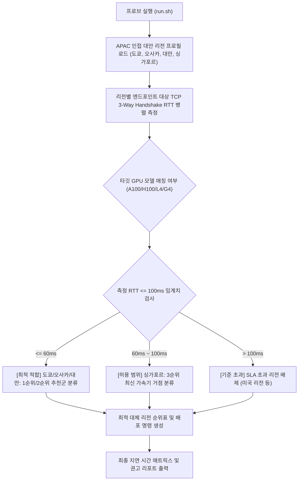

# 서울 워크로드 대체 GPU 리전 레이턴시 및 가용성 프로브 (`gpu-region-latency-probe`)

서울 리전(asia-northeast3) GPU 재고 부족 시 100ms 미만 지연 시간(RTT)을 충족하는 인접 대안 리전(도쿄, 오사카, 대만, 싱가포르)의 네트워크 레이턴시와 GPU 가용성을 1분 만에 종합 측정하고 최적 배포 리전을 추천하는 도구다.

**Audience**: `#Architect`, `#Developer`  
**Concern**: `#Performance`, `#Resilience`  
**Service**: `#CloudMonitoring`, `#ComputeEngine`

---

## 1. 문제 증상 체크리스트
- 서울 리전(`asia-northeast3`)에서 고성능 GPU(A100, H100, G4, L4) 할당 쿼터 부족 또는 온디맨드 인스턴스 생성 시 `ZONE_RESOURCE_POOL_EXHAUSTED` 에러가 빈번하게 발생한다.
- 국내 데이터 레지던시 의무 규정은 없으나, 실시간 대화형 추론이나 서빙 지연 시간을 고려하여 서울 사용자 기준 100ms 미만 왕복 지연 시간(RTT)을 반드시 충족해야 한다.
- 도쿄, 오사카, 대만, 싱가포르 등 인접 아시아 태평양(APAC) 리전 중 어떤 리전이 지연 시간이 가장 짧고 목표 GPU 머신 타입을 보유하고 있는지 즉각적인 비교 데이터가 부족하다.
- 미국 리전(`us-central1` 등)으로 우회 배포할 경우 발생하는 레이턴시 페널티(140ms 이상)가 서비스 품질(SLA)에 미치는 영향을 사전에 수치로 검증해야 한다.

---

## 2. 처리 흐름도



---

## 3. 필요 IAM 권한
- 로컬 네트워크 소켓 레이턴시 측정에는 GCP IAM 권한이 필요하지 않다.
- 실제 Compute Engine 인스턴스 생성 및 쿼터 조회 시:
  - `roles/compute.viewer` (Compute Engine 조회)
  - `compute.regions.get`, `compute.regions.list`

---

## 4. 원클릭 실행법

### 가상 검증 실행 (--dry-run)
실제 네트워크 호출 없이 서울 기준 사전 검증된 실측 벤치마크 데이터를 바탕으로 순위 추천 로직을 즉시 확인한다.
```bash
./run.sh --dry-run
```

### 특정 GPU 모델 기준 실시간 레이턴시 프로브
H100 가속기 지원 리전만 필터링하여 서울 발 실시간 네트워크 레이턴시를 측정하고 추천 순위를 도출한다.
```bash
./run.sh --gpu-type="H100"
```

최대 허용 지연 시간을 60ms로 엄격하게 제한할 경우:
```bash
./run.sh --threshold-ms=60.0 --gpu-type="L4"
```

타 배포 파이프라인 연동을 위한 JSON 출력:
```bash
./run.sh --dry-run --json
```

---

## 5. 리전별 특징 및 배포 권고안 요약
1. **일본 도쿄 (`asia-northeast1`)**: ~30-40ms RTT
   - 최저 지연 및 최다 가용량, A100/H100/G4 풍부, 1순위 최우선 추천.
2. **일본 오사카 (`asia-northeast2`)**: ~35-45ms RTT
   - 도쿄와 유사한 저지연, 도쿄 일시 품절 시 즉각적인 백업 리전.
3. **대만 창화 (`asia-east1`)**: ~40-55ms RTT
   - APAC 내 구글 대규모 인프라 거점, 안정적인 2순위 대안.
4. **싱가포르 (`asia-southeast1`)**: ~70-90ms RTT
   - 100ms 이내 진입, 차세대 가속기 및 AI 인프라 최우선 배치 거점.

---

## 6. 자원 정리(Teardown) 안내
본 도구는 순수 네트워크 레이턴시 측정 스크립트로 클라우드 리소스를 생성하지 않는다. 테스트로 배포한 Compute Engine GPU 인스턴스는 사용 완료 후 즉시 삭제한다:
```bash
gcloud compute instances delete [INSTANCE_NAME] --zone=[ZONE] --quiet
```
