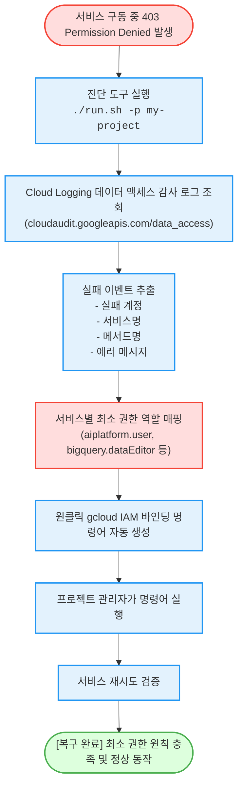

# GCP IAM 권한 거부(403) 감사 역추적 및 원클릭 복구 (`iam-permission-resolver`)

GCP 클라우드 환경에서 발생하는 403 권한 거부(Permission Denied) 실패 이벤트를 감사 로그에서 정밀 역추적하고, **서비스별 최소 권한(Least Privilege) IAM 역할 및 즉시 복구 가능한 gcloud 명령어를 1분 만에 자동 처방**하는 도구다.

**Audience**: `#Architect`, `#Developer`, `#SecOps`  
**Concern**: `#IAM`, `#Security`  
**Date**: `2026-09-09`  
**Service**: `#CloudIAM`, `#CloudLogging`

---

## 이 가이드가 필요한 상황 (증상 체크리스트)

- **원인 미상의 403 권한 거부**: 파이프라인이나 서비스에서 `Permission Denied` 오류가 발생했으나 정확히 어떤 IAM 역할(Role)이 누락되었는지 확인하기 어려울 때
- **과도한 권한 부여(오버 그랜트) 방지**: 문제를 해결하겠다고 `roles/editor`나 `roles/owner`를 남발하지 않고 최소 권한 역할만 선별하여 안전하게 부여하고자 할 때
- **감사 로그 기반의 즉각 처방**: Cloud Logging의 `cloudaudit.googleapis.com/data_access` 감사 로그를 분석하여 계정 형태(사용자 vs 서비스 계정)에 맞춘 gcloud 명령어를 원클릭으로 확보하고자 할 때

---

## 진단 및 복구 흐름 (Activity Diagram)



---

## 사전 준비 사항 (필요 권한 - IAM)

감사 로그를 조회하고 IAM 역할을 바인딩하기 위해 필요한 역할 목록이다:

| 역할 (Role) | 권한 ID | 용도 |
| :--- | :--- | :--- |
| **로그 뷰어 (권장)** | `roles/logging.viewer` | Cloud Logging 데이터 액세스 감사 로그 읽기 |
| **프로젝트 IAM 관리자** | `roles/resourcemanager.projectIamAdmin` | 추천된 IAM 역할을 계정에 최종 부여 |

> [!NOTE]
> `--dry-run` 모드로 실행할 경우 별도의 권한 없이도 가상 권한 거부 시나리오와 처방 명령어 형식을 즉시 확인할 수 있다.

---

## 1분 퀵스타트 (실행 방법)

### 방법 1: 구글 클라우드 쉘 (Google Cloud Shell) - *가장 권장*

```bash
# 1. 저장소 클론 및 폴더 이동
git clone https://github.com/jiangjun-forge/google-cloud-0-to-1.git
cd google-cloud-0-to-1/samples/iam-permission-resolver

# 2. 사전 가상 체험 또는 데모 모드 (권한 없이 가상 시뮬레이션)
./run.sh --dry-run

# 3. 실제 프로젝트 대상 최근 14일 감사 로그 진단 실행
./run.sh -p your-project-id -d 14
```

### 방법 2: 로컬 환경 (Local Python)

```bash
# 가상 실행
python3 diagnose.py --dry-run

# 실제 실행
python3 diagnose.py --project your-project-id --days 7 --limit 5
```

---

## 결과 출력 예시

스크립트가 완료되면 아래와 같이 **실패 내역과 즉시 복구할 수 있는 복사 가능한 gcloud 명령어**가 출력된다:

```text
========================================================================
[진단 결과] GCP IAM 권한 거부(403) 감사 추적 및 해결 처방 리포트
  - 대상 프로젝트: my-prod-project
  - 조회 기간: 최근 7일
========================================================================

발견된 권한 거부 실패 내역: 3건

[실패 건 #1]
  - 실패 주체 계정: backend-developer@company.com
  - 요청 대상 서비스: aiplatform.googleapis.com
  - 실행 실패 액션: google.cloud.aiplatform.v1beta1.PredictionService.GenerateContent
  - 실제 오류 내용: Permission 'aiplatform.endpoints.predict' denied on resource
  [정밀 처방 역할 추천]
    - 권장 역할: roles/aiplatform.user
    - 역할 상세: Gemini API 호출 및 Vertex AI 파운데이션 모델 추론 권한
  [즉시 조치 가능한 원클릭 gcloud 해결 명령어]
    gcloud projects add-iam-policy-binding "my-prod-project" \
      --member="user:backend-developer@company.com" \
      --role="roles/aiplatform.user"
------------------------------------------------------------------------
```

---

## 자원 정리 (Teardown Guide)

본 도구는 순수 감사 로그 조회 도구이며 클라우드 상에 영구 자원을 생성하지 않으므로 별도의 자원 정리 작업이 필요하지 않다.
