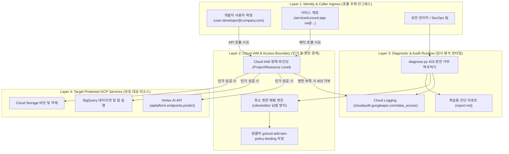

<!--
Copyright 2026 Google LLC. All Rights Reserved.
SPDX-License-Identifier: Apache-2.0

NOTICE: This code/repository is owned by Google LLC and provided under the Apache-2.0 License.
It is strictly provided as an EXAMPLE/REFERENCE ONLY and is NOT INTENDED FOR PRODUCTION USE.
All contents, designs, and code examples are subject to change, modification, or removal at any time without notice.

[고지 사항] 본 저장소 및 문서는 구글 (Google LLC) 소유이며 Apache 2.0 라이선스 하에 예시 (Sample) 용도로 제공된다.
프로덕션 환경용이 아니며, 사전 통지 없이 언제든지 수정, 변경 또는 삭제될 수 있다.
-->

> [!IMPORTANT]
> **구글 (Google LLC) 참조용 샘플 고지 사항**:
> 본 프로젝트의 모든 소스 코드와 문서는 Google LLC의 소유이며, Apache-2.0 라이선스에 따라 오직 **참조용 샘플 (Sample / Reference Only)** 목적으로만 제공된다. 프로덕션 환경에 그대로 사용할 수 없으며, 사전 통지 없이 언제든 내용이 수정, 변경 또는 삭제될 수 있다.

# GCP IAM 권한 거부(403) 감사 역추적 및 원클릭 복구 (iam-permission-resolver)

구글 클라우드 IAM(Cloud IAM) 환경에서 발생하는 403 권한 거부(Permission Denied) 실패 이벤트를 감사 로그에서 정밀 역추적하고, **서비스별 최소 권한(Least Privilege) IAM 역할 및 즉시 복구 가능한 gcloud 명령어를 1분 만에 자동 처방**하는 도구다. (As of 2026-10-17)

---

## 1. 발생 증상 및 진단 대상 체크리스트

사내 또는 고객사 환경에서 아래 증상이 발생한다면 즉시 진단 대상이다:
- [ ] **원인 미상의 403 권한 거부**: 파이프라인이나 서비스에서 `Permission Denied` 오류가 발생했으나 정확히 어떤 IAM 역할(Role)이 누락되었는지 확인하기 어려울 때
- [ ] **과도한 권한 부여(오버 그랜트) 방지**: 문제를 해결하겠다고 `roles/editor`나 `roles/owner`를 남발하지 않고 최소 권한 역할만 선별하여 안전하게 부여하고자 할 때
- [ ] **감사 로그 기반의 즉각 처방**: Cloud Logging의 `cloudaudit.googleapis.com/data_access` 감사 로그를 분석하여 계정 형태(사용자 vs 서비스 계정)에 맞춘 gcloud 명령어를 원클릭으로 확보하고자 할 때


### 1.1 도구의 본질 및 비즈니스 해결 과제 (What & Why)
- **대상 사용자 (Target)**: 클라우드 보안팀, IAM 관리자, 플랫폼 엔지니어 및 DevOps/SRE 담당자
- **해결하는 핵심 문제 (Core Pain Points)**:
  1. 배포 파이프라인이나 애플리케이션 실행 중 발생하는 403 Permission Denied 에러의 정확한 원인 권한을 즉시 파악하기 어려운 문제
  2. 누락된 권한을 해결하기 위해 개발자에게 무분별하게 `roles/editor`나 `roles/owner` 같은 과다 권한을 임시 부여하는 보안 사고
  3. 수많은 실패 로그 속에서 어떤 서비스 계정이 어떤 리소스에 접근하려다 실패했는지 역추적하는 데 소요되는 시간 낭비
- **본 솔루션의 해결 방식 (Solution)**:
  - Cloud Audit Logs에서 최근 403 권한 거부 실패 이벤트를 정밀 역추적하여 거부된 API 메서드와 권한명을 규명하고, 최소 권한 원칙(Least Privilege)에 입각한 구글 공식 IAM 역할 및 즉시 복구 gcloud 명령어를 도출한다.

### 1.2 최종 산출물 3종 세트 미리보기 (Deliverables & Visual Preview)
본 도구를 실행(`python diagnose.py`)하면 다음 3가지 구체적인 엔터프라이즈 자산이 생성된다:

| 산출물 구분 | 산출물 형태 및 명칭 | 주요 포함 내용 및 실무 활용 방안 |
| :--- | :--- | :--- |
| **① 터미널 콘솔 요약** | Visual CLI Table | 실패 시각, 호출 주체(Principal), 대상 리소스, 거부된 권한(Permission), 추천 최소 역할 및 해결 명령 요약 |
| **② 정규 진단 보고서** | 마크다운 파일 (`report.md`) | 403 권한 거부 전수 감사 보고서, 거부 사유 상세 분석, 최소 권한 추천 근거 및 즉시 실행 가능한 gcloud 명령어 세트 |
| **③ 후속 조치 및 배포 자산** | Actionable Asset Specs | • **최소 권한 부여 gcloud 명령어**: 필요한 역할만 선별하여 추가하는 원클릭 복구 스크립트<br/>• **과다 권한 회수 및 롤백 가이드**: 임시 부여되었던 관리자 권한을 안전하게 제거하는 절차서<br/>• **IAM 정책 감사 로그 모니터링 룰**: 권한 거부 급증 시 실시간 알림을 트리거하는 모니터링 설정 |

---

## 2. 빠른 시작 (Quickstart)

> [!TIP]
> Cloud Shell 접속 환경 구성 및 저장소 클론(`git clone`) 방법은 루트의 [메인 README](../../README.md)를 참고한다.

### 1) 모의 데이터 가상 실행 (Dry-Run)
GCP API 호출 없이 내장된 가상 인프라 데이터로 정상 동작 여부를 즉시 검증한다:
```bash
python diagnose.py --dry-run
```

**터미널 진단 출력 미리보기:**
```text
[진단 결과] GCP IAM 권한 거부(403) 감사 추적 및 해결 처방 리포트
  - 대상 프로젝트: sample-project-id
  - 조회 기간: 최근 7일
========================================================================
발견된 권한 거부 실패 내역: 3건
[실패 건 #1]
  - 실패 주체 계정: backend-developer@company.com
  - 요청 대상 서비스: aiplatform.googleapis.com
  - 실행 실패 액션: google.cloud.aiplatform.v1beta1.PredictionService.GenerateContent
  - 실제 오류 내용: Permission 'aiplatform.endpoints.predict' denied on resource
```


### 2) 사내 환경 대화형 설정 (Config Wizard, 선택 사항)
사내 활성 프로젝트 및 환경 설정을 대화형으로 탐색하여 `.env`에 자동 저장한다:
```bash
python diagnose.py --config
```


### 3) 실제 사내 인프라 실시간 진단
```bash
python diagnose.py
```
> [!NOTE]
> 앞서 `python diagnose.py --config`로 환경 설정을 저장했거나 gcloud 활성 설정을 그대로 활용할 경우 별도의 `.env` 생성 없이 즉시 실행할 수 있다. (환경 변수를 텍스트 에디터로 직접 수동 편집하고자 할 때만 `cp -n .env.example .env` 실행 후 수정)

---

## 3. 솔루션 아키텍처 및 처리 흐름


```mermaid
flowchart TD
    subgraph Layer1["Layer 1: Identity & Caller Ingress (호출 주체 인그레스)"]
        Developer["개발자 사용자 계정 (user:developer@company.com)"]
        ServiceAccount["서비스 계정 (serviceAccount:app-sa@...)"]
        SecOps["보안 관리자 / SecOps 팀"]
    end

    subgraph Layer2["Layer 2: Cloud IAM & Access Boundary (인가 및 권한 경계)"]
        IAMPolicy["Cloud IAM 정책 바인딩 (Project/Resource Level)"]
        LeastPrivilege["최소 권한 매핑 엔진 (roles/editor 남발 방지)"]
        MarkerRoles["원클릭 gcloud add-iam-policy-binding 처방"]
    end

    subgraph Layer3["Layer 3: Diagnostic & Audit Runtime (감사 분석 런타임)"]
        AuditLogs["Cloud Logging (cloudaudit.googleapis.com/data_access)"]
        ResolverCLI["diagnose.py 403 권한 거부 역추적기"]
        ReportOutput["복습용 진단 리포트 (report.md)"]
    end

    subgraph Layer4["Layer 4: Target Protected GCP Services (보호 대상 리소스)"]
        VertexAI["Vertex AI API (aiplatform.endpoints.predict)"]
        BigQuery["BigQuery 데이터셋 및 잡 실행"]
        CloudStorage["Cloud Storage 버킷 및 객체"]
    end

    Developer -->|API 호출 시도| IAMPolicy
    ServiceAccount -->|배치 호출 시도| IAMPolicy
    IAMPolicy -->|권한 부족 시 403 거부| AuditLogs
    IAMPolicy -->|인가 성공 시| VertexAI
    IAMPolicy -->|인가 성공 시| BigQuery
    IAMPolicy -->|인가 성공 시| CloudStorage
    SecOps --> ResolverCLI
    ResolverCLI --> AuditLogs
    ResolverCLI --> LeastPrivilege
    LeastPrivilege --> MarkerRoles
    ResolverCLI --> ReportOutput
```

---
## 4. 조치 가이드 및 권장 설정

- **Cloud IAM 관리 콘솔**: ( https://console.cloud.google.com/iam-admin/iam )
- **Cloud Logging 감사 로그 탐색기**: ( https://console.cloud.google.com/logs/query )

---
### GCP 리소스 생성 시 4대 필수 표준 라벨링 준수
- 사내 거버넌스 및 자원 식별, 비용 추적을 위해 관련 클라우드 리소스 생성 시 4대 표준 라벨을 필수로 주입한다:
  - `managed-by`: `google-cloud-0-to-1`
  - `scenario`: `iam-permission-resolver`
  - `env`: `sample`
  - `created-by`: `customer-engineer`
- gcloud CLI 예시: `--labels=managed-by=google-cloud-0-to-1,scenario=iam-permission-resolver,env=sample,created-by=customer-engineer`

---

## 5. 사전 준비 사항 (필요 IAM 권한)

본 도구를 실행하려면 최소 아래의 IAM 권한이 필요하다:

감사 로그를 조회하고 IAM 역할을 바인딩하기 위해 필요한 역할 목록이다:

| 역할 (Role) | 권한 ID | 용도 |
| :--- | :--- | :--- |
| **클라우드 로깅 뷰어(roles/logging.viewer)** | `roles/logging.viewer` | Cloud Logging 데이터 액세스 감사 로그 읽기 |
| **프로젝트 IAM 관리자(roles/resourcemanager.projectIamAdmin)** | `roles/resourcemanager.projectIamAdmin` | 추천된 IAM 역할을 계정에 최종 부여 |

> [!NOTE]
> `--dry-run` 모드로 실행할 경우 별도의 권한 없이도 가상 권한 거부 시나리오와 처방 명령어 형식을 즉시 확인할 수 있다.

---

## 6. 기술적 배경 및 아키텍처 원리 (Deep Dive)

### 관련 상세 설계 및 요구 사항 명세
- [비즈니스 요구 사항 명세서 (BRD)](docs/BRD.md): 비즈니스 배경, 성공 지표 및 요구 사항(BR-01~) 명세
- [기술 상세 설계서 (TDD)](docs/TDD.md): 시스템 아키텍처, 기능(FR-01~) 및 비기능(NFR-01~) 설계 명세

스크립트가 완료되면 아래와 같이 **실패 내역과 즉시 복구할 수 있는 복사 가능한 gcloud 명령어**가 출력된다:

```text
========================================================================
[진단 결과] GCP IAM 권한 거부(403) 감사 추적 및 해결 처방 리포트
  - 대상 프로젝트: my-prod-project
  - 조회 기간: 최근 7일
========================================================================

발견된 권한 거부 실패 내역: 3건

[실패 건 #1]
  - 실패 주체 계정: backend-developer@company.com
  - 요청 대상 서비스: aiplatform.googleapis.com
  - 실행 실패 액션: google.cloud.aiplatform.v1beta1.PredictionService.GenerateContent
  - 실제 오류 내용: Permission 'aiplatform.endpoints.predict' denied on resource
  [정밀 처방 역할 추천]
    - 권장 역할: roles/aiplatform.user
    - 역할 상세: Gemini API 호출 및 버텍스 AI(Vertex AI) 파운데이션 모델 추론 권한
  [즉시 조치 가능한 원클릭 gcloud 해결 명령어]
    gcloud projects add-iam-policy-binding "my-prod-project" \
      --member="user:backend-developer@company.com" \
      --role="roles/aiplatform.user"
------------------------------------------------------------------------
```

---
## 7. 리소스 정리 (Teardown) 안내

본 도구는 순수 감사 로그 조회 도구이며 클라우드 상에 영구 자원을 생성하지 않으므로 별도의 자원 정리 작업이 필요하지 않다.
