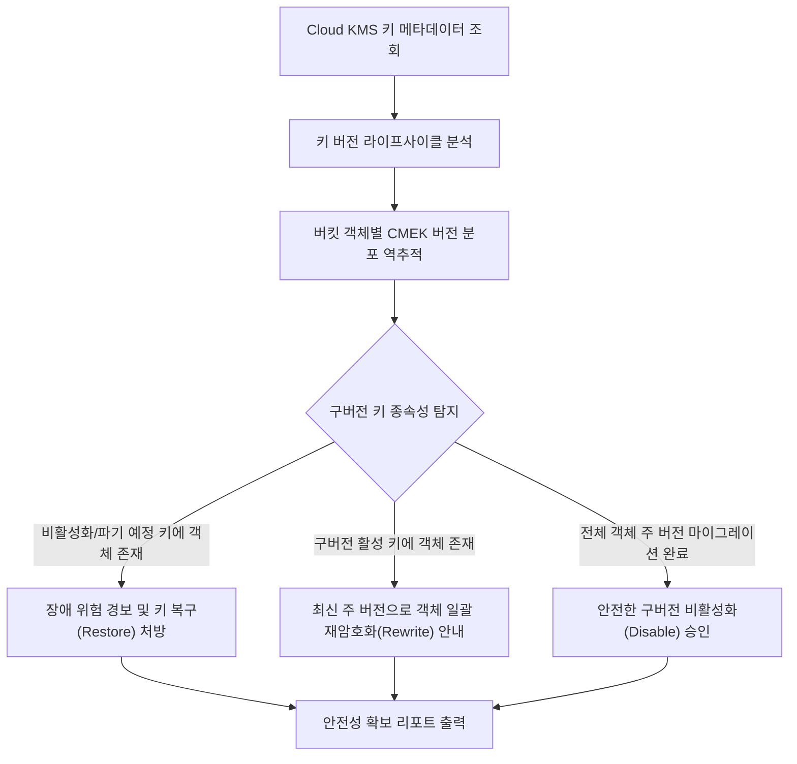

# Cloud KMS CMEK 키 순환 및 구버전 비활성화 장애 예방기

Cloud KMS 암호화 키(CMEK) 자동 순환 후 구버전(CryptoKeyVersion) 키를 비활성화하거나 삭제할 때 Cloud Storage 객체 및 영구 데이터의 복호화 실패로 인한 대형 서비스 장애(Outage)를 사전 탐지하고 안전한 데이터 재암호화(Rewrite) 워크플로우를 처방하는 도구다.

**Audience**: `#Architect`, `#SecOps`  
**Concern**: `#Resilience`, `#Security`  
**Date**: `2026-09-09`  
**Service**: `#CloudKMS`, `#CloudStorage`

---

## 1. 이 가이드가 필요한 상황

- Cloud KMS CMEK 키를 90일 주기로 자동 순환(Rotation)하도록 설정한 후 구버전 키를 안전하게 정리하고자 하는 경우
- 보안 규정 준수를 위해 이전 버전의 키를 비활성화(Disable)하거나 파기 예정(Destroy Scheduled)으로 전환하려 할 때, 해당 키로 암호화된 기존 데이터가 남아 있는지 검증해야 하는 경우
- 구버전 키가 비활성화되어 `Cloud Storage` 객체 다운로드 또는 `BigQuery` 테이블 조회 시 즉시 400/403 KMS 복호화 거부 장애가 발생하는 사태를 미연에 방지하려는 경우
- 최신 주 버전(Primary Version) 키로 기존 스토리지 객체들을 온라인 상태에서 무중단 일괄 재암호화(`rewrite`)하는 표준 절차가 필요한 경우

---

## 2. 진단 및 해결 흐름



---

## 3. 사전 준비 사항

본 도구를 실행하려면 최소 아래의 IAM 권한이 필요하다:

| 서비스 | 필요 역할(Role) | 최소 IAM 권한 |
| :--- | :--- | :--- |
| `Cloud KMS` | `roles/cloudkms.viewer` | `cloudkms.cryptoKeys.get`, `cloudkms.cryptoKeyVersions.list` |
| `Cloud Storage` | `roles/storage.objectViewer` | `storage.buckets.get`, `storage.objects.get`, `storage.objects.list` |

---

## 4. 1분 퀵스타트

### 가상 실행 (Dry-run)

실제 GCP API 호출이나 권한 없이도 모의 암호화 키 순환 시나리오를 즉시 시뮬레이션할 수 있다:

```bash
./run.sh --dry-run
```

### 실제 환경 실행

```bash
# 기본 환경 변수 기반 실행
./run.sh

# 특정 프로젝트 및 특정 키 링/키 이름 지정 실행
./run.sh --project=my-prod-project --location=asia-northeast3 --keyring=prod-keyring --key-name=customer-data-key

# 특정 Cloud Storage 버킷 지정 객체 전수 점검
./run.sh --project=my-prod-project --location=asia-northeast3 --keyring=prod-keyring --key-name=customer-data-key --bucket=my-customer-archive
```

---

## 5. 결과 출력 예시

```text
================================================================================
Cloud KMS CMEK 키 순환 및 구버전 비활성화 장애 예방 리포트
진단 모드: 가상 실행 (Dry-run)
대상 프로젝트: demo-kms-project
암호화 키 경로: projects/demo-kms-project/locations/asia-northeast3/keyRings/prod-keyring/cryptoKeys/customer-data-key
현재 주 버전(Primary): 버전 3
자동 순환 주기: 90일 (7,776,000초)
================================================================================

[1단계] Cloud KMS CryptoKey 버전별 라이프사이클 상태 점검
--------------------------------------------------------------------------------
버전       기본 키       상태                   생성 일자                  위험 등급     
--------------------------------------------------------------------------------
v3       YES (Primary) ENABLED              2026-06-01T09:00:00Z   OK        
v2       NO         ENABLED              2026-03-01T09:00:00Z   WARNING   
v1       NO         DESTROY_SCHEDULED    2025-12-01T09:00:00Z   CRITICAL  
--------------------------------------------------------------------------------

[2단계] Cloud Storage 버킷 내 구버전 키 종속성 및 객체 분포 분석
--------------------------------------------------------------------------------
대상 버킷: gs://demo-kms-customer-archive
점검 객체 총합: 1,250개

암호화 버전           객체 수         비율         위험도       
--------------------------------------------------------------------------------
버전 3            620          49.6%      NONE      
버전 2            480          38.4%      MEDIUM    
버전 1            150          12.0%      CRITICAL  
--------------------------------------------------------------------------------

[3단계] 서비스 장애 방지 긴급 처방 및 데이터 재암호화 가이드
1. [긴급] 파기 예정 또는 비활성화된 구버전 키 즉각 복구 (장애 방어):
   gcloud kms keys versions restore 1 \
     --key=customer-data-key \
     --keyring=prod-keyring \
     --location=asia-northeast3

2. [필수] 구버전 키로 암호화된 객체를 최신 주 버전(Primary)으로 일괄 재암호화(Rewrite):
   # 최신 주 키(v3)로 객체 메타데이터 및 암호화 블록 갱신:
   gcloud storage objects rewrite gs://demo-kms-customer-archive/**

3. [검증] 모든 객체가 최신 주 버전 키로 마이그레이션 완료된 후에만 구버전 비활성화(Disable):
   gcloud kms keys versions disable 1 \
     --key=customer-data-key \
     --keyring=prod-keyring \
     --location=asia-northeast3
================================================================================
```

---

## 6. 결과 확인 후 즉각 조치 가이드

1. **파기 예정 키 복구(Restore)**:
   - Cloud KMS ( https://console.cloud.google.com/security/kms ) > 키 링 선택 > 키 선택 > 파기 예정 버전 복구
   - Cloud KMS 키 순환 및 버전 관리 ( https://cloud.google.com/kms/docs/key-rotation )
2. **Cloud Storage 객체 재암호화(Rewrite)**:
   - 이전 버전 키로 암호화된 객체는 Cloud Storage의 온라인 `rewrite` 명령어를 통해 서비스 중단 없이 최신 주 버전(Primary) 키로 다시 암호화할 수 있다.
   - Cloud Storage 고객 관리 암호화 키(CMEK) 관리 ( https://cloud.google.com/storage/docs/encryption/customer-managed-keys )
3. **구버전 키 비활성화 및 안전 폐기**:
   - 버킷 내 모든 객체의 암호화 버전이 최신 주 버전으로 일원화된 것을 확인한 후 구버전을 `DISABLED` 처리하여 보안 정책을 완결한다.

---

## 7. 자원 정리 (Teardown) 가이드

본 진단 도구는 읽기 전용으로 Cloud KMS 키 메타데이터와 버킷 객체 정보를 조회하므로 별도의 클라우드 인프라 자원을 생성하지 않는다. 실습용으로 생성한 테스트 KMS 키나 버킷이 있다면 불필요한 비용을 방지하기 위해 버킷을 비우고 삭제한다:

```bash
# 테스트 버킷 객체 삭제 및 버킷 제거
gcloud storage rm -r gs://BUCKET_NAME --quiet
```
