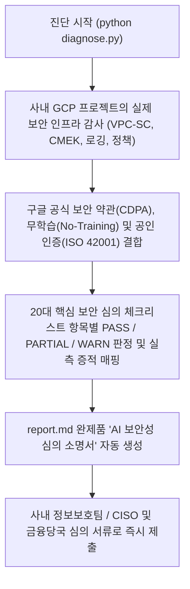

<!--
Copyright 2026 Google LLC. All Rights Reserved.
SPDX-License-Identifier: Apache-2.0

NOTICE: This code/repository is owned by Google LLC and provided under the Apache-2.0 License.
It is strictly provided as an EXAMPLE/REFERENCE ONLY and is NOT INTENDED FOR PRODUCTION USE.
All contents, designs, and code examples are subject to change, modification, or removal at any time without notice.

[고지 사항] 본 저장소 및 문서는 구글 (Google LLC) 소유이며 Apache 2.0 라이선스 하에 예시 (Sample) 용도로 제공된다.
프로덕션 환경용이 아니며, 사전 통지 없이 언제든지 수정, 변경 또는 삭제될 수 있다.
-->

> [!IMPORTANT]
> **구글 (Google LLC) 참조용 샘플 고지 사항**:
> 본 프로젝트의 모든 소스 코드와 문서는 Google LLC의 소유이며, Apache-2.0 라이선스에 따라 오직 **참조용 샘플 (Sample / Reference Only)** 목적으로만 제공된다. 프로덕션 환경에 그대로 사용할 수 없으며, 사전 통지 없이 언제든 내용이 수정, 변경 또는 삭제될 수 있다.

# Gemini & Gemini Enterprise 도입을 위한 한국형 AI 보안성 심의 체크리스트 진단기

사내 정보보호팀, CISO 및 금융감독원/금융보안원의 생성형 AI 도입 보안성 심의에 대비하여, 구글의 고객 데이터 비학습(No-Training) 정책, 인적 검토 배제(No Human Review), ISO/IEC 42001 국제 인증 및 사내 GCP 프로젝트의 실제 기술적 통제(VPC-SC, CMEK, Audit Logs) 상태를 실시간 대조하여 20대 핵심 보안 체크리스트 완제품 소명서(`report.md`)를 1분 만에 자동 생성하는 컴플라이언스 진단 도구다. (As of 2026-09-30)

**Audience**: `#Architect`, `#Compliance`, `#SecOps`  
**Concern**: `#Compliance`, `#IAM`, `#Resilience`, `#Security`  
**Service**: `#CloudIAM`, `#CloudKMS`, `#GeminiEnterprise`, `#ModelArmor`, `#SensitiveDataProtection`, `#VertexAI`, `#VPCServiceControls`  

---

## 1. 이 가이드가 필요한 상황 (증상 체크리스트)

- [ ] 사내 업무 혁신을 위해 Gemini API(Vertex AI) 또는 Gemini Enterprise App을 도입하려 하나, 사내 정보보호팀 및 CISO의 보안성 심의 승인 장벽에 부딪혔을 때
- [ ] 보안팀으로부터 수십 개 문항의 엑셀/워드 체크리스트(데이터 재학습 여부, 전송 암호화, 인적 검토, 접근 통제 등)를 수신했으나, 구글 공식 약관과 기술적 증적 작성이 막막할 때
- [ ] 금융감독원/금융보안원 보안성 심의 또는 K-ISMS 심사를 앞두고, 클라우드 프로젝트의 실제 보안 설정(CMEK, Audit Logs, Bucket Lock)을 객관적으로 입증해야 할 때
- [ ] 파트너사나 고객사 엔지니어 입장에서 도입 검토 초기 단계에 사내 승인용 보안 보고서를 신속하게 확보하고자 할 때

---

## 2. 진단 및 해결 흐름



---

## 3. 사전 준비 사항 및 필요 권한

### (1) 필수 API 활성화 (실측 감사 시)
```bash
gcloud services enable compute.googleapis.com logging.googleapis.com cloudresourcemanager.googleapis.com
```

### (2) 진단 실행 계정 최소 IAM 권한

| 역할 (Role) | 설명 |
| :--- | :--- |
| `roles/resourcemanager.organizationViewer` | 사내 조직 정책(`resourceLocations`, `allowedPolicyMemberDomains` 등) 조회 권한 |
| `roles/logging.viewer` | Cloud Audit Logs 데이터 접근 감사 로깅 활성화 상태 조회 권한 |
| `roles/cloudkms.viewer` | Cloud KMS 키링 및 CMEK 적용 상태 확인 권한 |

---

## 4. 1분 퀵스타트

### 가상 모의 실행 (Dry-run) - 예습
실제 GCP 호출 없이 사전 정의된 시뮬레이션 데이터와 공식 보안 소명서를 바탕으로 완제품 체크리스트 리포트를 1초 만에 즉시 생성한다:
```bash
python diagnose.py --dry-run
```

### 사내 실측 진단 실행 - 실습 및 복습
현재 활성화된 프로젝트의 실데이터를 기반으로 기술적 보안 통제를 실시간 감사하고 맞춤형 소명서를 생성한다:
```bash
# 기본 활성 프로젝트 점검 (서울 리전 기준)
python diagnose.py

# 특정 프로젝트 및 특정 리전 지정
python diagnose.py -p my-gemini-project -r asia-northeast3

# JSON 포맷 출력 (사내 GRC 시스템 연동용)
python diagnose.py --dry-run --json
```

---

## 5. 결과 확인 후 즉각 조치 가이드

### 1단계: 완제품 소명서 확인 및 사내 제출
실행 즉시 생성된 [report.md](report.md)를 열어 20대 핵심 보안 체크리스트 조견표와 증적 내용을 확인하고, 사내 정보보호팀 또는 규제 심의 신청 서류의 첨부 증적으로 제출한다:
- 구글 클라우드 생성형 AI 데이터 거버넌스 및 개인정보 보호 ( https://cloud.google.com/terms/data-processing-addendum )
- Google Cloud 글로벌 컴플라이언스 및 ISO 42001 인증 현황 ( https://cloud.google.com/security/compliance/iso-42001 )

### 2단계: 기술적 미흡(WARN/FAIL) 항목 보완
- **CMEK 미적용 시**: `samples/korea-regulatory-perimeter-guard`의 처방을 참조하여 Cloud KMS 키링을 생성하고 버킷/데이터셋에 바인딩한다.
- **감사 로깅 미흡 시**: `samples/gemini-request-response-logging`을 참조하여 `DATA_READ/WRITE` 로그 및 BigQuery 스트리밍 싱크를 활성화한다.
- **조직 정책 미적용 시**: `gcp.resourceLocations` 및 `iam.disableServiceAccountKeyCreation` 정책을 활성화하여 중앙 통제를 강화한다.

---

## 6. 자원 정리 가이드 (Teardown)
본 도구는 순수 읽기 전용 진단 도구이므로 별도의 클라우드 인프라 자원을 생성하지 않으며, 추가 삭제 절차가 필요하지 않다.
