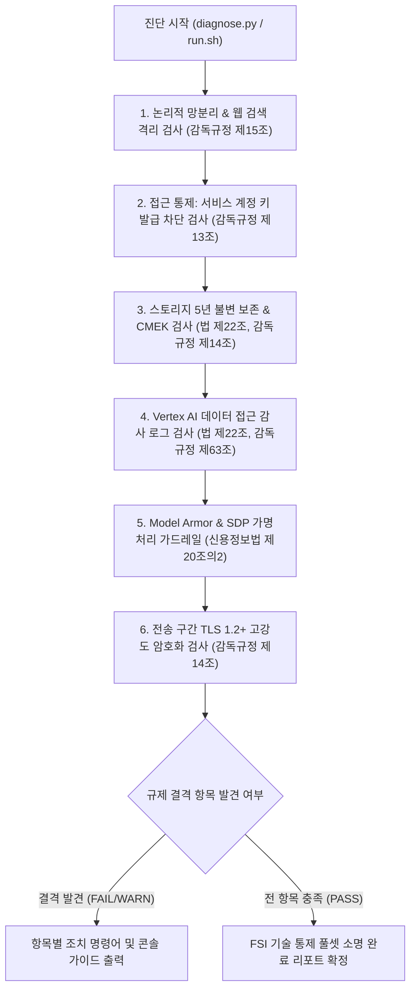

<!--
Copyright 2026 Google LLC. All Rights Reserved.
SPDX-License-Identifier: Apache-2.0

NOTICE: This code/repository is owned by Google LLC and provided under the Apache-2.0 License.
It is strictly provided as an EXAMPLE/REFERENCE ONLY and is NOT INTENDED FOR PRODUCTION USE.
All contents, designs, and code examples are subject to change, modification, or removal at any time without notice.

[고지 사항] 본 저장소 및 문서는 구글 (Google LLC) 소유이며 Apache 2.0 라이선스 하에 예시 (Sample) 용도로 제공된다.
프로덕션 환경용이 아니며, 사전 통지 없이 언제든지 수정, 변경 또는 삭제될 수 있다.
-->

> [!IMPORTANT]
> **구글 (Google LLC) 참조용 샘플 고지 사항**:
> 본 프로젝트의 모든 소스 코드와 문서는 Google LLC의 소유이며, Apache-2.0 라이선스에 따라 오직 **참조용 샘플 (Sample / Reference Only)** 목적으로만 제공된다. 프로덕션 환경에 그대로 사용할 수 없으며, 사전 통지 없이 언제든 내용이 수정, 변경 또는 삭제될 수 있다.

# 혁신 금융 서비스 규제 준수 보안 경계 진단 가이드

대한민국 금융위원회의 「금융분야 망분리 개선 로드맵」(1단계 생성형 AI 활용 특례) 및 전자금융감독규정에 따라, 퍼블릭 클라우드 인프라가 책임져야 하는 **9대 핵심 기술적 통제(Technical Controls) 전수(Full-Set)**를 1클릭으로 종합 점검하고 금융감독원 및 금융보안원(FSI) 보안성 심의 결격 사유를 사전에 예방하는 진단 도구다. (As of 2026-09-10)

**Audience**: `#Architect`, `#Compliance`, `#SecOps`
**Concern**: `#Compliance`, `#IAM`, `#Resilience`, `#Security`
**Service**: `#CloudKMS`, `#CloudStorage`, `#ModelArmor`, `#ResourceManager`, `#SensitiveDataProtection`, `#VertexAI`, `#VPCServiceControls`

---

## 1. 진단 대상 9대 보안 통제 항목

본 도구는 금융위원회 1단계 생성형 인공 지능 망분리 특례 및 전자금융감독규정에 따른 9대 기술적 통제를 전수 점검한다. 상세한 규제 조항 및 아키텍처 구현 명세는 [비즈니스 요구사항 명세서 (BRD.md)](docs/BRD.md) 및 [기술 상세 설계서 (TDD.md)](docs/TDD.md)에 상세히 기술되어 있다.

| 요구사항 ID | 통제 영역 | 점검 핵심 내용 |
| :--- | :--- | :--- |
| **FR-01** | 논리적 망분리 | VPC-SC 보안 경계 내 Vertex AI 보호 여부 (감독규정 제15조) |
| **FR-02** | 논리적 망분리 | VPC-SC 내부 실시간 웹 검색 격리 여부 및 DMZ 분리 |
| **FR-03** | 데이터 보호 | Cloud Storage 불변 보존(Bucket Lock) 5년 충족 여부 (법 제22조) |
| **FR-04** | 데이터 보호 | 고객 관리 암호화 키(CMEK) 전면 적용 여부 (감독규정 제14조) |
| **FR-05** | 감사 추적 | 데이터 접근 감사 로그(DATA_READ, DATA_WRITE) 활성화 여부 (법 제22조) |
| **FR-06** | AI 거버넌스 | Model Armor 실시간 프롬프트 인젝션 및 탈옥 방어 가드레일 |
| **FR-07** | AI 거버넌스 | Sensitive Data Protection(SDP) 개인신용정보 가명처리 템플릿 (신용정보법 제20조의2) |
| **FR-08** | 접근 통제 | 서비스 계정 키(SA Key) 발급 차단 및 WIF 강제 (감독규정 제13조) |
| **FR-09** | 전송 보안 | 전송 구간 고강도 암호화(TLS 1.2+ 강제) 통제 (감독규정 제14조) |

---

## 2. 진단 및 해결 흐름



---

## 3. 사전 준비 사항

본 도구 구동을 위해 필요한 최소 IAM 권한은 다음과 같다.

| 권한 역할 | 역할 명칭 | 필요 사유 |
| :--- | :--- | :--- |
| `roles/accesscontextmanager.reader` | Access Context Manager 독자 | VPC-SC 서비스 보안 경계 설정 조회 (감독규정 제15조) |
| `roles/compute.viewer` | Compute 뷰어 | SSL 정책 TLS 최소 버전 조회 (감독규정 제14조) |
| `roles/dlp.inspectTemplatesReader` | DLP 검사 템플릿 독자 | Sensitive Data Protection 가명처리 템플릿 조회 (신용정보법 제20조의2) |
| `roles/logging.viewer` | 로그 뷰어 | 프로젝트 IAM 감사 로그(auditConfigs) 설정 조회 (법 제22조) |
| `roles/orgpolicy.policyViewer` | 조직 정책 뷰어 | 서비스 계정 키 생성 차단 조직 정책 조회 (감독규정 제13조) |
| `roles/storage.admin` | 스토리지 관리자 | Cloud Storage 버킷 보존 정책 및 잠금 상태 조회 (5년 보존 규정) |

---

## 4. 1분 퀵스타트

### 옵션 A: Google Cloud Shell에서 바로 실행

```bash
# 저장소 클론 및 폴더 이동
git clone https://github.com/jiangjun-forge/google-cloud-0-to-1.git
cd google-cloud-0-to-1/samples/korea-fsi-regulatory-perimeter-guard

# 모의 가상 데이터 기반 스모크 테스트 (--dry-run)
./run.sh --dry-run

# 실제 사내 프로젝트 대상 보안 경계 전수 진단
./run.sh --project=example-fsi-corp --location=asia-northeast3
```

### 옵션 B: 로컬 파이썬 가상 환경에서 실행

```bash
# 가상 환경 생성 및 의존성 설치
python3 -m venv .venv
source .venv/bin/activate
pip install -r requirements.txt

# 진단 실행
python3 diagnose.py --dry-run
```

---

## 5. 결과 출력 예시

```text
========================================================================================
 혁신 금융 서비스(FSI) 규제 준수 보안 경계 진단 리포트
 대상 프로젝트: example-fsi-corp | 점검 리전: asia-northeast3 | 실행 모드: 가상 진단 (Dry-Run)
========================================================================================

진단 요약: 총 9개 규제 항목 중 충족 4건, 주의 2건, 미달 3건
----------------------------------------------------------------------------------------
ID      | 분류             | 상태     | 진단 항목 및 조치 요약
----------------------------------------------------------------------------------------
FR-01   | 논리적 망분리        | [PASS] | VPC-SC 보안 경계 내 Vertex AI 보호 확인
FR-02   | 논리적 망분리        | [WARN] | 실시간 웹 검색 DMZ 분리 및 비동기 적재 구조 권고
FR-03   | 데이터 보호         | [FAIL] | Cloud Storage 5년 불변 보존(Bucket Lock) 미설정 (법 제22조)
FR-04   | 데이터 보호         | [PASS] | 고객 관리 암호화 키(CMEK) 전면 바인딩 확인 (감독규정 제14조)
FR-05   | 감사 추적          | [FAIL] | Vertex AI 데이터 접근 감사 로그(DATA_READ/WRITE) 미설정
FR-06   | AI 모델 거버넌스     | [PASS] | Model Armor 프롬프트 인젝션 방어 필터 적용 확인
FR-07   | AI 모델 거버넌스     | [WARN] | SDP 주민등록번호/계좌번호 특화 가명처리 템플릿 등록 권고
FR-08   | 접근 통제          | [FAIL] | 서비스 계정 키 생성 차단 조직 정책 미적용 (감독규정 제13조)
FR-09   | 전송 보안          | [PASS] | 전송 구간 TLS 1.2+ 고강도 암호화 적용 확인 (감독규정 제14조)
----------------------------------------------------------------------------------------
종합 평가: 금융보안원 보안성 심의 전 미달(FAIL) 3건의 우선 조치가 요구된다.
========================================================================================
```

---

## 6. 결과 확인 후 즉각 조치 가이드

1. **서비스 계정 키 생성 전면 차단 (전자금융감독규정 제13조)**:
   - 정적 서비스 계정 JSON 키 발급을 방지하고 WIF 연동을 강제한다.
   ```bash
   gcloud resource-manager org-policies enable-enforce constraints/iam.disableServiceAccountKeyCreation --project=$PROJECT_ID
   ```

2. **전송 구간 암호화 정책 수립 (전자금융감독규정 제14조)**:
   - 취약한 프로토콜(TLS 1.0, 1.1)을 차단하고 TLS 1.2 이상만 허용하는 커스텀 SSL 정책을 생성한다.
   ```bash
   gcloud compute ssl-policies create fsi-tls-policy --profile=RESTRICTED --min-tls-version=1.2 --project=$PROJECT_ID
   ```

3. **Cloud Storage 5년 보존 정책 및 Bucket Lock 적용 (전자금융거래법 제22조 및 전자금융감독규정 제63조)**:
   - 금융 감사 로그 및 AI 입출력 버킷에 5년(157,680,000초) 불변 보존을 강제한다.
   ```bash
   gcloud storage buckets update gs://<AUDIT_BUCKET_NAME> --retention-period=157680000s
   gcloud storage buckets lock gs://<AUDIT_BUCKET_NAME>
   ```

4. **Vertex AI 데이터 접근 감사 로그 강제 (전자금융감독규정 제14조 및 제63조)**:
   - 프로젝트 IAM 정책에 `aiplatform.googleapis.com` 및 `storage.googleapis.com` 데이터 접근 로그(`DATA_READ`, `DATA_WRITE`)를 추가한다.

5. **Model Armor 및 Sensitive Data Protection(SDP) 가드레일 연동 (신용정보법 제20조의2)**:
   - 악성 프롬프트 인젝션 방어 필터를 활성화하고 주민등록번호(`KOREA_RESIDENT_REGISTRATION_NUMBER`) 가명처리 템플릿을 등록한다.

---

## 7. 자원 정리 가이드

본 도구는 순수 진단 및 상태 점검을 수행하므로 자체적으로 영구 리소스를 생성하거나 과금을 유발하지 않는다.
진단 과정에서 테스트용으로 생성한 모의 버킷이나 키가 있는 경우 아래 명령어로 정리한다.

```bash
# 테스트용 버킷 삭제 (잠금되지 않은 버킷에 한함)
gcloud storage rm -r gs://<TEST_BUCKET_NAME>
```

---

## 8. 관련 규격 문서

- [비즈니스 요구사항 명세서 (BRD.md)](docs/BRD.md)
- [기술 상세 설계서 (TDD.md)](docs/TDD.md)
