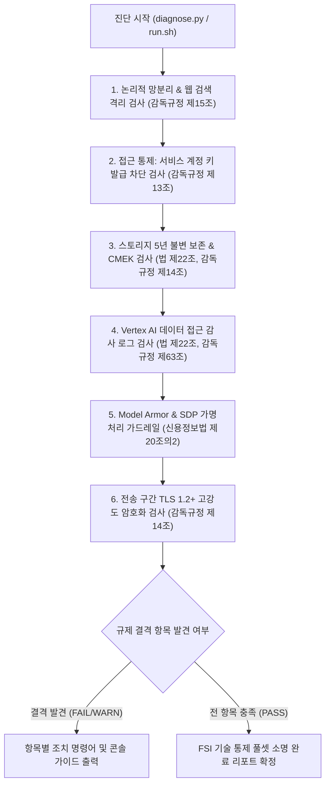

<!--
Copyright 2026 Google LLC. All Rights Reserved.
SPDX-License-Identifier: Apache-2.0

NOTICE: This code/repository is owned by Google LLC and provided under the Apache-2.0 License.
It is strictly provided as an EXAMPLE/REFERENCE ONLY and is NOT INTENDED FOR PRODUCTION USE.
All contents, designs, and code examples are subject to change, modification, or removal at any time without notice.

[고지 사항] 본 저장소 및 문서는 구글 (Google LLC) 소유이며 Apache 2.0 라이선스 하에 예시 (Sample) 용도로 제공된다.
프로덕션 환경용이 아니며, 사전 통지 없이 언제든지 수정, 변경 또는 삭제될 수 있다.
-->

> [!IMPORTANT]
> **구글 (Google LLC) 참조용 샘플 고지 사항**:
> 본 프로젝트의 모든 소스 코드와 문서는 Google LLC의 소유이며, Apache-2.0 라이선스에 따라 오직 **참조용 샘플 (Sample / Reference Only)** 목적으로만 제공된다. 프로덕션 환경에 그대로 사용할 수 없으며, 사전 통지 없이 언제든 내용이 수정, 변경 또는 삭제될 수 있다.

# 혁신 금융 서비스 규제 준수 보안 경계 진단 가이드

대한민국 금융위원회의 「금융분야 망분리 개선 로드맵」(1단계 생성형 AI 활용 특례) 및 전자금융감독규정에 따라, 퍼블릭 클라우드 인프라가 책임져야 하는 **9대 핵심 기술적 통제(Technical Controls) 전수(Full-Set)**를 1클릭으로 종합 점검하고 금융감독원 및 금융보안원(FSI) 보안성 심의 결격 사유를 사전에 예방하는 진단 도구다. (As of 2026-09-10)

**Audience**: `#Architect`, `#Compliance`, `#SecOps`
**Concern**: `#Compliance`, `#IAM`, `#Resilience`, `#Security`
**Service**: `#CloudKMS`, `#CloudStorage`, `#ModelArmor`, `#ResourceManager`, `#SensitiveDataProtection`, `#VertexAI`, `#VPCServiceControls`

---

## 1. 규제 수용 범위 및 법적 근거 사실 관계

금융보안원 및 금융위원회의 보안 규제 프레임워크는 관리적 통제와 기술적 통제로 구분된다. 본 진단 도구는 **클라우드 인프라 아키텍처 관점에서 자동 검증 가능한 기술적 통제 9대 기둥 전수(Full-Set)**를 다룬다:

| 통제 영역 | 법적/규정 근거 조항 | 본 도구 점검 항목 (9대 기술 통제 풀셋) | 자동 검증 방식 |
| :--- | :--- | :--- | :--- |
| **논리적 망분리** | 전자금융감독규정 제15조 제1항 제3호 및 제5호 | `FR-01`: VPC-SC 보안 경계 내 Vertex AI 보호 여부 | `access-context-manager` 경계 서비스 검증 |
| **외부망 차단** | 감독규정 제15조 및 1단계 특례 부가조건 | `FR-02`: 실시간 웹 검색(Web Search Grounding) 격리 여부 | Egress 정책 위반 및 DMZ 분리 구조 점검 |
| **전자기록 보존** | 전자금융거래법 제22조, 감독규정 제63조 | `FR-03`: Cloud Storage 5년 불변 보존 (Bucket Lock) | 보존 기간(157,680,000초) 및 잠금 상태 확인 |
| **데이터 암호화** | 전자금융감독규정 제14조 (전산자료 보호대책) | `FR-04`: 고객 관리 암호화 키(CMEK) 전면 적용 여부 | Cloud KMS 사내 키 바인딩 및 키링 검증 |
| **감사 추적** | 전자금융거래법 제22조, 감독규정 제14조 | `FR-05`: 데이터 접근 감사 로그(DATA_READ/WRITE) 활성화 | IAM `auditConfigs` 전산자료 조회 로그 검증 |
| **AI 모델 안전성** | 금융위원회 1단계 샌드박스 특례 부가조건 | `FR-06`: Model Armor 실시간 프롬프트 인젝션/탈옥 방어 | Model Armor 템플릿 및 악성 필터 검증 |
| **개인신용정보 보호** | 신용정보의 이용 및 보호에 관한 법률 제20조의2 | `FR-07`: SDP 개인신용정보 가명처리 템플릿 | Sensitive Data Protection 주민등록번호/계좌번호 규칙 확인 |
| **단말/시스템 통제** | 전자금융감독규정 제13조 (접근 통제) | `FR-08`: 서비스 계정 키(SA Key) 발급 차단 및 WIF 강제 | 조직 정책 `disableServiceAccountKeyCreation` 검증 |
| **전송 구간 암호화** | 전자금융감독규정 제14조 제2항 제2호 | `FR-09`: 전송 구간 고강도 암호화(TLS 1.2+ 강제) 통제 | Cloud Load Balancing 커스텀 SSL Policy 검증 |

> [!NOTE]
> **관리적·물리적 통제와의 역할 분담**:
> 본 도구는 기술적 인프라 통제(Technical Controls)를 완벽하게 검증한다. 단, 사내 정보보호 지침 제정, CISO 및 준법감시인 내부 결재, 임직원 보안 서약서 징구, 재해 복구 비상대응 계획 수립 등 관리적 통제(Administrative Controls)는 금융사 내부 서류 및 절차로 구비되어야 한다.

---

## 2. 진단 및 해결 흐름



---

## 3. 사전 준비 사항

본 도구 구동을 위해 필요한 최소 IAM 권한은 다음과 같다.

| 권한 역할 | 역할 명칭 | 필요 사유 |
| :--- | :--- | :--- |
| `roles/accesscontextmanager.reader` | Access Context Manager 독자 | VPC-SC 서비스 보안 경계 설정 조회 (감독규정 제15조) |
| `roles/compute.viewer` | Compute 뷰어 | SSL 정책 TLS 최소 버전 조회 (감독규정 제14조) |
| `roles/dlp.inspectTemplatesReader` | DLP 검사 템플릿 독자 | Sensitive Data Protection 가명처리 템플릿 조회 (신용정보법 제20조의2) |
| `roles/logging.viewer` | 로그 뷰어 | 프로젝트 IAM 감사 로그(auditConfigs) 설정 조회 (법 제22조) |
| `roles/orgpolicy.policyViewer` | 조직 정책 뷰어 | 서비스 계정 키 생성 차단 조직 정책 조회 (감독규정 제13조) |
| `roles/storage.admin` | 스토리지 관리자 | Cloud Storage 버킷 보존 정책 및 잠금 상태 조회 (5년 보존 규정) |

---

## 4. 1분 퀵스타트

### 옵션 A: Google Cloud Shell에서 바로 실행

```bash
# 저장소 클론 및 폴더 이동
git clone https://github.com/jiangjun-forge/google-cloud-0-to-1.git
cd google-cloud-0-to-1/samples/korea-fsi-regulatory-perimeter-guard

# 모의 가상 데이터 기반 스모크 테스트 (--dry-run)
./run.sh --dry-run

# 실제 사내 프로젝트 대상 보안 경계 전수 진단
./run.sh --project=example-fsi-corp --location=asia-northeast3
```

### 옵션 B: 로컬 파이썬 가상 환경에서 실행

```bash
# 가상 환경 생성 및 의존성 설치
python3 -m venv .venv
source .venv/bin/activate
pip install -r requirements.txt

# 진단 실행
python3 diagnose.py --dry-run
```

---

## 5. 결과 출력 예시

```text
========================================================================================
 혁신 금융 서비스(FSI) 규제 준수 보안 경계 진단 리포트
 대상 프로젝트: example-fsi-corp | 점검 리전: asia-northeast3 | 실행 모드: 가상 진단 (Dry-Run)
========================================================================================

진단 요약: 총 9개 규제 항목 중 충족 4건, 주의 2건, 미달 3건
----------------------------------------------------------------------------------------
ID           | 분류             | 상태     | 진단 항목 및 현황
----------------------------------------------------------------------------------------
FR-01   | 논리적 망분리        | [PASS] | VPC-SC 보안 경계 내 Vertex AI 보호 여부 (감독규정 제15조)
  - 현재 상태: aiplatform.googleapis.com 이 서비스 경계(accessPolicies/123456/servicePerimeters/fsi_perimeter)에 등록됨

FR-02   | 논리적 망분리        | [WARN] | VPC-SC 내부 실시간 웹 검색(Web Search Grounding) 격리 여부
  - 현재 상태: VPC-SC 내부에서 web_search_tool 호출 시 egress 차단 위험 존재
  - 규제 요건: 외부 인터넷 직접 통신 차단 원칙에 따라 웹 검색이 필요한 워크로드는 DMZ 전용 프로젝트로 분리 후 비동기 벡터 DB 적재 아키텍처 적용 필요
  - 조치 권고: 외부 검색 연동 워크로드를 VPC-SC 외부 DMZ 프로젝트로 이관하고 내부 인스턴스로의 비동기 적재 파이프라인 구성 권장

FR-03   | 데이터 보호         | [FAIL] | Cloud Storage 불변 보존(Retention Policy / Bucket Lock) 5년 충족 여부 (법 제22조)
  - 현재 상태: 지정 버킷에 보존 정책 미설정 (retention_period: 0s)
  - 규제 요건: 전자금융거래법 제22조 및 전자금융감독규정 제63조에 따라 감사 로그 및 AI 입출력 저장 버킷은 최소 5년(157,680,000초) 보존 및 잠금(Bucket Lock) 필수
  - 조치 권고: gcloud storage buckets update gs://example-fsi-corp-audit-logs --retention-period=157680000s && gcloud storage buckets lock gs://example-fsi-corp-audit-logs

FR-04   | 데이터 보호         | [PASS] | 고객 관리 암호화 키(CMEK) 전면 적용 여부 (감독규정 제14조)
  - 현재 상태: Cloud KMS 키(projects/example-fsi-corp/locations/asia-northeast3/keyRings/fsi-ring/cryptoKeys/cmek-key) 정상 바인딩 확인

FR-05   | 감사 추적          | [FAIL] | 데이터 접근 감사 로그(DATA_READ, DATA_WRITE) 활성화 여부 (법 제22조)
  - 현재 상태: aiplatform.googleapis.com 데이터 접근 로그 미설정 (ADMIN_READ 만 활성화됨)
  - 규제 요건: 전자금융거래법 제22조 및 전자금융감독규정 제14조에 따라 금융 거래 및 AI 추론 데이터 조회를 위해 DATA_READ, DATA_WRITE 로그 감사 필수 수집
  - 조치 권고: gcloud projects get-iam-policy $PROJECT_ID 후 auditConfigs 에 aiplatform.googleapis.com 및 storage.googleapis.com 추가

FR-06   | AI 모델 거버넌스     | [PASS] | Model Armor 실시간 프롬프트 인젝션 및 탈옥 방어 가드레일 (특례 부가조건)
  - 현재 상태: Model Armor 템플릿(fsi-prompt-guard) 활성화 및 프롬프트 인젝션 탐지 필터 적용됨

FR-07   | AI 모델 거버넌스     | [WARN] | Sensitive Data Protection (SDP) 개인신용정보 가명처리 템플릿 (신용정보법 제20조의2)
  - 현재 상태: 기본 민감 정보 템플릿 존재하나 주민등록번호(RRN) 및 계좌번호 특화 커스텀 InfoType 미등록
  - 규제 요건: 신용정보법 제20조의2 및 금융보안원 가이드라인에 따라 원본 개인신용정보 직접 입력 금지 및 주민등록번호, 계좌번호 특화 가명처리 템플릿 등록 필수
  - 조치 권고: gcloud dlp inspect-templates create --display-name='fsi-rrn-filter' --info-types=KOREA_RESIDENT_REGISTRATION_NUMBER

FR-08   | 접근 통제          | [FAIL] | 서비스 계정 키(SA Key) 발급 차단 및 WIF 강제 (감독규정 제13조)
  - 현재 상태: 조직 정책 iam.disableServiceAccountKeyCreation 미적용 (로컬 JSON 키 발급 가능 위험)
  - 규제 요건: 전자금융감독규정 제13조에 따라 단말기 및 전산 시스템 접근 자격 증명의 유출을 방지하기 위해 정적 서비스 계정 키 생성을 전면 차단하고 Workload Identity Federation(WIF) 필수 적용
  - 조치 권고: gcloud resource-manager org-policies enable-enforce constraints/iam.disableServiceAccountKeyCreation --project=example-fsi-corp

FR-09   | 전송 보안          | [PASS] | 전송 구간 고강도 암호화(TLS 1.2+ 강제) 통제 (감독규정 제14조)
  - 현재 상태: SSL 정책(fsi-tls-policy)을 통해 TLS 1.0, 1.1 차단 및 TLS 1.2+ 고강도 암호화 스위트 적용 확인

========================================================================================
종합 평가 및 감사 준비 가이드:
본 진단 결과 규제 필수 요건에 미달하는 항목이 존재한다.
금융감독원 현장 실사 및 금융보안원 보안성 심의 전 미달(FAIL) 항목을 우선 조치해야 한다.
특히 스토리지 5년 불변 보존(Bucket Lock), 서비스 계정 키 생성 차단, Vertex AI 감사 로깅은 필수 소명 대상이다.
========================================================================================
```

---

## 6. 결과 확인 후 즉각 조치 가이드

1. **서비스 계정 키 생성 전면 차단 (전자금융감독규정 제13조)**:
   - 정적 서비스 계정 JSON 키 발급을 방지하고 WIF 연동을 강제한다.
   ```bash
   gcloud resource-manager org-policies enable-enforce constraints/iam.disableServiceAccountKeyCreation --project=$PROJECT_ID
   ```

2. **전송 구간 암호화 정책 수립 (전자금융감독규정 제14조)**:
   - 취약한 프로토콜(TLS 1.0, 1.1)을 차단하고 TLS 1.2 이상만 허용하는 커스텀 SSL 정책을 생성한다.
   ```bash
   gcloud compute ssl-policies create fsi-tls-policy --profile=RESTRICTED --min-tls-version=1.2 --project=$PROJECT_ID
   ```

3. **Cloud Storage 5년 보존 정책 및 Bucket Lock 적용 (전자금융거래법 제22조 및 전자금융감독규정 제63조)**:
   - 금융 감사 로그 및 AI 입출력 버킷에 5년(157,680,000초) 불변 보존을 강제한다.
   ```bash
   gcloud storage buckets update gs://<AUDIT_BUCKET_NAME> --retention-period=157680000s
   gcloud storage buckets lock gs://<AUDIT_BUCKET_NAME>
   ```

4. **Vertex AI 데이터 접근 감사 로그 강제 (전자금융감독규정 제14조 및 제63조)**:
   - 프로젝트 IAM 정책에 `aiplatform.googleapis.com` 및 `storage.googleapis.com` 데이터 접근 로그(`DATA_READ`, `DATA_WRITE`)를 추가한다.

5. **Model Armor 및 Sensitive Data Protection(SDP) 가드레일 연동 (신용정보법 제20조의2)**:
   - 악성 프롬프트 인젝션 방어 필터를 활성화하고 주민등록번호(`KOREA_RESIDENT_REGISTRATION_NUMBER`) 가명처리 템플릿을 등록한다.

---

## 7. 자원 정리 가이드

본 도구는 순수 진단 및 상태 점검을 수행하므로 자체적으로 영구 리소스를 생성하거나 과금을 유발하지 않는다.
진단 과정에서 테스트용으로 생성한 모의 버킷이나 키가 있는 경우 아래 명령어로 정리한다.

```bash
# 테스트용 버킷 삭제 (잠금되지 않은 버킷에 한함)
gcloud storage rm -r gs://<TEST_BUCKET_NAME>
```

---

## 8. 관련 규격 문서

- [비즈니스 요구사항 명세서 (BRD.md)](docs/BRD.md)
- [기술 상세 설계서 (TDD.md)](docs/TDD.md)
